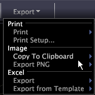

# 共享工作区{#share-a-workspace}

可以使用“导出”工作区菜单将工作区打印和导出到 .png 文件或 Excel。

In a workspace, click **[!UICONTROL Export]**.

<table id="table_900D1AB7B08749469DA9544C5D37096F"> 
 <thead> 
  <tr> 
   <th colname="col1" class="entry"> 菜单选项 </th> 
   <th colname="col2" class="entry"> 描述 </th> 
  </tr> 
 </thead>
 <tbody> 
  <tr> 
   <td colname="col1"> 打印 </td> 
   <td colname="col2"> 打印工作区。打印工作区时，背景打印为白色。如果打印到彩色打印机，则会在白色背景上用彩色打印工作区。如果打印到黑白打印机，则会在白色背景上用灰度打印工作区。默认情况下，打印输出在页面上水平居中。 </td> 
  </tr> 
  <tr> 
   <td colname="col1"> 打印设置 </td> 
   <td colname="col2"> 设置页面方向（横向或纵向）和边距。 </td> 
  </tr> 
  <tr> 
   <td colname="col1"> 复制到剪贴板 </td> 
   <td colname="col2"> 
将工作区或侧栏复制到剪贴板。复制工作区和/或侧栏时，可使用以下选项： 
     <ul id="ul_F7338E53385B4AE39FBCF1C3A80276CE"> 
      <li id="li_9A3147A64B1C443AAE2843A5260E3273">“深色背景”选项按显示情况复制工作区。 </li> 
      <li id="li_516B6162FDA747CFBB2886E71DF49146">“浅色背景”选项用彩色复制工作区的元素并将其显示在白色背景上。 </li> 
      <li id="li_E0B5E9D31F5948238DEB0D75E235BAE3">“单色”选项用灰度复制工作区的元素并将其显示在白色背景上。 </li> 
     </ul> 
 </td> 
  </tr> 
  <tr> 
   <td colname="col1"> 导出 PNG </td> 
   <td colname="col2">以可移植的网络图像格式（.png 文件）保存工作区的快照。请参阅<a href="../../../home/c-get-started/c-work-worksp/c-ex-wksp.md#section-f9fbe0f0a1c341e2b063cce106cac35e">将工作区导出为 PNG 文件</a>。 </td> 
  </tr> 
  <tr> 
   <td colname="col1"> Excel </td> 
   <td colname="col2"> 如果Data Workbench计算机上安装了Microsoft Excel，则会自动启动Microsoft Excel，并将某些可视化、某些图例和文本注释中的数据导出到新的Excel文件（.xls或。xlsx）。 请参阅<a href="../../../home/c-get-started/c-work-worksp/c-ex-wksp.md#section-fe214e3dbc364d2eba3834d62d295acb">将工作区数据导出到 Microsoft Excel</a>。 </td> 
  </tr> 
  <tr> 
   <td colname="col1"> 从模板导出 (Excel) </td> 
   <td colname="col2"> If Microsoft Excel is installed on the Data Workbench machine, automatically starts Microsoft Excel and exports the data from certain visualizations, certain legends, and text annotations to the template Excel file ( .xls or  .xlsx) that you select. 请参阅<a href="../../../home/c-get-started/c-work-worksp/c-ex-wksp.md#section-814772929ca64cf6b92b89d3fdd02302">导出到模板 Excel 文件</a>。 </td> 
  </tr> 
 </tbody> 
</table>
