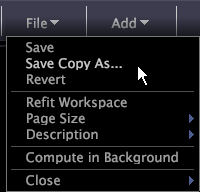

# 工作区“文件”菜单{#workspace-file-menu}

{{eol}}

有关工作区“文件”菜单中可用菜单选项的信息。

在工作区中，单击 **[!UICONTROL File]**.

下表提供对每个菜单项的描述。

**保存**

保存工作区。请参阅 [保存工作区](../../../home/c-get-started/c-work-worksp/c-save-wksp.md#concept-e0c34e75cc194e57bd02d1f02316a606).

**副本另存为**

使用其他名称保存工作区或将工作区保存到其他位置。请参阅 [保存工作区](../../../home/c-get-started/c-work-worksp/c-save-wksp.md#concept-e0c34e75cc194e57bd02d1f02316a606).

**还原**

还原到当前工作区的上次保存版本。

**重新调整工作区**

将可视化的大小调整为您所使用的显示分辨率。该选项对于快速调整演示文稿的显示非常有帮助。

**页面大小**

设置工作区的工作页面大小。可以为计算机屏幕、打印页面和报表选择“全屏”、“标准”或任何特定大小。“全屏”填充特定屏幕，“标准”是可以配置为适合您组织的标准屏幕大小的设置。默认“标准”设置填充使用 1024 x 768 分辨率时的屏幕。

复制、另存为的工作区 [!DNL .png] 文件或打印的页面大小也用于输出。 大于Data Workbench可视化的页面大小使用滚动条，而小的页面大小在屏幕上居中，并在工作区周围显示浅灰色边框。

**描述**

让您可以创建或编辑工作区的文本说明。该文本显示在 [!DNL Worktop] 中的缩略图下。请参阅 [向工作区添加描述](../../../home/c-get-started/c-work-worksp/t-add-wksp-desc.md#task-163734487e8848dfa0a4d8da6323a963).

**在后台计算**

（仅当联机工作时显示。）在您继续工作的同时，使所选工作区中的查询在后台运行。选择该选项时，缩略图显示以下信息，该信息指示查询的进度：

* “正在处理: *n%*”- 指示查询正在进行处理以及所完成处理的百分比。
* “*n* MB 查询负载”- 查询结果的总大小。查询负载与Data Workbench服务器的总内存负载成正比，但不直接相关。 作为指导原则，10 MB 或更高的查询负载可能会耗尽您的系统资源。所列的查询负载未考虑群集。

>[!NOTE]
>
>如果“在后台计算”保持选中状态，则所选工作区中的查询将成为持续查询，并继续更新并使用内存负载。 当您完成该工作区中的工作时，确保清除对“在后台计算”的选择。

**关闭**

关闭工作区。单击 **[!UICONTROL Close]** > **[!UICONTROL Save]** 要保存您在工作区中所做的更改，请单击 **[!UICONTROL Close]** > **[!UICONTROL Don’t Save]** 返回 [!DNL Worktop] 而不保存您在工作区中所做的更改。

您也可以使用以下任一方法保存更改、关闭工作区并返回 [!DNL Worktop]：

* 单击工作区左上角的Data Workbench徽标。
* 如果您的鼠标具有导航按钮，则单击您鼠标上的后退按钮。

您还可以通过按关闭工作区而不保存来撤消更改 **Ctrl+Backspace**.

**从模板导出到 Excel**

如果Data Workbench计算机上安装了Microsoft Excel，则会自动启动Microsoft Excel，并将某些可视化、某些图例和文本批注中的数据导出到模板Excel文件( [!DNL .xls]或 [!DNL .xlsx])。 请参阅[导出到模板 Excel 文件](../../../home/c-get-started/c-work-worksp/c-ex-wksp.md#section-814772929ca64cf6b92b89d3fdd02302)。
