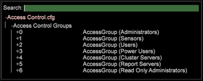

# 了解访问级别{#understanding-access-levels}

访问级别描述允许一组用户读取或修改计算机上的哪些URI。

按照以下准则为组织的用户定义所需的访问级别：

* 没有尾随斜杠字符的特定URI仅限访问该URI。 例如，[!DNL /Components/Communications.cfg]仅提供对[!DNL Communications.cfg]文件的访问。

* 指定目录的尾随斜杠(/)允许组成员访问以该字符串开头的任何URI。 例如，/用户档案/提供对整个用户档案目录的访问。
* 尾随美元符号($)仅限于对确切URI的访问，即使它是目录也是如此。 例如，/用户档案s/$提供读取主用户档案目录的权限，但不能读取该目录中的任何文件。

   要访问特定文件，您无需使用尾随$。

   例如，[!DNL /Components/Communications.cfg]和[!DNL /Components/Communications.cfg$]提供相同的访问。

* 百分比符号(%)可与CN（公用名称）一起使用，以允许访问。 例如，/Users/%CN%/允许访问与[!DNL Insight]用户的SSL证书公用名匹配的用户目录。 请注意，此语法在URI中只能使用一次。

预定义访问控制组中的URI已配置如下：

<table id="table_8E6FDD741BF24E2DAD96A2919FAE6C7F"> 
 <thead> 
  <tr> 
   <th colname="col1" class="entry"> 群组名称 </th> 
   <th colname="col2" class="entry"> 只读访问 </th> 
   <th colname="col3" class="entry"> 读写访问 </th> 
   <th colname="col4" class="entry"> 描述 </th> 
  </tr> 
 </thead>
 <tbody> 
  <tr> 
   <td colname="col1"> 
管理员 
 </td> 
   <td colname="col2"> </td> 
   <td colname="col3"> 
/ 
 </td> 
   <td colname="col4"> 
对所有 Insight Server目录的读取和写入访问。 
 </td> 
  </tr> 
  <tr> 
   <td colname="col1"> 
传感器 
 </td> 
   <td colname="col2"> </td> 
   <td colname="col3"> 
/SensorInit.vsp 
 
/Submit.vsp 
 </td> 
   <td colname="col4"> 
对传感器用来与 Insight Server通信的两个文件的读取和写入访问权限。 
 </td> 
  </tr> 
  <tr> 
   <td colname="col1"> 
用户 
 </td> 
   <td colname="col2"> 
/配置文件/ 
 
/状态/ 
 
/Software/ 
 
/地址/ 
 
/用户/$ 
 </td> 
   <td colname="col3"> /Users/%CN%/ </td> 
   <td colname="col4"> 
对与 Insight用户的SSL证书公用名匹配的用户目录的读写访问。 
 </td> 
  </tr> 
  <tr> 
   <td colname="col1"> 
高级用户 
 </td> 
   <td colname="col2"> 
/配置文件/$ 
 
/状态/ 
 
/Software/ 
 
/地址/ 
 
/用户/$ 
 </td> 
   <td colname="col3"> 
/配置文件/ 
 
/Users/%CN%/ 
 </td> 
   <td colname="col4"> 
Power Users与Users具有相同的访问权限，并添加了写入用户档案目录的功能。 这些用户可以编辑用户档案，并启用其他 Insight用户自动更新的更改功能，例如在分发新定义的工作区时。 
 </td> 
  </tr> 
  <tr> 
   <td colname="col1"> 
群集服务器 
 </td> 
   <td colname="col2"> 
/处理服务器的组件/ 
 
/地址/ 
 
/配置文件/ 
 
/Lookups/ 
 
/访问控制/ 
 
/Bin/ 
 
/日志/ 
 </td> 
   <td colname="col3"> 
/Cluster/ 
 </td> 
   <td colname="col4"> 
对群集目录的读和写访问。 
 </td> 
  </tr> 
  <tr> 
   <td colname="col1"> 
报表服务器 
 </td> 
   <td colname="col2"> 
/配置文件/$ 
 
/状态/ 
 
/Software/ 
 
/地址/ 
 
/用户/$ 
 </td> 
   <td colname="col3"> 
/配置文件/ 
 
/Users/%CN%/ 
 
/ReportStatus.vsp 
 </td> 
   <td colname="col4"> 
允许报表计算机与Power Users访问相同，并添加了写入 ReportStatus.vsp文件的功能。 
 </td> 
  </tr> 
 </tbody> 
</table>

**配置访问控制**

定义访问控制组时，需要包括需要访问此[!DNL Insight Server]计算机的所有系统管理员、用户、群集服务器和报告服务器用户。 您可以使用IP地址或SSL证书信息（如公用名称或组织）授予访问权限。

>[!NOTE]
>
>在[!DNL Insight Server]上更改[!DNL Access Control.cfg]文件时，所有现有连接都将终止并强制重新连接。 根据更新的[!DNL Access Control.cfg]文件中的权限检查连接。 在“服务器管理器”界面中，[!DNL Insight Server]图标会临时变为红色，然后再次变为绿色，因为连接已终止，并且会强制与所有其他连接一起重新连接。

1. 在[!DNL Admin] > [!DNL Dataset and Profile]选项卡上，单击&#x200B;**[!UICONTROL Servers Manager]**&#x200B;缩略图以打开Servers Manager工作区。

1. 右键单击要配置的[!DNL Insight Server]图标，然后单击&#x200B;**[!UICONTROL Files]**。

1. 在[!DNL Server Files Manager]中，单击&#x200B;**[!UICONTROL Access Control]**&#x200B;视图其内容。 [!DNL Access Control.cfg] 文件位于此目录中。

1. 右键单击[!DNL Access Control.cfg]的&#x200B;*服务器名称*&#x200B;列中的复选标记，然后单击&#x200B;**[!UICONTROL Make Local]**。 [!DNL Access Control.cfg]的[!DNL Temp]列中显示复选标记。

1. 右键单击[!DNL Temp]列中新建的复选标记，然后单击&#x200B;**[!UICONTROL Open]** > **[!UICONTROL in Workstation]**。

1. 在[!DNL Access Control.cfg]窗口中，单击&#x200B;**[!UICONTROL Access Control Groups]**&#x200B;视图其内容。

   

1. 添加新访问控制组：

   1. 右键单击&#x200B;**[!UICONTROL Access Control Groups]** ，然后单击&#x200B;**[!UICONTROL Add new]** > **[!UICONTROL Group]**。

   1. 右键单击&#x200B;**[!UICONTROL Members]** ，然后单击&#x200B;**[!UICONTROL Add new]** > **[!UICONTROL Member]**。

      未预定义默认用户组的成员。 默认情况下，将为127.0.0.1（本地主机）授予管理员访问权限，并将[!DNL Sensor]访问权限授予IP:*。 必须定义所有其他访问控制组成员。

   1. 完成参数。

1. 要将新成员添加到现有访问控制组，请执行以下操作：

   1. 右键单击相应访问控制组下的&#x200B;**[!UICONTROL Members]**，然后单击&#x200B;**[!UICONTROL Add new]** > **[!UICONTROL Member]**。

1. 保存文件，方法是右键单击窗口顶部的&#x200B;**[!UICONTROL (modified)]**，然后单击&#x200B;**[!UICONTROL Save]**。

1. 要保存对[!DNL Insight Server]计算机所做的本地更改，请在[!DNL Server Files Manager]中右键单击[!DNL Temp]列中[!DNL Access Control.cfg]的复选标记，然后单击&#x200B;**[!UICONTROL Save to]** *&lt;**[!UICONTROL server name]**>*。
