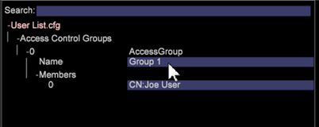

# 群组会员访问权限的用户管理{#user-administration-of-group-member-access}

管理员可以向工作站用户授予部分权限，允许其管理自定义群组的访问控制。

**群组成员访问权限的自我管理**&#x200B;为非管理员用户提供了在自定义群组中添加和删除成员权限的能力。管理员可以在 **Access Control.cfg** 文件中为新增的群组成员创建 [User List](https://experienceleague.adobe.com/docs/data-workbench/using/server-admin-install/admin-dwb-server/access-control/c-config-acs-ctrl.html) 文件并设置群组访问权限。

**访问服务器管理器**

在&#x200B;**服务器管理器**&#x200B;工作区中完成&#x200B;**[!DNL User List]**&#x200B;文件的设置，并将其与&#x200B;**[!DNL Communications.cfg]**&#x200B;文件同步。

1. 在工作台上，单击&#x200B;**管理员**&#x200B;选项卡 >**数据集和配置文件**&#x200B;选项卡。

1. 打开&#x200B;**服务器管理器**&#x200B;工作区。
1. 在图中右键单击 &lt;*您的服务器名称*>，然后选择&#x200B;**文件**。

   服务器文件将在具有列&#x200B;*File*、*`<server name>`*&#x200B;和&#x200B;*Temp*&#x200B;的表中打开。

1. **在服** 务器文件的服务器列中单击鼠标右键以进行“本地”操作(对于此功能 **[!DNL Access Control]** 和 **[!DNL Components/Communications.cfg)]**)。

   此刻，**临时**&#x200B;列中将会显示一个白色复选标记。您可以在“临时”文件夹中进行编辑。然后右键单击复选标记，**保存到**&#x200B;服务器中。（与服务器进行同步时，它会变为红色。）

## 创建一个 User List.cfg 文件 {#section-c25bcaf34f4546e6b8b65f5e7f69ac09}

管理员需要在&#x200B;**[!DNL Access Control]**&#x200B;文件夹中创建&#x200B;**[!DNL User List.cfg]**&#x200B;文件。

1. 右键单击&#x200B;**Temp**&#x200B;列中的**访问控制**行，然后选择&#x200B;**打开** > **文件夹**。 

   **Temp** 文件夹中的 Access Control 文件夹将会打开，其中列出了 **[!DNL Access Control.cfg]** 文件。

1. 向此文件夹中添加另一个文本文件，并将其命名为&#x200B;**[!DNL User List.cfg]**（位于&#x200B;**[!DNL Access Control.cfg]**&#x200B;旁边）。

1. 将以下参数添加到&#x200B;**[!DNL User List.cfg]**&#x200B;文件。

User List 文件应当包含一个 **AccessGroup** 对象的矢量，每个 **AccessGroup** 对象都应该具有一个名称和一个称之为 **Members** 的字符串矢量。

```
Access Control Groups = vector: 1 items 
  0 = AccessGroup:  
    Name = string: Group 1 
    Members = vector: 1 items 
      0 = string: CN:Joe User
```

然后，您可以在**[!DNL User List.cfg]**文件的工作站视图中编辑并添加用户。



以下是要添加到&#x200B;**[!DNL User List.cfg]**&#x200B;文件的最基本参数。 随后，可以在工作站视图中添加成员。

```
Access Control Groups = vector: 1 items 
  0 = AccessGroup:  
    Name = string:  
    Members = vector: 0 items
```

>[!IMPORTANT]
>
>与手动编辑的任何&#x200B;**[!DNL .cfg]**&#x200B;文件一样，请确保使用空格而不是制表符，并密切注意空格和语法。 如果该文件出现错误，则会导致 *Adobe Insight Server* 忽略 User List 文件。

每个&#x200B;**访问群组**&#x200B;中的&#x200B;**名称**&#x200B;字段将被引用在 [!DNL Access Control.cfg] 文件中。

>[!NOTE]
>
>只接受具有目录服务前缀（如&#x200B;**CN:**&#x200B;或&#x200B;**OU:**）的有效成员，这些成员不能包含通配符(*)。

## 设置 Communications.cfg 文件 {#section-9d6f05ba81c14f15be63e361533459e8}

管理员首先通过打开&#x200B;**[!DNL Components]>[!DNL Communications.cfg]**&#x200B;文件并添加名为&#x200B;**[!DNL Access Control User List File]**&#x200B;的新键来启用此功能。 这个键的字符串值就是将要存储该新文件的路径。

1. 从服务器文件中，单击&#x200B;**组件**，然后右键单击服务器列中的复选标记。单击&#x200B;**制作本地副本**。

   此刻，**临时**&#x200B;列中将会显示一个白色复选标记。

1. 右键单击&#x200B;**临时**&#x200B;列中的复选标记，然后选择&#x200B;**打开** > **在工作站中**。

1. 在 **Communication.cfg** 文件中，右键单击&#x200B;**组件**，然后选择&#x200B;**添加自定义键**。  

1. 在&#x200B;**名称**&#x200B;中键入 *Access Control User List File*，然后将&#x200B;**类型**&#x200B;设置为 *String*。

   >[!NOTE]
   不能将新列表文件创建为路径。 若要纠正这个问题，您需要保存文件，然后在编辑器（记事本）中打开该文件，将“String”更改为“Path”：

   之前：

   ```
   component = CommServer:  
     Access Control File = Path: Access Control\\Access Control.cfg 
     Access Control User List File =  
    <string>: Access Control\\User List.cfg
   ```

   之后：

   ```
   component = CommServer:  
     Access Control File = Path: Access Control\\Access Control.cfg 
     Access Control User List File =  
    <Path>: Access Control\\User List.cfg
   ```

1. 保存 **[!DNL Communications.cfg]** 文件，（如有必要）将它保存到服务器中。这将会在服务器中重新启动组件，以确保您没有产生任何错误，导致阻止解析 **[!DNL Communications.cfg]** 文件。
1. 如果您的系统包含处理服务器，请修改&#x200B;**[!DNL Components for Processing Servers.cfg]**&#x200B;文件中的配置文件。
1. 右键单击&#x200B;**[!DNL Communications.cfg]**&#x200B;并保存到服务器。

现在，Data Workbench 管理员可以确认目标用户具有 User List 文件的访问权限，并且允许用户管理该群组。这些用户将可以打开 User List 文件、对其进行编辑，并且可以根据需要，添加和删除 CN 或 OU 成员。

## 同步 Access Control.cfg 文件 {#section-ca6da453dfb4432bb40b86ef15ede872}

管理员可以编辑 **[!DNL Access Control.cfg]**，并将引用插入到由 *User List* 文件定义的群组中。

应当像任何其他成员一样，插入对群组的引用，不过，应使用下面的语法：

```
$(Group Name)
```

“群组名称”应当与 User List 文件中定义的内容相同，包括空格。  

此时，Data Workbench 管理员可以确认选定的群组用户具有 User List 文件的访问权限。接下来，选定的用户就可以打开 **[!DNL User List.cfg]** 文件、对其进行编辑，并且可以根据需要，添加和删除 CN 或 OU 成员。
