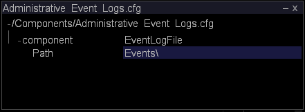

# 监控管理事件{#monitoring-administrative-events}

您应定期监控事件日志文件以跟踪Insight Server系统事件消息，这些消息记录到`<YYYYMMDD>-event.txt`文件中，默认位于Insight Server安装目录的Events文件夹中。

**推荐频率：** 每5-10分钟

您可以使用[!DNL Insight]中的[!DNL Server Files Manager]、自动管理工具、[!DNL *-event.txt]文件或Windows事件查看器来监视这些事件。

>[!NOTE]
>
>管理事件日志与Windows事件日志完全分开，但包含一些相同的事件。 管理事件日志仅包含有关[!DNL Insight Server]事件的信息。

**要通过[!DNL Server Files Manager]**

1. 在[!DNL Insight]的[!DNL Admin] > [!DNL Dataset and Profile]选项卡上，单击&#x200B;**[!UICONTROL Servers Manager]**&#x200B;缩略图以打开“服务器管理器”工作区。
1. 右键单击活动[!DNL Insight Server]的图标，然后单击&#x200B;**[!UICONTROL Server Files]**。
1. 在[!DNL Server Files Manager]中，单击&#x200B;**[!UICONTROL Events]**&#x200B;以查看其内容。
1. 右键单击所需文件旁边&#x200B;*服务器名称*&#x200B;列中的复选标记，然后单击&#x200B;**[!UICONTROL Make Local]**。 [!DNL Temp]列中的文件名旁边会显示一个复选标记。
1. 右键单击[!DNL Temp]列中的复选标记，然后单击&#x200B;**[!UICONTROL Open]** > **[!UICONTROL in Notepad]**。 该事件文件将在新的Microsoft Windows记事本窗口中显示。

   

   [!DNL Insight Server]安装目录[!DNL Trace]文件夹中的[!DNL Server.log]文件包含更详细的日志记录信息。

**通过Windows事件查看器查看事件**

* 单击 **[!UICONTROL Start]** > **[!UICONTROL Control Panel]** > **[!UICONTROL Administrative Tools]** > **[!UICONTROL Event Viewer]**.

**更改管理事件日志目录**

“管理事件日志”配置文件[!DNL Administrative Events Log.cfg]指定将事件日志记录输出到的目录。

1. 在[!DNL Insight]的[!DNL Admin] > [!DNL Dataset and Profile]选项卡上，单击&#x200B;**[!UICONTROL Servers Manager]**&#x200B;缩略图以打开“服务器管理器”工作区。

1. 右键单击要配置的[!DNL Insight Server]图标，然后单击&#x200B;**[!UICONTROL Server Files]**。

1. 在[!DNL Server Files Manager]中，单击&#x200B;**[!UICONTROL Components]**&#x200B;以查看其内容。 [!DNL Administrative Event Logs.cfg] 文件位于此目录中。

1. 右键单击&#x200B;*服务器名称*&#x200B;列中[!DNL Administrative Event Logs.cfg]的复选标记，然后单击&#x200B;**[!UICONTROL Make Local]**。 [!DNL Temp]列中会出现[!DNL Administrative Event Logs.cfg]的复选标记。

1. 右键单击[!DNL Temp]列中新建的复选标记，然后单击&#x200B;**[!UICONTROL Open]** > **[!UICONTROL in Insight]**。

1. 在[!DNL Administrative Event Logs.cfg]窗口中，单击&#x200B;**[!UICONTROL component]**&#x200B;以查看其内容。 默认路径为[!DNL Insight Server]安装目录内的[!DNL Events]文件夹。

   

1. 在路径参数中，键入要将事件日志记录数据输出到的目录的名称。
1. 通过执行以下操作，将更改保存到服务器：

   1. 右键单击窗口顶部的&#x200B;**[!UICONTROL (modified)]** ，然后单击&#x200B;**[!UICONTROL Save]**。
   1. 在[!DNL Server Files Manager]中，右键单击[!DNL Temp]列中文件的复选标记，然后选择&#x200B;**[!UICONTROL Save to]** > **[!UICONTROL server name]**。
