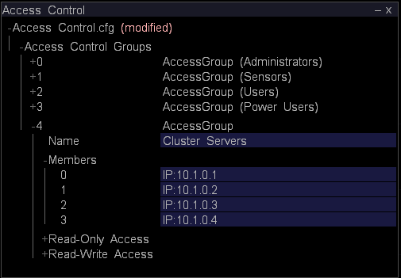

# 配置聚类的主 Insight Server{#configuring-the-master-insight-server-for-clustering}

{{eol}}

有关在主控Insight Server上配置群集、更新群集的访问控制文件等的信息。

要配置群集，请在主控 [!DNL Insight Server]:

* 添加处理 [!DNL Insight Servers’] 地址文件的通用名称和地址。
* 添加 [!DNL Insight Servers] 到 [!DNL Access Control.cfg] 文件。

* 更新 [!DNL Synchronize.cfg] 文件，以指向主控 [!DNL Insight Server].

* 如有必要，请修改 [!DNL Disk Files.cfg] 文件，以指定 [!DNL temp.db] 文件 [!DNL Insight Servers].

要完成这些步骤，您需要知道通用名称（在个人的数字证书中指定） [!DNL Insight Server])和每个 [!DNL Insight Server] 在群集中。 如果您还没有此信息，请先获取该信息，然后再继续。

>[!NOTE]
>
>本节所述的程序要求 [!DNL Insight]. 如果尚未安装 [!DNL Insight]，请按照 **[!DNL Insight]用户指南** 继续之前。

## 将处理Insight Server添加到地址文件 {#section-2fe5298180164e8dbaa59ea6b6ff682d}

使用以下过程添加处理 [!DNL Insight Servers’] 主控上地址文件的通用名称和IP地址 [!DNL Insight Server]. (尽管地址文件是在主控 [!DNL Insight Server]，则会被所有 [!DNL Insight Servers] )

>[!NOTE]
>
>以下假设已为主控配置了地址文件 [!DNL Insight Server]. 如果您尚未添加主控 [!DNL Insight Server’s] 将IP地址添加到地址文件，完成 [定义服务器的网络位置](../../../../../../home/c-inst-svr/c-install-ins-svr/t-install-proc-inst-svr-dpu/c-svrs-ntwk-loc/c-svrs-ntwk-loc.md#concept-87dd2aa3448c415ca1285bc445a8c649) 开始之前。

**添加处理 [!DNL Insight Servers] 地址文件**

1. 开始 [!DNL Insight] 并加载配置配置文件（如果尚未打开），方法是右键单击标题栏，然后单击 **[!UICONTROL Switch Profile]** > **[!UICONTROL Configuration]**.

1. 在 [!DNL Insight]，在 [!DNL Admin] > [!DNL Dataset and Profile] ，单击 **[!UICONTROL Servers Manager]** 缩略图以打开“服务器管理器”工作区。

1. 右键单击主控 **[!UICONTROL Insight Server]** 单击 **[!UICONTROL Server Files]**.

1. 在 [!DNL Server Files Manager]，打开Addresses目录并执行以下操作以打开 [!DNL Insight Server’s] 地址文件：

   1. 右键单击 *服务器名称* 列，单击 **[!UICONTROL Make Local]**.

   1. 右键单击 [!DNL Temp] 列，单击 **[!UICONTROL Open]** > **[!UICONTROL in Insight]**.

1. 展开 [!DNL Locations] 结构，然后展开NetworkLocation 0、Addresses和AddressDefinition。
1. 执行以下操作，为每个处理向NetworkLocation 0中添加一个AddressDefinition [!DNL Insight Server] 在群集中：

   1. 右键单击 **[!UICONTROL AddressDefinition]** 单击 **[!UICONTROL Add New]** > **[!UICONTROL Address Definition]**.

   1. 在名称参数中，指定处理过程 [!DNL Insight Server’s] 通用名称。
   1. 在地址参数中，指定处理 [!DNL Insight Server’s] IP地址。

      在“地址”字段中，可以使用星号作为通配符，如10.10.116。&#42;，以简化聚类。 请参阅 [了解访问级别](../../../../../../home/c-inst-svr/c-admin-inst-svr/c-config-acs-ctrl/c-undst-acc-lvls.md#concept-6b292edf79214750a8d0525097b8795a).

      以下示例定义一个包含两个 [!DNL Insight Servers]:

      

1. 如果服务器已连接到多个网络，请重复步骤6以添加处理 [!DNL Insight Servers] 到网络位置。

   以下示例显示了一个包含四个的群集 [!DNL Insight Servers] （“公司内联网”和“互联网”）。

   

1. 通过执行以下操作，将更改保存到服务器：

   1. 右键单击 **[!UICONTROL (modified)]** ，然后单击 **[!UICONTROL Save]**.

   1. 在 [!DNL Server Files Manager]，右键单击 [!DNL Temp] 列和选择 **[!UICONTROL Save to]** > *&lt;**[!UICONTROL server name]**>*.

## 更新群集的访问控制文件 {#section-fce1367d92a445168c35e9ca506e7d6b}

使用 [!DNL Insight Servers] 在群集中，每个 [!DNL Insight Server] (包括主控 [!DNL Insight Server])必须属于群集服务器访问控制组。 群集服务器组标识允许参与群集的服务器（按IP地址）。 尽管此文件是在主控 [!DNL Insight Server]，则所有 [!DNL Insight Servers] 在群集中。

**编辑访问控制文件**

1. 在 [!DNL Insight]，在 [!DNL Admin] > [!DNL Dataset and Profile] ，单击 **[!UICONTROL Servers Manager]** 缩略图以打开“服务器管理器”工作区。

1. 右键单击主控 [!DNL Insight Server] 单击 **[!UICONTROL Server Files]**.

1. 在 [!DNL Server Files Manager]，打开访问控制目录。
1. 执行以下操作以打开 [!DNL Access Control.cfg] 文件：

   1. 右键单击 *服务器名称* 列，单击 **[!UICONTROL Make Local]**.

   1. 右键单击 [!DNL Temp] 列，单击 **[!UICONTROL Open]** > **[!UICONTROL in Insight]**.

1. 展开访问控制组结构，然后展开访问组（群集服务器）。
1. 对于 [!DNL Insight Server] (包括主控 [!DNL Insight Server])，请执行以下操作：

   1. 右键单击 **[!UICONTROL Members]** 单击 **[!UICONTROL Add New]** > **[!UICONTROL New Member]**.

   1. 指定 [!DNL Insight Server’s] IP地址（其数字IP地址，而非名称）。 如果 [!DNL Insight Servers] 连接到多个网络，此AccessGroup应仅包含 [!DNL Insight Servers] 用于群集中的服务器间通信。

      下面显示了四个群集的AccessGroup（群集服务器） [!DNL Insight Servers].

      

1. 通过执行以下操作，将更改保存到服务器：

   1. 右键单击 **[!UICONTROL (modified)]** ，然后单击 **[!UICONTROL Save]**.

   1. 在 [!DNL Server Files Manager]，右键单击 [!DNL Temp] 列，单击 **[!UICONTROL Save to]** > *&lt;**[!UICONTROL server name]**>*.

## 配置同步文件 {#section-d23e751771c84da6bab6a34a8db867bc}

您可以使用以下过程配置 [!DNL Synchronize.cfg] 文件。 此文件的中心副本将在主控 [!DNL Insight Server]. 处理 [!DNL Insight Servers] 在群集中启动与主控的通信 [!DNL Insight Server] 以检索此文件的更新副本。

的 [!DNL Synchronize.cfg] 文件指定主控的位置 [!DNL Insight Server]. 它还标识每个处理过程的一组管理文件 [!DNL Insight Servers] 在群集中从主控 [!DNL Insight Server]. 处理 [!DNL Insight Servers] 自动从主控下载这些文件 [!DNL Insight Server] 开始时。 它们还会从主控中动态检索这些文件的更新副本 [!DNL Insight Server] 文件更改时。

>[!NOTE]
>
>尽管您在 [!DNL Synchronize.cfg] 文件在主控 [!DNL Insight Server],主控 [!DNL Insight Server] 本身不使用此文件。 在主控上更新此文件 [!DNL Insight Server] 以便在处理时正确配置 [!DNL Insight Servers] 检索文件。

**在主控上更新Synchronize.cfg文件[!DNL Insight Server]**

1. 在 [!DNL Insight]，在 [!DNL Admin] > [!DNL Dataset and Profile] ，单击 **[!UICONTROL Servers Manager]** 缩略图以打开“服务器管理器”工作区。

1. 右键单击主控 [!DNL Insight Server] 单击 **[!UICONTROL Server Files]**.

1. 在 [!DNL Server Files Manager]，打开 **[!UICONTROL Components]** ，用于处理服务器目录。

1. 执行以下操作以打开 [!DNL Synchronize.cfg]:

   1. 右键单击 *服务器名称* 列，单击 **[!UICONTROL Make Local]**.

   1. 右键单击 [!DNL Temp] 勾选标记并单击 **[!UICONTROL Open]** > **[!UICONTROL in Insight]**.

1. 展开组件结构。
1. 在群集主服务器地址参数中，指定主控（主）的IP地址 **[!UICONTROL Insight Server]**.

   

   创建日志，记录每次在主控 [!DNL Insight Server] 和处理 [!DNL Insight Servers]，请确保将Enable Synchronization Log参数设置为“true”。

1. 通过执行以下操作，将更改保存到服务器：

   1. 右键单击 **[!UICONTROL (modified)]** ，然后单击 **[!UICONTROL Save]**.

   1. 在 [!DNL Server Files Manager]，右键单击 [!DNL Temp] 列，单击 **[!UICONTROL Save to]** > *&lt;**[!UICONTROL server name]**>*.

## 配置数据集 (temp.db) 的位置 {#section-5ec257a4b4c64fb58baec1f12119a822}

如果需要处理，请执行以下过程 [!DNL Insight Servers] 维护 [!DNL temp.db] （数据集）的目录或驱动器中，或者 [!DNL temp.db] 跨多个驱动器。

>[!NOTE]
>
>因为处理 [!DNL Insight Servers] 所有共享 [!DNL Disk Files.cfg]，则它们都必须支持您在此文件中指定的文件位置。 例如，如果您将 [!DNL temp.db] E:驱动器，每个处理 [!DNL Insight Server] 群集中必须具有E:开车。

**配置temp.db的位置**

1. 在 [!DNL Insight]，在 [!DNL Admin] > [!DNL Dataset and Profile] ，单击 **[!UICONTROL Servers Manager]** 缩略图以打开“服务器管理器”工作区。

1. 右键单击主控 [!DNL Insight Server] 单击 **[!UICONTROL Server Files]**.

1. 在 [!DNL Server Files Manager]，打开 **[!UICONTROL Components for Processing Servers]** 目录访问Advertising Cloud的帮助。

1. 执行以下操作以打开 [!DNL Disk Files.cfg]:

   1. 右键单击 *服务器名称* 列，单击 **[!UICONTROL Make Local]**.

   1. 右键单击 [!DNL Temp]列，单击 **[!UICONTROL Open]** > **[!UICONTROL in Insight]**.

1. 展开DiskSpaceManagerComponent结构，然后展开“磁盘文件”列表。
1. 编辑条目0以更改 [!DNL temp.db] 文件。
1. 如果您想要分发 [!DNL temp.db] 跨多个驱动器，使用以下步骤为每个其他驱动器创建一个额外条目。

   1. 右键单击 **[!UICONTROL Disk Files]** 单击 **[!UICONTROL Add New]** > **[!UICONTROL Disk File]**.

   1. 在新条目中，指定所需的位置 [!DNL temp.db] 已写入。
   下面显示了 [!DNL temp.db] 写在四个驱动器上。

   

1. 通过执行以下操作，将更改保存到服务器：

   1. 右键单击 **[!UICONTROL (modified)]** ，然后单击 **[!UICONTROL Save]**.

   1. 在 [!DNL Server Files Manager]，右键单击 [!DNL Temp] 列，单击 **[!UICONTROL Save to]** > *&lt;**[!UICONTROL server name]**>*.
