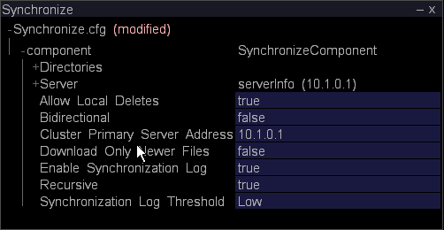

# 配置聚类的主 Insight Server{#configuring-the-master-insight-server-for-clustering}

有关在主控Insight Server上配置群集、更新群集的访问控制文件等信息。

要配置群集，请在主控上执行以下步骤 [!DNL Insight Server]:

* 将处理公 [!DNL Insight Servers’] 用名称和地址添加到地址文件。
* 将所有群集服 [!DNL Insight Servers] 务器组添加到文件 [!DNL Access Control.cfg] 中。

* 更新“ [!DNL Synchronize.cfg] 处理服务器的组件”目录中的文件以指向主控 [!DNL Insight Server]。

* 如有必要，请修 [!DNL Disk Files.cfg] 改“处理服务器组件”目录中的文件，以指定文件在处 [!DNL temp.db] 理中的位置 [!DNL Insight Servers]。

要完成这些步骤，您需要知道群集中每个人的公用名称(如个人的数字证书 [!DNL Insight Server]中指定)和IP [!DNL Insight Server] 地址。 如果您尚未获得此信息，请在继续之前获取该信息。

>[!NOTE]
>
>本节所述的过程需要 [!DNL Insight]。 如果尚未安装，请 [!DNL Insight]按照“User Guide（用户指南）”中 **[!DNL Insight]的说明** ，然后继续。

## 将Processing Insight Server添加到地址文件 {#section-2fe5298180164e8dbaa59ea6b6ff682d}

请按照以下过程将处理公 [!DNL Insight Servers’] 用名和IP地址添加到主控上的地址文件 [!DNL Insight Server]。 (尽管地址文件在主控上进行维护和管 [!DNL Insight Server]理，但群集中的所有 [!DNL Insight Servers] 人都使用它。)

>[!NOTE]
>
>以下假设已为主控配置了地址文件 [!DNL Insight Server]。 如果尚未将主控IP地 [!DNL Insight Server’s] 址添加到地址文件，请在开始之前完 [成定义服务器网络位置中所述的过程](../../../../../../home/c-inst-svr/c-install-ins-svr/t-install-proc-inst-svr-dpu/c-svrs-ntwk-loc/c-svrs-ntwk-loc.md#concept-87dd2aa3448c415ca1285bc445a8c649) 。

**将处理添加[!DNL Insight Servers]到地址文件**

1. 开始 [!DNL Insight] 并加载配置用户档案（如果尚未打开），方法是右键单击标题栏，然后单击 **[!UICONTROL Switch Profile]** > **[!UICONTROL Configuration]**。

1. 在> [!DNL Insight]选项卡上 [!DNL Admin] ，单 [!DNL Dataset and Profile] 击缩略图以打 **[!UICONTROL Servers Manager]** 开“服务器管理器”工作区。

1. 右键单击主控的图标， **[!UICONTROL Insight Server]** 然后单击 **[!UICONTROL Server Files]**。

1. 在中， [!DNL Server Files Manager]打开地址目录并执行以下操作以打开地 [!DNL Insight Server’s] 址文件：

   1. 右键单击“服务器名称”列 *中的复选标记* ，然后单击 **[!UICONTROL Make Local]**。

   1. 右键单击列中的复选标 [!DNL Temp] 记，然后单击 **[!UICONTROL Open]** > **[!UICONTROL in Insight]**。

1. 展开结构的内 [!DNL Locations] 容，然后展开NetworkLocation 0、Addresses和AddressDefinition。
1. 请执行以下操作，为群集中的每个处理将AddressDefinition [!DNL Insight Server] 添加到NetworkLocation 0:

   1. 右键单 **[!UICONTROL AddressDefinition]** 击，然 **[!UICONTROL Add New]** 后单击 **[!UICONTROL Address Definition]**>。

   1. 在“名称”参数中，指定处理公 [!DNL Insight Server’s] 用名称。
   1. 在“地址”参数中，指定处理 [!DNL Insight Server’s] IP地址。

      您可以在地址字段中使用星号作为通配符，如10.10.116。*简化群集。 See [Understanding Access Levels](../../../../../../home/c-inst-svr/c-admin-inst-svr/c-config-acs-ctrl/c-undst-acc-lvls.md#concept-6b292edf79214750a8d0525097b8795a).

      以下示例定义包含两个群集的群集 [!DNL Insight Servers]:

      

1. 如果服务器已连接到多个网络，请重复步骤6，将处理 [!DNL Insight Servers] 添加到这些网络的NetworkLocations。

   以下示例展示了一个四个群集， [!DNL Insight Servers] 它们连接到两个网络（“公司内部网”和“因特网”）。

   

1. 通过执行以下操作，将更改保存到服务器：

   1. 右键单 **[!UICONTROL (modified)]** 击窗口顶部，然后单击 **[!UICONTROL Save]**。

   1. 在中， [!DNL Server Files Manager]右键单击列中文件的复选标记， [!DNL Temp] 然后选择 **[!UICONTROL Save to]** > *&lt;**[!UICONTROL server name]**>*。

## 更新群集的访问控制文件 {#section-fce1367d92a445168c35e9ca506e7d6b}

要在群 [!DNL Insight Servers] 集中使用，群 [!DNL Insight Server] 集中的每个(包括主控) [!DNL Insight Server]都必须属于群集服务器访问控制组。 群集服务器组标识允许参加群集的服务器（按IP地址）。 尽管此文件在主控上进行维护 [!DNL Insight Server]和管理，但群集中的所有 [!DNL Insight Servers] 成员都使用它。

**编辑访问控制文件**

1. 在> [!DNL Insight]选项卡上 [!DNL Admin] ，单 [!DNL Dataset and Profile] 击缩略图以打 **[!UICONTROL Servers Manager]** 开“服务器管理器”工作区。

1. 右键单击主控的图标， [!DNL Insight Server] 然后单击 **[!UICONTROL Server Files]**。

1. 在中， [!DNL Server Files Manager]打开访问控制目录。
1. 执行以下操作以打开 [!DNL Access Control.cfg] 文件：

   1. 右键单击“服务器名称”列 *中的复选标记* ，然后单击 **[!UICONTROL Make Local]**。

   1. 右键单击列中的复选标 [!DNL Temp] 记，然后单击 **[!UICONTROL Open]** > **[!UICONTROL in Insight]**。

1. 展开访问控制组结构，然后展开AccessGroup（群集服务器）。
1. 对于群 [!DNL Insight Server] 集中的每个(包括主控 [!DNL Insight Server])，请执行以下操作：

   1. 右键单 **[!UICONTROL Members]** 击，然 **[!UICONTROL Add New]** 后单击 **[!UICONTROL New Member]**>。

   1. 指定 [!DNL Insight Server’s] IP地址（其数字IP地址，而非其名称）。 如果连 [!DNL Insight Servers] 接到多个网络，则此AccessGroup应仅包含群集中用于服务 [!DNL Insight Servers] 器间通信的内部地址。

      下面显示了四个群集的AccessGroup（群集服务器） [!DNL Insight Servers]。

      

1. 通过执行以下操作，将更改保存到服务器：

   1. 右键单 **[!UICONTROL (modified)]** 击窗口顶部，然后单击 **[!UICONTROL Save]**。

   1. 在列 [!DNL Server Files Manager]中，右键单击该文件的复选标 [!DNL Temp] 记，然后 **[!UICONTROL Save to]** 单击> *&lt;**[!UICONTROL server name]**>*。

## 配置同步文件 {#section-d23e751771c84da6bab6a34a8db867bc}

您可以使用以下过程配置文件的中心副 [!DNL Synchronize.cfg] 本。 此文件的中心副本将保留在主控上 [!DNL Insight Server]。 群集中 [!DNL Insight Servers] 的处理会启动与主控的通 [!DNL Insight Server] 信，以检索此文件的更新副本。

文 [!DNL Synchronize.cfg] 件指定主控的位置 [!DNL Insight Server]。 它还标识群集中每个处理都从主控检索 [!DNL Insight Servers] 的管理文件集 [!DNL Insight Server]。 当这些文 [!DNL Insight Servers] 件开始时，处理程序会自 [!DNL Insight Server] 动从主控下载它们。 当文件发生更改时，他们还会从主控动态 [!DNL Insight Server] 检索这些文件的更新副本。

>[!NOTE]
>
>虽然在主控 [!DNL Synchronize.cfg] 上配置了该 [!DNL Insight Server]文件，但 [!DNL Insight Server] 主控本身不使用此文件。 在主控上更新此文 [!DNL Insight Server] 件，以便在处理检索文件时正确 [!DNL Insight Servers] 配置它。

**在主控上更新Synchronize.cfg文件[!DNL Insight Server]**

1. 在> [!DNL Insight]选项卡上 [!DNL Admin] ，单 [!DNL Dataset and Profile] 击缩略图以打 **[!UICONTROL Servers Manager]** 开“服务器管理器”工作区。

1. 右键单击主控的图标， [!DNL Insight Server] 然后单击 **[!UICONTROL Server Files]**。

1. 在中， [!DNL Server Files Manager]打开“处理服 **[!UICONTROL Components]** 务器”目录。

1. 执行以下操作以打开 [!DNL Synchronize.cfg]:

   1. 右键单击“服务器名称”列 *中的复选标记* ，然后单击 **[!UICONTROL Make Local]**。

   1. 右键单击复 [!DNL Temp] 选标记，然后单 **[!UICONTROL Open]** 击> **[!UICONTROL in Insight]**。

1. 展开组件结构。
1. 在群集主服务器地址参数中，指定主控（主服务器）的IP地址 **[!UICONTROL Insight Server]**。

   

   要创建记录每次在主控和处理之间进行同 [!DNL Insight Server] 步的日 [!DNL Insight Servers]志，请确保将“启用同步日志”参数设置为“true”。

1. 通过执行以下操作，将更改保存到服务器：

   1. 右键单 **[!UICONTROL (modified)]** 击窗口顶部，然后单击 **[!UICONTROL Save]**。

   1. In [!DNL Server Files Manager], right-click the check mark for the file in the [!DNL Temp] column and click **[!UICONTROL Save to]** > *&lt;**[!UICONTROL server name]**>*.

## 配置数据集 (temp.db) 的位置{#section-5ec257a4b4c64fb58baec1f12119a822}

如果要将处理（数据集）保 [!DNL Insight Servers] 留在 [!DNL temp.db] 不同于默认位置的目录或驱动器中，或要分发到多个驱动器，请执行 [!DNL temp.db] 以下过程。

>[!NOTE]
>
>由于处理 [!DNL Insight Servers] 都共享相同 [!DNL Disk Files.cfg]，因此它们都必须支持您在此文件中指定的文件位置。 例如，如果您为 [!DNL temp.db] E分配：驱动器，群集中 [!DNL Insight Server] 的每个处理都必须具有E:驱动器。

**配置temp.db的位置**

1. 在> [!DNL Insight]选项卡上 [!DNL Admin] ，单 [!DNL Dataset and Profile] 击缩略图以打 **[!UICONTROL Servers Manager]** 开“服务器管理器”工作区。

1. 右键单击主控的图标， [!DNL Insight Server] 然后单击 **[!UICONTROL Server Files]**。

1. 在中， [!DNL Server Files Manager]打开该目 **[!UICONTROL Components for Processing Servers]** 录。

1. 执行以下操作以打开 [!DNL Disk Files.cfg]:

   1. 右键单击“服务器名称”列 *中的复选标记* ，然后单击 **[!UICONTROL Make Local]**。

   1. 右键单击列中的复选 [!DNL Temp]标记，然后单 **[!UICONTROL Open]** 击> **[!UICONTROL in Insight]**。

1. 展开DiskSpaceManagerComponent结构，然后展开“磁盘文件”列表。
1. 编辑条目0以更改文件的位 [!DNL temp.db] 置。
1. 如果要分发到多个驱 [!DNL temp.db] 动器，请使用以下步骤为每个额外的驱动器创建一个额外的入口。

   1. 右键单 **[!UICONTROL Disk Files]** 击，然 **[!UICONTROL Add New]** 后单击 **[!UICONTROL Disk File]**>。

   1. 在新条目中，指定要写入的位 [!DNL temp.db] 置。
   下面显示了 [!DNL temp.db] 跨四个驱动器写入的内容。

   

1. 通过执行以下操作，将更改保存到服务器：

   1. 右键单 **[!UICONTROL (modified)]** 击窗口顶部，然后单击 **[!UICONTROL Save]**。

   1. In [!DNL Server Files Manager], right-click the check mark for the file in the [!DNL Temp] column and click **[!UICONTROL Save to]** > *&lt;**[!UICONTROL server name]**>*.

