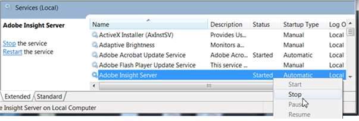

# 从 Data Workbench 6.0 升级至 6.1{#data-workbench-to-upgrade}

按照以下步骤，从安装的 Data Workbench v6.0x 更新至 Data Workbench v6.1。

**步骤 1**：[服务器升级](../../../../../home/c-inst-svr/c-upgrd-uninst-sftwr/c-upgrd-sftwr/c-6-0-to-6-1-upgrade/c-6-0-to-6-1-upgrade.md#section-7845393f76214aa7ad53ac4b2cca9e5b)

**步骤 2**：[Report Server 升级](../../../../../home/c-inst-svr/c-upgrd-uninst-sftwr/c-upgrd-sftwr/c-6-0-to-6-1-upgrade/c-6-0-to-6-1-upgrade.md#section-afd9560a446242e9b06490e5f98aaaec)

**步骤 3**：[客户端升级](../../../../../home/c-inst-svr/c-upgrd-uninst-sftwr/c-upgrd-sftwr/c-6-0-to-6-1-upgrade/c-6-0-to-6-1-upgrade.md#section-c896e57ecd2847afb18f4d8ef7cc0e06)

>[!IMPORTANT]
>
>升级服务器、报表服务器和客户端组件的目的是为了在 64 位 Windows 操作系统上运行。

## 服务器升级 {#section-7845393f76214aa7ad53ac4b2cca9e5b}

Follow these steps to update the **[!UICONTROL Server v6.1]** components:

1. Using the **[!UICONTROL Software and Docs]** profile, open the **[!UICONTROL Start Here]** workspace and download all needed server packages to a local folder.

   * Download **[!UICONTROL Server Packages]** \ **[!UICONTROL v6.1]** zip folders and extract all files.

      The Server package includes **[!UICONTROL Lookup]** and **[!UICONTROL Profile]** folders with **[!UICONTROL Base]** and **[!UICONTROL Transform]** profiles to update the server.

      * Download the **[!UICONTROL Profiles]** folders.
      * Download the **[!UICONTROL Lookup]** folders.
      * 下载 **[!UICONTROL Report Server]** \包 **[!UICONTROL v6.1]** 。
      * Download additional **[!UICONTROL Sensor]**, **[!UICONTROL Documentation]**, and **[!UICONTROL Dashboard]** files as needed for your system.

1. Stop the **[!UICONTROL Adobe Insight Server]** service.

   

1. From the downloaded **[!UICONTROL Server]** package:

   1. Replace the [!DNL Server\Bin] folder to update the [!DNL InsightServer64.exe] and supporting files.

   1. Replace the [!DNL Server\Profiles] folder. 您可以覆盖所有文件。
   1. Update the [!DNL Server\Lookups] folder. 您将需要将新下载的文件添加到文件夹中已存在的自定义文件中。
   1. Replace the [!DNL Server\Software] folder to update [!DNL Insight.exe] and [!DNL ReportServer.exe]
   1. Update the [!DNL Server\Scripts] folder to update [!DNL TnTSend.exe].

1. 如果采用 **[!UICONTROL DeviceAtlas]**，则将需要[更新捆绑包](https://docs.adobe.com/content/help/en/data-workbench/using/dataset/trans-config-file/c-deviceatlas-update.html)（位于 [!DNL Server\Lookups] 文件夹）。

1. 配置 [!DNL Profile.cfg] 文件，以确保矢量已更新，可以反映每个配置文件的项目数量。

   For example, to enable the **[!UICONTROL Predictive Analytics]** profile you will need to update this setting.

   ```
   Directories = vector: 5 items 
       0 = string: Base\\ 
       1 = string: Geography\\ 
       2 = string: Predictive Analytics\\ 
       3 = string: Adobe SC\\ 
       4 = string: Profile Name\\
   ```

1. 配置并保存 PAServer.cfg 文件以启用预测分析功能。

   如果您需要将“预测分析”作业提交至服务器，则将需要配置 [!DNL Server > Predictive Analytics > Dataset > PAServer.cfg] 文件以便管理服务器端聚类提交。

   自定义配置文件应该从“预测分析”配置文件继承设置，并允许您根据站点的实施配置并保存 [!DNL PAServer.cfg] 文件。

1. 定义 **[!UICONTROL Log Source ID]**.

   添加 **[!UICONTROL Recording of Rows per Log Source]** 了唯一名 **[!UICONTROL v6.04]** 称的自定义配置文件，并在 [!DNL Log Processing.cfg] 该文件中进行了定义 **[!UICONTROL Log Source ID]**。

   ```
   Log Processing.cfg
   Log Source ID = string: <Name your ID Here>
   ```

   如果没有定义“日志源 ID”，则将收到以下错误：

   ```
   Missing Log Source ID in log processing.cfg.  
   Log Source ID must be defined for all log sources.
   ```

1. 由于 [!DNL EventMessages.dll] 已进行更新，因此您必须在聚类中取消注册 **[!UICONTROL Adobe Insight Server]**，然后再对其重新注册。

   * [!DNL InsightServer64.exe /unregserver]
   * [!DNL InsightServer64.exe /regserver]

1. Start the **[!UICONTROL Adobe Insight Server]** service across the cluster.

服务器安装现已完成。

## Report Server 升级 {#section-afd9560a446242e9b06490e5f98aaaec}

>[!IMPORTANT]
>
>升级到之 **[!UICONTROL Report Server v6.1]**&#x200B;前，必须先升级到 **[!UICONTROL Server v6.1]**。

1. 使用配 **[!UICONTROL Software and Docs]** 置文件，从包 **[!UICONTROL v6.1]** 下载 **[!UICONTROL Report Server]** 到本地文件夹。

1. 复制下载的包中的 **[!UICONTROL Report Server 6.1]** 并替换配置文件包。

   >[!NOTE]
   >
   >The [!DNL Insight.zbin] file in the [!DNL install] folder is a backup file used for localization, and must be present in the [!DNL install] directory. This file or other [!DNL .zbin] files will be used depending on the command-line settings passed when starting up.

1. （可选）Data Workbench当前支持英语(-en-us)和中文(-zh-cn)。 需要设置字体才能支持单字节和双字节字符：

   ```
   Report Server.cfg - Add Fonts 
      Fonts = vector: 2 items  
      0 = string: SimSun  
      1 = string: Arial 
   ```

   Windows 操作系统必须也安装了列出的这些字体。

1. 配置 [!DNL Report Server v6.1] 本地化。

   1. Stop the **[!UICONTROL Adobe Insight Report Server]** service.
   1. 以“管理员”身份启动命令提示符。
   1. Navigate to the Report Server [!DNL install] folder.
   1. 使用以下命令删除 Report Server 服务。

      ```
      ReportServer.exe /unregserver
      ```

   1. 根据语言设置启动服务：

      ```
      ReportServer.exe -RegServer -Locale -en-us (English)  
      ReportServer.exe -RegServer -Locale -zh-cn (Simplified Chinese)
      ```

1. 要验证Report Server是否使用正确的设置运行，请打开并 **[!UICONTROL Windows Service Manager]** 右键单击 **[!UICONTROL Adobe Insight Report Server - Properties]**。 可执行文件的路径将显示更新后的命令行设置。

报表服务器安装现已完成。

## 客户端升级 {#section-c896e57ecd2847afb18f4d8ef7cc0e06}

>[!IMPORTANT]
>
>Before upgrading to **[!UICONTROL Client v6.1]**, the administrator must first upgrade to **[!UICONTROL Insight Server v6.1.]**

1. 启动 [!DNL Insight.exe]，但是不要连接任何配置文件。
1. Edit the [!DNL Insight.cfg] file.

   ```
   Update Software = bool: true
   ```

1. 连接到您的配置文件。

   允许客户端与服务器同步，并且将使用最新的 v6.1 客户端配置文件、可执行文件和配置文件升级您的客户端。

   >[!NOTE]
   >
   >The [!DNL Insight.zbin] file in the [!DNL install] folder is a backup file used for localization and must be present. This file or other [!DNL .zbin] files will be used depending on the command-line settings passed when starting up.

   See [setting up localized languages](../../../../../home/c-inst-svr/c-upgrd-uninst-sftwr/c-upgrd-sftwr/c-6-0-to-6-1-upgrade/c-localized-ime.md#concept-86d7602cd6ec416b8d4a518f325e001e) to add an [!DNL insight.zbin] file required for localized settings.

**其他客户端设置**

在配置 [!DNL Insight.exe] 和支持文件之前，必须退出客户端应用程序。

安装简体中文版：

1. 创建一个用于传入命令行设置的 [!DNL Insight.exe] 文件快捷方式。

   ```
   Insight.exe -zh-cn
   ```

1. 将 [!DNL Insight.cfg] 配置为支持单字节和双字节字体字符。

   Data Workbench 目前支持英语和简体中文。您可以选择以下字体以支持这两种语言：

   ```
   Fonts = vector: 2 items 
   0 = string: SimSun 
   1 = string: Arial 
   ```

   Windows 操作系统必须也安装了所需的字体。

1. 启动您创建的快捷方式以同步配置文件和更新的 [!DNL zbin] 文件。

采用输入法编辑器 (IME)。

IME 允许您输入国际字符。

1. 使用以下设置更新 [!DNL Insight.cfg] 文件：

   ```
   Localized IME = bool: true
   ```

1. Launch the shortcut that you created to synchronize profiles and the updated [!DNL .zbin] file.

客户端安装现已完成。
