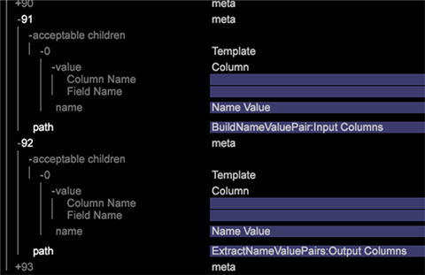
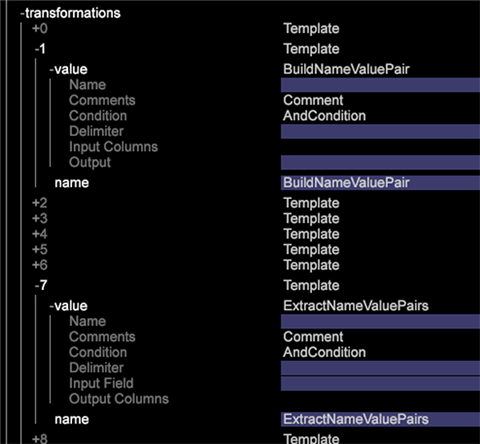

# DWB服务器升级：6.2至6.3{#dwb-server-upgrade-to}

升级Data Workbench 6.3的服务器组件。

**升级服务器**

If you have customized profiles that take precedence over the default files provided in the [!DNL Base] package, then you will need to update these customized files:

* **更新Meta.cfg文件** ( [!DNL E:\..\Profiles\<your custom profile>\Context\meta.cfg)]为文件系统单元（FSU服务器）设置更新的密码加密)，并为名称值对转换添加条目以利用查询字符串 [组](../../../../home/c-inst-svr/c-upgrd-uninst-sftwr/c-upgrd-sftwr/c-6-2-to-6-3-upgrade.md#concept-42f74911b5714219a359b719badac8e0)。

   1. 打开 FSU 中的 [!DNL meta.cfg] 文件。
   1. Change the data type for **[!UICONTROL Proxy Password]** from &quot; [!DNL string"] to &quot; [!DNL EncryptedString]&quot; in the *Workstation Configuration* section.

      ```
      Proxy User Name = string: 
      Proxy Password = EncryptedString:   ( 
      
<i>from Proxy Password = String</i>)Use Address File = bool:true&quot;

    1. 添加新条目以启用新的名称值对转换：*BuildNameValuePair*和*ExtractNameValuePairs*。
    
    打开工作区，右键单击**管理员** > **配置文件管理器**。
    
    在**Context**下，单击**Base**列中的**meta.cfg**文件，然后单击**Make Local**。 在“用户”表列中，右键单击并选择“打开”**>“在工作站中”**。
    
    
    
    * In the new window, click **metadata** and add acceptable children templates.
    
    
    
    *打开**转换**并添加新模板。
    
    

* **为实现快速合并的改进而进行更新**。为下列配置文件添加参数或更改值，以便在转换过程中利用 Data Workbench 中的速度改进。

   * **Communications.cfg** ( [!DNL E:\Server\Components\Communications.cfg])

      ```
      18 = SourceListServer:  
          URI = string: /SourceListServer/ 
          Listing Interval = int: 10 ( 
      <new>)
      ```

   * **Disk Files.cfg** (在和 [!DNL E:\Server\Components] 上 [!DNL E:\Server\Components for Processing Servers])

      ```
      Disk Cache Size (MB) = double: 1024  
      <(from double: 256)> 
      Disk Cache Read Limit (MB) = double: 768  
      <(new)>
      ```

   * **Log Processing Mode.cfg** ( [!DNL E:\Server\Profiles\<your profile>\Dataset\Log Processing Mode.cfg])

      ```
      <(changed) 
      Batch Bytes = int: 268435456 
      Cloud Bytes = int: 268435456 
      Real Time FIFO Bytes = int: 268435456
      ```

      ```
      ( 
      <new>) 
      Cache Bytes = int: 32000000 
      Fast Input Decision Ratio = double: 200 
      Fast Input FIFO Bytes = int: 268435456 
      FIFO Hash Mask = int: 16383 
      Fast Merge Buffer Bytes = int: 536870912 
      Slow Merge Buffer Bytes = int: 268435456 
      Fast Merge Fan In = int: 64 
      Key Cache Size Logarithm = int: 21 
      Max Seeks = int: 512 
      Output Old Buffer Bytes = int: 536870912 
      Overflow FIFO Bytes = int: 67108864 
      Paused = bool: false
      ```
   >[!NOTE]
   >
   >若要利用快速合并改进，请确保您的每个 DPU 至少有 8 GB 的 RAM。

* **具有 DWB 集成更新的 Adobe Target**。A new export file, [!DNL ExportIntegration.exe], replaces the existing [!DNL TnTSend.exe] file on the Insight Server (`E:\Server\Scripts\TnTSend.exe`). 这个新导出的文件同时支持 [Adobe Target](https://www.adobe.com/marketing/target.html) 与最新主营销配置文件 (MMP) 和 [Adobe Audience Manager](https://www.adobe.com/analytics/audience-manager.html) 的集成和协同。

   您将需要为 Adobe Target 导出更新以下命令。

   `Command = string: TnTSend.exe`

   更改为

   ```
   <filepath>
   Command = string: ExportIntegration.exe 
   </filepath>
   ```

   >[!NOTE]
   >
   >这将仅影响在6.3版之前创建的导出。

   您还可以尝试下列操作以使用旧的导出过程：

   * 在工作站中创建新的 Test&amp;Target 导出。
   * 修改／导出中的旧“测试和目标” [!DNL Server/Profiles/`<your profile>`导出。]

* **更新 Adobe SC 配置文件。** 对文件的更 [!DNL Exclude Hit.cfg] 改要求在关联的文件中声明一个字 [!DNL Decoding Instructions.cfg] 段。

   >[!NOTE]
   >
   >If your Adobe SC profile includes a customized [!DNL Decoding Instructions.cfg] file, you will need to include a [!DNL DelimitedDecoder] parameter to your customized file.

   ```
   0 = DelimitedDecoder: 
      Delimiter = string: \t 
      Fields = vector: x items 
      …  
         5 = string: 
   Changed to: 
   
   5 = string: x-hit_source
   ```

   通过添加 [!DNL DelimitedDecoder] 字段，您可以利用功能更新，并避免可能由这些更新导致的日志处理问题。
