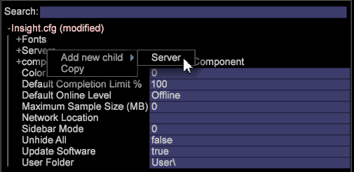

# 配置与 Insight Server 的连接{#configuring-the-connection-to-insight-server}

安装 Insight 软件和数字证书之后，必须启动 Insight 并配置它与 Insight Server 的连接。

>[!NOTE]
>
>在某些情况下，Adobe Consulting Services或您的系统管理员可能已预配置了与Insight Server的连接。 如果是这样，则您无需完成此任务。

首次启动 Insight 时，它会自动连接到 Adobe 许可证服务器以注册您的数字证书。若要成功完成注册过程，在执行以下步骤时必须将您的计算机连接到 Internet。

>[!NOTE]
>
>If you have already requested, downloaded, and installed a pre-locked certificate as described in [Downloading and Installing the Digital Certificate](../../../home/c-install-insight/install-setup/c-dgtl-crtf.md#topic-fed3b44e472c4e4ca6dd5852af14cdb9), Insight will not attempt to connect to the License Server and you will not receive an error.

**配置与 Insight Server** 的连接

当 Insight 运行在群集环境中时，应将其配置为访问主 Insight Server 以避免发生同步问题。In Insight you can view information about the processing [!DNL Insight Servers] in your cluster using the [!DNL Related Servers] menu item in the [Servers Manager](https://docs.adobe.com/content/help/en/data-workbench/using/client/admin-ui/c-svrs-mgr.html).

1. 启动 Insight。
1. 在上， [!DNL Worktop]单击， **[!UICONTROL Admin]**&#x200B;然后 **[!UICONTROL First Steps]**。

1. 单击缩 **[!UICONTROL Configure Connection to Servers]** 略图。

   The [!DNL Servers Manager], the [!DNL Insight.cfg] file, and instructions for configuring your [!DNL Insight.cfg]file are displayed.

1. 在窗 [!DNL Insight.cfg] 口中，右键单击并 **[!UICONTROL Servers]** 单击 **[!UICONTROL Add new child]** > **[!UICONTROL Server]**。

   

1. 完成或修改服务器参数以便为 Insight 提供对主 Insight Server 的访问权限。For detailed descriptions of the parameters in the Insight.cfg file, see [Configuration parameters](https://docs.adobe.com/content/help/en/data-workbench/using/client/c-insght-config-param.html).

   

1. 对于要配置连接的每个 Insight Server，重复步骤 4 和步骤 5。
1. 要保存配置更改，请右键单击 **[!UICONTROL Insight.cfg (modified)]** 窗口顶部的按钮，然后单击 **[!UICONTROL Save as Insight.cfg]**。

   Insight attempts to connect to the [!DNL Insight Server(s)] using the settings that you have specified. If a connection is established, a green node appears in the [!DNL Servers Manager] as shown on the following page.

   

   * **绿色：**&#x200B;指示与 Insight Server 的连接处于活动状态。
   * **淡红：**&#x200B;指示服务器存在潜在问题，如服务器处理能力耗尽、内存使用率过高或磁盘空间不足。
   * **红色：**&#x200B;指示与 Insight Server 的连接处于非活动状态。
   If Insight cannot connect using the specified settings, a red node appears in the [!DNL Servers Manager]. 如果出现这种情况，请参 [阅连接疑难解答](../../../home/c-install-insight/install-setup/t-conn-trbsh.md#task-034e588c5ce04c4a8f6d0097364d3b2b)。

<!--
c_dir_crt_setup.xml
-->

当您选择要使用的配置文件时，会将配置文件信息（包括相关数据以及为该配置文件定义的任何特定工作区或可视化效果）下载到您的计算机。下载每个配置文件时，Insight 会使用该配置文件名称在安装目录中创建一个文件夹。

例如，如果您选择名为 Sales 的配置文件，则会在您的 Insight 目录中显示一个名为 Sales 的文件夹。该文件夹包含在 Sales 配置文件中定义的量度、维度、工作区以及可视化效果。初始加载配置文件之后，脱机工作时便可以使用该配置文件。See [Working offline and online](https://docs.adobe.com/content/help/en/data-workbench/using/client/c-off-on.html).

此外，当您首次从 Insight 连接到 Insight Server 时，Insight Server 会在 Insight 安装目录中创建以下目录。

* **[!DNL Trace]目录：**目录中[!DNL Trace]有Insight日志文件([!DNL insight.log])。 When the size of the[!DNL Insight.log]file reaches 100 MB, the file is renamed to[!DNL insight-1.log]. If a file of the name[!DNL insight-1.log]already exists, then[!DNL insight-1.log]is renamed to[!DNL insight-2.log], and so forth, with a maximum of[!DNL insight-9.log]. 文件[!DNL insight.log]始终包含最新的日志信息，[!DNL insight-max.log]包含最旧的日志信息。

* **[!DNL User]目录：**目录中[!DNL User]有与用于日期的每个配置文件对应的文件夹，每个配置文件文件夹中都有名为和的[!DNL Work]文件夹[!DNL Workspaces]。 The directory`User\*profile name*\Workspaces`is the default location in which Insight workspace files are saved.`User\*profile name*\Work`是保存Insight可视化和Insight用户执行的其他自定义工作的默认位置。

下表列出了经常访问的组件的默认位置。

<table id="table_0254A8C25AF5400F89F87A242746D07E"> 
 <thead> 
  <tr> 
   <th colname="col1" class="entry"> 组件 </th> 
   <th colname="col2" class="entry"> 目录位置 </th> 
  </tr>
 </thead>
 <tbody> 
  <tr> 
   <td colname="col1"> 
保存的可视化效果 
 </td> 
   <td colname="col2"> 
<i>Insight</i>\User\<i>配置文件名称</i>\Work\ 
 </td> 
  </tr> 
  <tr> 
   <td colname="col1"> 
Saved  Workspaces 
 </td> 
   <td colname="col2"> 
<i>Insight</i>\User\<i>配置文件名称</i>\Workspaces\<i>选项卡名称</i>\ 
 </td> 
  </tr> 
  <tr> 
   <td colname="col1"> 
保存的 .png 文件 
 </td> 
   <td colname="col2"> 
<i>Insight</i>\User\<i>配置文件名称</i>\Work\ 
 </td> 
  </tr> 
  <tr> 
   <td colname="col1"> 
数据缓存 
 </td> 
   <td colname="col2"> 
<i>Insight</i>\User\Cache.db 
 </td> 
  </tr> 
  <tr> 
   <td colname="col1"> 
 Insight.log 文件 
 </td> 
   <td colname="col2"> 
<i>Insight</i>\Trace\ 
 </td> 
  </tr> 
 </tbody> 
</table>

<!--
c_config_file_ent.xml
-->

您可以按键名称、键类型或值进行搜索以便快速找到某个条目，避免以滚动方式在展开的大型文件中查找嵌套信息。您可以查找到维度名称、服务器名称等。以下示例显示了短语 map 搜索的匹配项。

在此字段中键入一个搜索短语以查找数据。根据是否匹配成功，字段的颜色将会发生相应变化。匹配项将会突出显示，而非匹配项将会变暗。如果不存在匹配项，则搜索字段的背景将会变为红色。当您按 Enter 时，配置树将展开每个存在匹配项的位置，并折叠不存在匹配项的位置。

您还可以在 [!DNL Search] 字段中使用正则表达式。For example, you can use re: [!DNL *zip.*]for any entry containing the word “zip.”

若要清除搜索，请按 **[!UICONTROL Escape]**。
