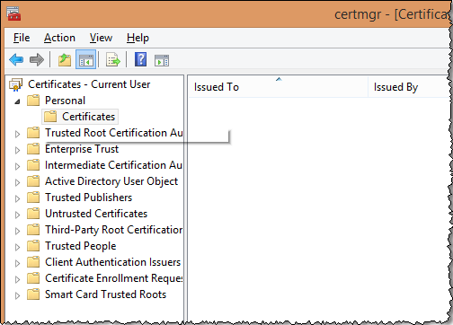

# 下载和安装数字证书{#downloading-and-installing-the-digital-certificate}

{{eol}}

安装了 Insight 程序文件之后，您必须下载并安装 Adobe 为您提供的数字证书。

## 下载和安装数字证书 {#topic-fed3b44e472c4e4ca6dd5852af14cdb9}

安装了 Insight 程序文件之后，您必须下载并安装 Adobe 为您提供的数字证书。

## 了解数字证书 {#concept-9eed01c8d95440cda6ce29d68e65098c}

Adobe 使用 X.509 数字证书来标识和验证构成实施的客户端和服务器组件。

<!--
c_undst_dgtl_crtf.xml
-->

安装 Insight 时，您必须安装数字证书，以授权指定人选（例如，Jane Smith）使用所安装的客户端应用程序。

>[!NOTE]
>
>如果您需要将Insight迁移到另一台计算机或另一个指定用户，则必须从Adobe获取新证书。 为此，请与 Adobe 客户关怀团队联系。

Insight 提供此数字证书以获得对服务器组件的访问权限。服务器组件管理员可以根据用户证书中显示的通用名称或组织单位值限制对服务器资源的访问。

通过随 Adobe 应用程序一起安装的 X.509 数字证书，其客户端和服务器组件还可以通过安全套接字层 (SSL) 交换信息。SSL 使用公钥和私钥加密系统保证通过 HTTP 的传输安全。Adobe 的 SSL 实现支持 1024 位 RSA 密钥并使用 128 位 RC4 加密算法。

除了安全性之外，安装的数字证书还可以用作使您能够运行 Insight 的许可证密钥。若要正常工作，数字证书必须是节点锁定证书且为最新，否则应用程序将无法启动。

## 节点锁定证书 {#section-984aa8f2f5a1448cadc4afea978aedc9}

节点锁定证书是已在安装该证书的计算机上进行注册的数字证书。节点锁定会永久性地将证书与特定节点标识符（唯一标识某个特定计算机的值）相关联。若要使您的证书锁定到节点，您的计算机必须能够通过 Internet 访问 Adobe 许可证服务器或拥有许可证服务器访问权限的代理服务器。

如果在无法访问 Internet 的计算机上进行安装，则必须获取并安装特殊的预锁定证书，如[在没有 Internet 访问权限的计算机上使用数字证书](../../../home/c-install-insight/install-setup/c-dgtl-crtf.md#section-d3c060131d7f45cda27f68848b704fa1)中所述。

如果安装在可以访问Internet的计算机上，则首次启动Insight时，您的数字证书将自动锁定到节点。 在锁定到节点之后，该证书便不能在任何其他计算机上使用。如果您需要将 Insight 迁移到其他计算机，则必须从 Adobe 获取新的未锁定证书。

## 最新证书 {#section-0816b031df3e415ab3f0205b720c723e}

除了锁定到节点之外，数字证书还必须是最新的。若要保持最新，必须定期（通常每隔 30 天，但具体情况可依据您与 Adobe 签署的协议而定）重新验证您的证书。如果您的计算机有 Internet 访问权限，则再验证过程会完全透明。Insight 自动连接到许可证服务器并在必要时重新验证证书。如果您的计算机没有 Internet 访问权限，则必须按照以下部分所述手动安装更新的证书。

## 在没有 Internet 访问权限的计算机上使用数字证书 {#section-d3c060131d7f45cda27f68848b704fa1}

如果安装在无法访问 Internet 的计算机上，则必须为您的 Insight 安装请求预先锁定的证书。预先锁定的证书是 Adobe 手动锁定到计算机的节点标识符的数字证书。

要请求预锁定证书，您必须将节点标识符和证书编号发送到Adobe客户关怀团队。 要获取您计算机的节点标识符，请联系Adobe客户关怀团队以请求Adobe [!DNL Node Identifier] 工具。 还可以从 Insight 尝试连接到许可证服务器但无法连接时发出的警告中获取节点标识符。当您收到预锁定证书时，请按照 [安装数字证书](../../../home/c-install-insight/install-setup/c-dgtl-crtf.md#task-1dad1e1d86d04100a7bcf87f26303c38).

当需要重新验证证书时，您必须从许可证服务器下载新的已验证证书，然后在您的计算机上重新安装该证书（除非您与 Adobe 的协议另有说明）。

## 安装数字证书 {#task-1dad1e1d86d04100a7bcf87f26303c38}

<!--
t_install_dgtl_crtf.xml
-->

**要下载并安装数字证书，请执行以下步骤：**

1. 打开Web浏览器以 [!DNL https:\\license.visualsciences.com].

   >[!NOTE]
   >
   >此时，您的浏览器可能会提示您提供数字证书。如果存在，请单击 **[!UICONTROL Cancel]** 关闭对话框。

1. 在“登录”屏幕上，输入您从 Adobe 收到的 [!DNL Account Name] 和 [!DNL Password]，然后单击 **[!UICONTROL login]**。
1. 找到为您的Insight实例颁发的证书( *您的姓名*.pem)，然后单击  与该证书关联的图标。
1. 提示保存证书时，单击 **[!UICONTROL Save]**。
1. 将文件下载到 [!DNL Certificates]Insight 安装目录中的  文件夹中。

   此文件夹包含一个名为的证书文件 [!DNL trust_ca_cert.pem]. 两个证书文件必须总是同时存在，Insight 才能正常工作。

## Windows 证书存储 {#concept-4acb13b7de9340ea8cde8ad84b93358d}

您可以将客户端的证书和私钥存储在 Windows 证书存储区，以便与服务器进行 SSL 通信。

<!--
crypto-api.xml
-->

适用于客户端的 Windows 证书存储是一项新功能，该功能允许您将 SSL 通信证书和私钥存储在 Windows 证书存储区而非 `Insight/Certificates/<CertName>.pem` 文件中。如果您将证书存储区用于其他应用程序并希望在同一位置管理证书，或者，将证书存储区用于那些希望享用 Windows 证书存储区提供的额外 Windows 审核日志记录服务的用户，那么使用 Windows 证书存储区会是一种较适合的选择。

>[!NOTE]
>
>许可证服务器的授权功能仍将通过使用现有的 `<Common Name>.pem` 文件来维护，并且从证书存储区获得的证书将只能用于同您指定的服务器通信。

## 前提条件 {#section-69b18600052145ff8e5299b7123e69c5}

1. 您必须具有 [!DNL certmgr.msc] 文件的访问权限，并且能够将证书和密钥导入 **Personal** 存储区。（对于大部分 Windows 用户而言，默认情况下应当将其设置为 True。）

1. 执行配置的用户必须具有 **OpenSSL** 命令行工具的副本。
1. 必须将服务器和客户端配置为使用自定义SSL证书，这些证书说明了如何将客户端证书存储在Windows证书存储区，而不是存储在 **证书** 目录访问Advertising Cloud的帮助。

## 配置 Windows 证书存储区 {#section-3629802122e947d4b4f63e8b732cfe27}

可通过以下步骤启用适用于客户端的 Windows 证书存储区：

**步骤 1：将用户的 SSL 证书和私钥导入 Windows 证书存储区。**

在 [在中使用自定义证书Data Workbench](../../../home/c-install-insight/install-setup/c-dgtl-crtf.md#concept-ee6a9b5015f84a0ba64a11428b0a72dd) 系统会指导您将SSL证书和密钥放入以下目录：

```
<
<filepath>
  DWB Install folder
</filepath>>\Certificates\
```

证书的名称为 `<Common Name>.pem` 例如Analytics Server 1.pem（不是trust_ca_cert.pem文件。）

在可以导入证书和私钥之前，必须先将它们从 [!DNL pem] 格式转化为 [!DNL .pfx] 格式（如 [!DNL pkcs12.pfx]）。

1. 打开命令提示符或终端，然后导航至目录：

   ```
   <CommonName>.pem c: cd \<filepath>DWB Install folder</filepath>>\Certificates
   ```

1. 通过以下参数（以及实际的 [!DNL .pem] 文件名）运行 [!DNL openssl]：

   ```
   openssl pkcs12 -in "<Common Name>.pem" -export -out "<Common Name>.pfx"
   ```

   如果出现系统提示，请按 **Enter** 以跳过输入导出密码的步骤。

1. 从运行提示符、开始菜单或命令行中运行 [!DNL certmgr.msc]。
1. 打开当前用户的 **Personal** 证书存储区。

   

1. 右键单击 **Certificates**，然后单击&#x200B;**“所有任务”**>**“导入”**。

   请确保已选中&#x200B;**“当前用户”**&#x200B;选项，然后单击&#x200B;**“下一步”**。

   

1. 单击&#x200B;**“浏览”**，并选择您此前创建的 `<CommonName>.pfx` 文件。为了进行查看，您需要将 X.509 证书的文件扩展下拉框更改为&#x200B;**“个人信息交换”**&#x200B;或&#x200B;**“所有文件”**。

   选择文件并单击&#x200B;**“打开”**，然后单击&#x200B;**“下一步”**。

1. 请不要输入密码，并确保只选中了&#x200B;**标志此密钥为可导出的密钥**&#x200B;和&#x200B;**包括所有扩展属性**&#x200B;选项。

   

   单击&#x200B;**下一步**。

1. 确保选中&#x200B;**将所有的证书都放入下列存储**，并且所列出的证书存储区为 **Personal**。（如果您是高级用户，可在此时选择其他存储区，但是您需要在以后更改配置。）

1. 单击&#x200B;**下一步**，然后单击&#x200B;**完成**。您应该会看到一个已成功导入的对话框，并且会在存储区的 Certificate 文件夹中发现您的证书。

   >[!NOTE]
   >
   >请特别留意&#x200B;**颁发给**&#x200B;和&#x200B;**颁发者**&#x200B;字段。下面的步骤将需要使用这些字段。

**步骤 2：编辑 Insight.cfg 文件。**

必须编辑 [!DNL Insight.cfg] 文件，以便指示 Data Workbench 使用 Windows 证书存储区功能。此文件中的每一个服务器条目都必须指定一些额外的参数。如果忽略这些参数，工作站将默认使用现有的证书配置。如果指定了参数但具有不正确的值，工作站则会进入错误状态，您必须参考日志文件以了解错误信息。

1. 打开 **Insight.cfg** 文件（位于 **Insight** 安装目录中）。

1. 向下滚动到您要配置的服务器条目。如果您要将 Windows 证书存储区应用于每个服务器，则必须对 [!DNL serverInfo] 对象矢量中的每个条目进行此类修改。
1. 将这些参数添加到他们的 [!DNL Insight.cfg] 文件。您可以在工作站中执行这一操作，或通过将以下参数添加到 [!DNL serverInfo] 对象来手动执行操作。（请确保使用空格而不是制表符，并且不要在此文件中出现其他录入或语法错误。）

   ```
   SSL Use CryptoAPI = bool: true
   SSL CryptoAPI Cert Name = string: <Common Name>
   SSL CryptoAPI Cert Issuer Name = string: Visual Sciences,LLC
   SSL CryptoAPI Cert Store Name = string: My
   ```

   布尔值可启用或禁用此功能。证书名称与证书管理器中的&#x200B;**颁发给**&#x200B;匹配。证书颁发者名称与&#x200B;**颁发者**&#x200B;匹配，而&#x200B;**存储区名称**&#x200B;必须匹配证书存储区名称。

   >[!NOTE]
   >
   >证书管理器 (certmgr.msc) 中的名称“Personal”实际上是指名为&#x200B;**“My”的证书存储区。**&#x200B;因此，如果您将 SSL 通信证书和私钥 (.PFX) 导入建议的 **Personal** 证书存储区，则必须将 **SSL CryptoAPI 证书存储区名称**&#x200B;字符串设置为“My”。将此参数设置为“Personal”并不会起作用。这是 Windows 证书存储区的特性。

   可在此获取有关预定义系统存储区的完整列表：[https://msdn.microsoft.com/zh-cn/library/windows/desktop/aa388136(v=vs.85).aspx](https://msdn.microsoft.com/zh-cn/library/windows/desktop/aa388136%28v=vs.85%29.aspx)。您的系统可能具有额外的证书存储区。如果您要使用的存储区不是“Personal”（例如 **My**），则必须获取证书存储区的规范名称，并在 [!DNL Insight.cfg] 文件中提供该名称。（Windows 文档对于系统存储区名称“My”的引用不一致，有时为“My”，有时为“MY”。此参数似乎不区分大小写。）

1. 在添加了这些参数并验证值与 Windows 证书管理器中的列表匹配后，保存 [!DNL Insight.cfg] 文件。

您现在即可启动工作站（或者与服务器断开连接/重新连接）。Data Workbench 应当从证书存储区加载您的证书和私钥，并正常连接。

## 日志输出 {#section-a7ef8c9e90ef4bbabaa3cd51a2aca3ab}

当未找到证书或证书无效时，会在 [!DNL HTTP.log] 文件中引发此错误消息。

```
ERROR Fatal error: the cert could not be found!
```

>[!NOTE]
>
>通过设置 [!DNL L4.cfg] 文件可启用 L4 记录框架（请查看您的帐户管理器，以执行相应设置）。

## 使用 Data Workbench 中的自定义证书 {#concept-ee6a9b5015f84a0ba64a11428b0a72dd}

有关使用自定义证书的说明。

<!--
using-custom-certificates-DWB.xml
-->

Data Workbench 客户端或服务器使用的证书需要由受信任的 CA（证书颁发机构）签名。Data Workbench 客户会收到由 Visual Sciences CA 签名的证书。这些证书受到 Data Workbench 软件的信任，因为 [!DNL trust_ca_cert.pem]（随 Insight 软件一起提供，并存储在服务器和客户端的 **Certificates** 目录中）包含 Visual Sciences CA 的&#x200B;*根 CA 证书*。当客户端和服务器使用 SSL 相互通信时，这些证书可同时用于软件和身份验证的授权。只有 Visual Sciences CA 颁发的证书才可用于授权，但是其他证书有可能被用于通信和身份验证。在下列情况中，由非 Visual Sciences 的 CA 颁发的证书被称为&#x200B;*自定义证书*。

**重要说明：**&#x200B;对于服务器和客户端，Data Workbench 软件使用客户端中安装的证书文件，或服务器 **Certificates** 目录中的证书，或在其配置中明确标识的证书。然而，您还可以使用适用于客户端的 Windows 证书存储区。

以下说明介绍了使用自定义证书在 Data Workbench 客户端和服务器之间通信时应遵循的流程。并非必须顾及到每一个细节，可在流程中采取不同的变通方式。但是，以下流程是经过测试并证明有效的。

## 设置自定义客户端证书 {#section-2083fd41973e451fa404e7a4ae4da591}

1. 将发证 CA 的证书添加到 [!DNL trust_cert_ca.pem]，该文件安装在客户端的 **Certificates** 目录中，以及可使用此自定义证书访问的每个聚类内每个服务器的目录中。

1. 获取聚类中每个服务器的自定义证书，这些证书具有以下条件：

   1. 证书的格式为 [!DNL .pem] 证书。
   1. 证书包含其私钥，并且未被加密（例如，它没有密码/密码短语）。

      证书包含其私钥，并且具有以下行之一：

      ```
      BEGIN PRIVATE KEY
      BEGIN RSA PRIVATE KEY
      ```

      一种可以从 [!DNL .pem] 证书中删除密码短语的方法：

      ```
      openssl rsa  -in password-protected-cert.pem -out no-password-cert.pem
      openssl x509 -in password-protected-cert.pem >> no-password.pem
      ```

   1. Certificate 具有 CN、O、OU 等，这是根据服务器的 [!DNL Access Control.cfg] 文件中此客户端的要求来决定的。
   1. 证书的颁发者为 *用途&#42;&#42;&#42;* of *客户端* (或同时 *服务器* **和** *客户端*)。

      要验证证书具有服务器和/或客户端的目的代码，可使用以下命令：

      ```
      openssl verify -CAfile trust_ca_cert.pem -purpose sslserver -x509_strict custom_communications_cert.pem
      openssl verify -CAfile trust_ca_cert.pem -purpose sslclient -x509_strict custom_communications_cert.pem
      ```

      对于服务器证书，两个命令都应产生 OK：

      ```
      custom_communications_cert.pem: OK
      ```

      对于客户端证书，只需第二个命令产生 [!DNL OK]。

1. 将证书置于客户端的 **Certificates** 目录中。
1. 在您希望使用此证书的每个聚类 [!DNL Insight.cfg]serverInfo 下方的 ** 中，确保&#x200B;*自定义客户端证书*&#x200B;已命名，例如：

   ```
   Servers = vector: 1 items
     0 = serverInfo:
       SSL Client Certificate = string:
     <my_custom_client_cert.pem>
   ```

## 设置自定义服务器证书 {#setting-up-custom-server-certificates}

此部分假设您拥有一个已设置并运行的聚类，它使用 Visual Sciences 颁发的证书，并且其配置遵循普通规则（例如主服务器上的 *Components for Processing Servers* 目录被同步到所有 DPU 的 *Components* 目录）。

1. 将发证 CA 的证书添加到 [!DNL trust_cert_ca.pem]，该文件安装在聚类中的每个服务器上，以及需要与此聚类通信的每个客户端上。
1. 获取聚类中每个服务器的自定义证书，这些证书具有以下要求：

   1. 自定义证书的格式为 [!DNL .pem] 证书。
   1. 证书包含其私钥，并且未被加密（例如，它没有密码/密码短语）。

      当证书具有类似下面的行时，需要包含其私钥：

      ```
      BEGIN PRIVATE KEY
      BEGIN RSA PRIVATE KEY
      ```

      一种可以从 [!DNL .pem] 证书中删除密码短语的方法：

      ```
      openssl rsa  -in password-protected-cert.pem -out no-password-cert.pem
      openssl x509 -in password-protected-cert.pem >> no-password.pem
      ```

   1. 证书具有与当前安装在服务器上的 [!DNL server_cert.pem] 相同的 CN。
   1. 证书是为了用于 *server* 和 *client* 的目的而颁发的。

      要验证证书具有服务器和/或客户端的目的代码，可使用以下命令：

      ```
      openssl verify -CAfile trust_ca_cert.pem -purpose sslserver -x509_strict custom_communications_cert.pem
      openssl verify -CAfile trust_ca_cert.pem -purpose sslclient -x509_strict custom_communications_cert.pem
      ```

      对于服务器证书，两个命令都应产生 OK：

      ```
      custom_communications_cert.pem: OK
      ```

      对于客户端证书，只需第二个命令产生 [!DNL OK]。

1. 在服务器的 **Certificates** 目录中安装每个服务器的自定义证书，其名称为 [!DNL custom_communications_cert.pem]。

1. 使用文本编辑器，将以下行同时添加到 **Components** 和 *Components for Processing Servers* 目录的 *Communications.cfg* 文件中，它们位于第一行 ([!DNL component = CommServer]) 的正下方：

   ```
   Certificate = string: Certificates\\custom_communications_cert.pem
   ```

1. 重新启动所有服务器。

**关于证书失败的警告**

当 Insight 服务器或客户端在 **Certificates** 目录中查找&#x200B;**“许可证”**&#x200B;证书时，它会尝试验证所有的证书（除 [!DNL trust_ca_cert.pem] 之外）是否存在 Insight CA 证书的硬编码副本，但是对于目录中存在的任何自定义证书而言，将出现验证失败的结果。服务器会发出下面的警告：

```
Certificate failed to verify. Error 20 at 0 depth. Desc: unable to get local issuer certificate. Cert details:
```

您可以放心地忽略此警告。

## 字符串加密 {#concept-35da0b53650a4d7e82b240ad27f6d45a}

客户端与服务器之间进行通信时，加密密码和其他字符串。

<!--
string_encryption.xml
-->

Data Workbench 客户端（工作站）与服务器进行通信时，您可以保存具有 *EncryptedString* 类型的值参数（例如密码）。此操作可隐藏参数，并通过返回的相应私钥将字符串保存到服务器上的 *Windows 凭据存储区*。此操作主要存储导出中使用的凭据，但可用于加密任何参数。

* 新文件夹被添加在 Server\**EncryptStrings** 路径下。

   在此，您可以设置配置文件以加密字符串。

* 新的配置文件被添加在 Server\Component\**EncryptedStrings.cfg** 路径下。

   ```
   component = EncryptionComponent:
     Path = Path: EncryptStrings\\*.cfg
   ```

   此文件可轮询 *Server*\*EncryptStrings* 文件夹中的加密配置文件。

**加密字符串**：

1. 为具有以下字段集的字符串创建 **EncryptedStrings.cfg** 配置文件：

   ```
   Names = vector: 1 items
    0 = NameEncryptValuePair:
     EncryptValue = EncryptedString: // left empty as input then output will be filled by server
     Name = string: // Name for identifier
     Value = string: // Value to be encrypted
   ```

   * *Value* - 此字段包含需要加密的纯文本。

      它只是服务器端加密。*Value* 设置仅在服务器计算机上加密。

   * *Name* - 此字段包含可标识加密字符串的值。
   * *EncryptValue* - 此字段将在输入配置文件中保留为空。在此字段中将返回加密的值。

   您可以为不同的字段添加多个 **NameEncryptValuePair** 值以进行加密。

   >[!NOTE]
   >
   >所有空白值字段都将被删除。

1. 将 **EncryptedStrings.cfg** 文件保存至 Server\**EncryptStrings** 文件夹。

**输出文件**

将会生成与输入文件（名称为 &lt;*文件名*>）同名的输出文件。*加密*&#x200B;扩展。例如，如果输入文件名称为 *sample.cfg*，则输出文件将命名为 *sample.cfg.encrypted*。
