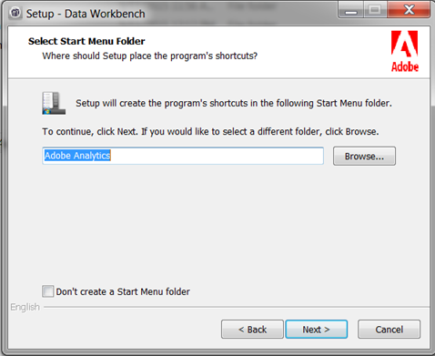

# 工作站安装向导{#workstation-setup-wizard}

Data Workbench 提供了一个安装工作站（客户端）应用程序的安装向导。

## 使用安装向导安装工作站 {#section-58da9bb6196c46eab3b54146913fdcb8}

启动安装向导可执行文件，并遵循每一项步骤来安装工作站客户端程序。安装工作站后，您可以连接服务器和配置文件。

1. 双击工作站安装程序可执行文件。
1. 单击&#x200B;**是**&#x200B;以允许在 Windows 上安装程序。
1. 为安装向导选择一种&#x200B;**语言**。

   将会打开向导：

   

1. 单击&#x200B;**欢迎使用 Data Workbench 安装向导**&#x200B;对话框中的&#x200B;**下一步**。

1. 选择&#x200B;**全新安装**&#x200B;或者&#x200B;**升级或修复现有安装**。

   **全新安装**&#x200B;将会覆盖以前安装的所有文件。

   **升级**&#x200B;可将您的工作站更新至最新版本，或者允许您修复现有的安装。Data Workbench 将会比较所安装的 **Insight.exe** 文件，当存在更新的客户端版本时，则运行工作站安装向导。

1. 选择安装位置：

   **典型**&#x200B;安装到默认文件夹或位置。

   * 默认情况下，程序文件保存在以下位置：

      ```
      C:\Program Files\Adobe\Adobe Analytics\Data Workbench
      ```

   * 默认情况下，数据文件（配置文件、证书、跟踪日志和用户文件）保存在以下位置：

      ```
      C:\Users\<username>\AppData\Local\Adobe\Adobe Analytics\Data Workbench\
      ```

      >[!IMPORTANT]
      >
      >A generic ***Insight.cfg*** file without server details will be installed initially. 建议您使用新安装的 ***Insight.cfg*** 文件并对其进行自定义，而不是从以前的安装中移动文件。Because the path for installing the workstation has changed, the addition of fonts, removal of the *User Folder*, and the removal of the *TraceFileComponent * is recommended.

1. （可选）选择**自定义**以选择语言包以及程序和数据文件的位置。
1. 选择&#x200B;**“开始”菜单中快捷方式**&#x200B;的位置。

   

   单击&#x200B;**不创建‘开始’菜单文件夹**&#x200B;可以在 Windows“开始”菜单中不安装快捷方式。

1. 单击&#x200B;**下一步。**。将会显示有关选定文件位置路径和语言的概述。单击&#x200B;**安装**。

1. 找到 **Data Workbench 证书**。

   如果安装向导在安装期间找不到 Data Workbench 证书，则会打开一个对话框以浏览证书的位置（一个 **.pem** 文件，默认情况下位于客户端的 **Certificates** 文件夹中），或者单击&#x200B;**跳过**&#x200B;以便在安装后查找证书。

   在找到证书后单击&#x200B;**安装**。

1. 完成安装向导并安装 Data Workbench 后，单击&#x200B;**完成**&#x200B;以结束安装。

   >[!NOTE]
   >
   >The default log location for the Workstation Set up Wizard at **[!DNL C:\Users\`<userName>\AppData\Local\Temp。]**

   选中&#x200B;**启动应用程序**&#x200B;复选框可在安装后打开 Workbench。

1. **配置到文件中** ，与服务器的 **[!DNL Insight.cfg]** 连接。

   安装工作站后，系统将会打开“增强的工作站配置体验”工作区，其中包含要在 *Insight.cfg* 文件中输入的其他[服务器连接信息](/help/home/c-get-started/c-insght-config-param.md)，以及一个可以从下拉菜单中选择配置文件的选项。您还可以查看服务器的连接状态。

   

## 安装文件夹 {#section-b5ea5a3b3ecb4622aef713972f3f8ebd}

Data Workbench 文件夹结构具有两个安装位置：

* **Program Files**&#x200B;现在，**Insight.exe** 和支持客户端文件 (**Insight.ini**) 默认情况下位于 

   ```
   C:\Program Files\Adobe\Analytics\DataWorkbench
   ```

* **Appdata** 文件夹。

   现在，**Insight.cfg**、配置文件、证书、跟踪日志以及用户文件默认情况下位于 

   ```
   C:\Users\<Winuser>\AppData\Adobe\Analytics\DataWorkbench\ 
   ```

   您可以在 **文件中设置** Appdata`Insight.ini` 文件夹的路径：

   ```
   [InitialSettings] 
   AppDataFolder=C:\Users\mhiatt\AppData\Local\Adobe\Adobe Analytics\Data Workbench\ 
   Locale=en-us
   ```

## 卸载工作站 {#section-5ce2e233fe4348469ef1b3c451dd5b70}

Data Workbench now includes an executable to uninstall the workstation (located by default at **`Program Files\Adobe\Adobe Analytics\Data Workbench\ unins000.exe`**).

启动可执行文件并遵循相关步骤，从您的硬盘驱动器中删除 Data Workbench 工作站文件。

>[!NOTE]
>
>You can launch the **unins000.exe** executable from the folder, using the **Uninstall Data Workbench** shortcut from Start Menu, or from **[!UICONTROL Control Panel]** > **[!UICONTROL Program and Features]**.
