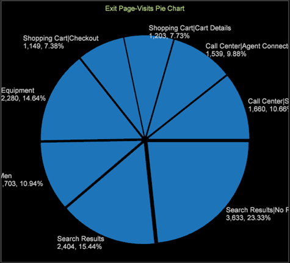

# 饼图更新{#pie-chart-update}

更新饼图的显示内容，让您可以使用图例中确定的默认颜色，或者根据比色图表设置颜色。

打开饼图后，数据集的颜色在默认情况下是由图例中确定的每个颜色设置的。

右键单击图表并选择&#x200B;**显示图例**，可切换图例的开关。结果会得到一个圆形分析图，它没有颜色代码，也没有在标注中针对每个部分确定的元素。

**自定义圆形分析图**

右键单击圆形分析图，以打开一个用来修改圆形分析图的菜单。 

此菜单允许您更改维度元素、量度和数值显示，并允许您自定义图表颜色和标签。
