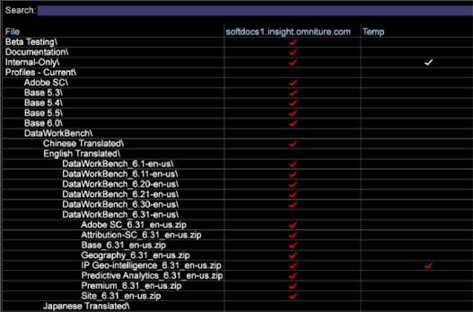

# Data Workbench 6.3 发行说明{#data-workbench-release-notes}

Data Workbench 6.3 发行说明包括新增功能、升级要求、错误修复和已知问题。

## 新增功能 {#section-1225066ea8f44cf68e42e019d0bca816}

Data Workbench 6.3 包括以下新增功能：

<table id="table_E28A6D31E7D941F7A0C2048F0F0F7838"> 
 <thead> 
  <tr> 
   <th colname="col1" class="entry"> 功能 </th> 
   <th colname="col2" class="entry"> 描述 </th> 
  </tr> 
 </thead>
 <tbody> 
  <tr> 
   <td colname="col1"> <a href="../../../home/c-get-started/c-attribution-profiles/c-attrib-algorithmic/c-attrib-algorithmic.md"> 最佳拟合归因 </a> </td> 
   <td colname="col2"> 最适合归因提供了一种机器学习方法以此来确定客户交互对成功转化事件的各种影响级别，然后为每个事件分配合适的归因级别。最适合归因可让您评估成功转化事件发生前一段时间的接触，然后应用 Data Workbench 算法根据数据以及特定于营销活动和内部工作流程的结果来构建归因模型。 </td> 
  </tr> 
  <tr> 
   <td colname="col1"> <a href="../../../home/c-get-started/c-exp-data-seg-exp/c-mmp-integration.md"> 与主营销配置文件集成 </a> </td> 
   <td colname="col2"> 与Adobe Experience CloudData Workbench共享丰富的客户细分。 Integrating with Profiles and Audiences enables the <a href="https://www.adobe.com/solutions/digital-marketing.html?promoid=KLXLZ" format="https" scope="external"> Adobe Experience Cloud </a> and other Adobe Analytic capabilities the opportunity to leverage rich audience segments created in Data Workbench. 这要求您配置并运行Experience Cloud。 <p>与主控Experience Cloud集成使您能够运行聚类或倾向评分等预测功能，然后将细分推送到较大的Adobe Experience Cloud或Adobe Target和Adobe Experience Manager等其他产品。 </p> </td> 
  </tr> 
  <tr> 
   <td colname="col1"> <a href="../../../home/c-get-started/c-exp-data-seg-exp/c-segment-export.md#concept-ac18fdb34edc4b9592130ab98fabd05e"> 区段导出格式选项 </a> </td> 
   <td colname="col2"> 为区段新增的行业标准格式选项，可以直接与其他功能集成（如 <b>R</b>），而不需要进行额外的文件处理。此选项提供了一个更加无缝的工作流程，并能够以更快的速度进行分析。 </td> 
  </tr> 
  <tr> 
   <td colname="col1"> <a href="../../../home/c-get-started/c-analysis-vis/c-visitor-cluster/c-clustering-2.md"> 聚类 2.0 </a> </td> 
   <td colname="col2"> 包含新的 <span class="filepath">KMeans++</span> 算法（目前支持 <span class="filepath">KMeans</span>），该算法可使用更快的方法找到迅速生成聚类的中心。 </td> 
  </tr> 
  <tr> 
   <td colname="col1"> <a href="../../../home/c-get-started/c-analysis-vis/c-graphs/c-trend-lines.md#concept-2898b2ef97dc4762bda7df292713e9a2"> 趋势线 </a> </td> 
   <td colname="col2"> 展示直观且易于理解的数据描述。 </td> 
  </tr> 
  <tr> 
   <td colname="col1"> <a href="../../../home/c-get-started/c-analysis-vis/c-graphs/c-regression-analysis.md#concept-58ec981ab50549488585a88295fa14b7"> 回归分析图 </a> </td> 
   <td colname="col2"> 支持在分析工作流程内部直接将一个因素的影响与另一个相比较。 </td> 
  </tr> 
  <tr> 
   <td colname="col1"> <a href="../../../home/c-get-started/c-analysis-vis/c-chord-visualization.md#concept-ca600beb11674f3bb2696edf41f1dda9"> 和弦可视化图表 </a> </td> 
   <td colname="col2"> 弦图可视化提供了<a href="https://docs.adobe.com/content/help/en/data-workbench/using/client/analysis-visualizations/correlation-analysis/c-correlation-analysis.html" format="http" scope="external">关联矩阵</a>的另一种视图。 </td> 
  </tr> 
  <tr> 
   <td colname="col1"> <a href="../../../home/c-get-started/c-admin-intrf/c-query-que/c-query-string-grouping.md"> 查询字符串分组 </a> </td> 
   <td colname="col2"> 如果您有许多自定义 eVar、prop 和变量字段，那么在日志处理过程中，您可以在一个报表中构建名称值对来合并字段。 </td> 
  </tr> 
  <tr> 
   <td colname="col1"> <a href="../../../home/c-get-started/c-analysis-vis/c-latency.md#concept-a18c23d45af0460ba531f94da0cdfe6a"> 延迟分析 </a> </td> 
   <td colname="col2"> 在某个营销活动或其他类型的事件发生后，延迟可视化允许您分析在某个事件发生前后的一定天数内潜在客户的行为。 </td> 
  </tr> 
  <tr> 
   <td colname="col1"> <b>时间</b>维度 </td> 
   <td colname="col2"> 在“查找器”面板中，您现在可以右键单击“维度”<span class="uicontrol"></span>选项卡，然后依次选择“维度类型”&gt;“时间”<span class="uicontrol"></span>。在搜索结果中将会显示时间维度列表。 <p>  </p> </td> 
  </tr> 
  <tr> 
   <td colname="col1"> <b>锁定</b>功能 </td> 
   <td colname="col2"> 当工作区被锁定时，全新的<b>锁定</b>功能会在工具栏显示一个图标。您可以单击“<b>添加</b>”菜单，然后单击“<b>临时解锁</b>”，从而解锁工作区。 </td> 
  </tr> 
  <tr> 
   <td colname="col1"> <b>“过滤器”面板</b>中的逻辑运算符和全新的量度功能 </td> 
   <td colname="col2"> 已经在<b>“过滤器”面板</b>中添加了 AND/OR 逻辑运算符，您可以在过滤数据时结合或添加量度。您在更改量度时，过滤器百分比会相应地调整并显示。 </td> 
  </tr> 
  <tr> 
   <td colname="col1"> 键盘快捷键 </td> 
   <td colname="col2"> Data Workbench 中的新增键盘快捷键允许您使用箭头键浏览主要桌面和各个工作区。此外，工作区中的工具栏现在显示在桌面窗口上。 </td> 
  </tr> 
  <tr> 
   <td colname="col1"> Windows 8.1 支持 </td> 
   <td colname="col2"> 客户端安装<a href="https://docs.adobe.com/content/help/zh-Hans/data-workbench/using/install/c-data-workbench-client-install.html" format="https" scope="external">现在支持</a> 64 位 Microsoft Windows 8.1。 </td> 
  </tr> 
 </tbody> 
</table>

## 升级要求和建议 {#section-8704a9ac358246cd81233dd0982d534f}

Data Workbench 的新配置文件位于“**软件和文档**”配置文件中，具体位置如下：

```
Profiles - Current\DataWorkBench\ 
  English Translated\DataWorkBench_6.31-en-us\
```



**升级服务器：**

>[!NOTE]
>
>If you have customized profiles that take precedence over the default files provided in the [!DNL Base] package, then you will need to update these customized files:

* **更新Meta.cfg文件** ( [!DNL E:\..\Profiles\<your custom profile>\Context\meta.cfg)]为文件系统单元（FSU服务器）设置更新的密码加密)，并为名称值对转换添加条目以利用 [查询字符串分组](../../../home/c-get-started/c-admin-intrf/c-query-que/c-query-string-grouping.md)。

   1. 打开 FSU 中的 [!DNL meta.cfg] 文件。
   1. Change the data type for **[!UICONTROL Proxy Password]** from &quot; [!DNL string"] to &quot; [!DNL EncryptedString]&quot; in the *Workstation Configuration* section.

      ```
      Proxy User Name = string: 
      Proxy Password = EncryptedString:   (from Proxy Password = String) 
      Use Address File = bool: true
      ```

   1. 为启用新的名称值对转换而添加新条目：*BuildNameValuePair* 和 *ExtractNameValuePairs*。

      打开工作区，右键单击&#x200B;**管理员** > **配置文件管理器**。

      在&#x200B;**上下文**&#x200B;的下方，单击&#x200B;**基本**&#x200B;列中的 **meta.cfg** 文件，然后单击&#x200B;**制作本地副本**。在“用户”表格列中，选择&#x200B;**打开** > **在工作站中**。

      

      * 在新窗口中，单击&#x200B;**元数据**，然后添加可接受的子模板。

      

      * 打开&#x200B;**转换**，并添加新模板。

      


* **为实现快速合并的改进而进行更新**。为下列配置文件添加参数或更改值，以便在转换过程中利用 Data Workbench 中的速度改进。

   * **Communications.cfg** ([!DNL E:\Server\Components\Communications.cfg])

      ```
      18 = SourceListServer:  
          URI = string: /SourceListServer/ 
          Listing Interval = int: 10 (new)
      ```

   * **Disk Files.cfg** (在 [!DNL E:\Server\Components] 和 [!DNL E:\Server\Components for Processing Servers])

      ```
      Disk Cache Size (MB) = double: 1024 (from double: 256) 
      Disk Cache Read Limit (MB) = double: 768 (new)
      ```

   * **Log Processing Mode.cfg** ( [!DNL E:\Server\Profiles\<your profile>\Dataset\Log Processing Mode.cfg])

      ```
      <i>(changed)</i> 
      Batch Bytes = int: 268435456 
      Cloud Bytes = int: 268435456 
      Real Time FIFO Bytes = int: 268435456
      ```

      ```
      (new) 
      Cache Bytes = int: 32000000 
      Fast Input Decision Ratio = double: 200 
      Fast Input FIFO Bytes = int: 268435456 
      FIFO Hash Mask = int: 16383 
      Fast Merge Buffer Bytes = int: 536870912 
      Slow Merge Buffer Bytes = int: 268435456 
      Fast Merge Fan In = int: 64 
      Key Cache Size Logarithm = int: 21 
      Max Seeks = int: 512 
      Output Old Buffer Bytes = int: 536870912 
      Overflow FIFO Bytes = int: 67108864 
      Paused = bool: false
      ```

      >[!NOTE]
      >
      >* 若要利用快速合并改进，请确保您的每个 DPU 至少有 8 GB 的 RAM。
      >* 如果应用了新的“日志处理模式”参数，则可能需要缩短“保存间隔”（两次数据集保存之间的持续时间）。由于转换过程的完成速度将会更快，因此数据集状态文件在“保存间隔”之间包含的数据将会比以前的版本更多。

      >
      >  **建议将“保存间隔”设置缩短为 1800 秒（30 分钟）**—默认的“保存间隔”为 3600 秒（1 小时）。（如果需要将此行添加到 [!DNL Log Processing Mode.cfg]，请注意行前有两 (2) 个前导空格）。
      >
      >  
      ```
      >      Save Interval (sec) = int: 1800
      >  ```
      >
      >  * 对于使用&#x200B;**所有**&#x200B;操作配置了 **CrossRows** 的数据集，建议不要应用新的“日志处理模式”参数。因为使用这些设置后，此操作占用环境的内存会变得非常庞大。


* **具有 DWB 集成更新的 Adobe Target**。A new export file, [!DNL ExportIntegration.exe], replaces the existing [!DNL TnTSend.exe] file on the Insight Server ( [!DNL E:\Server\Scripts\TnTSend.exe]). 该新导出文件同时支持 Adobe Target 与新主营销配置文件 (MMP) 和 Adobe Audience Manager 的集成和协同工作。

   您将需要为 Adobe Target 导出更新以下命令。

   `Command = string: TnTSend.exe`

   更改为

   ```
   <filepath>
   Command = string: ExportIntegration.exe 
   </filepath>
   ```

   >[!NOTE]
   >
   >这将仅影响在6.3版之前创建的导出。
   >
   >
   >您还可以尝试下列操作以使用旧的导出过程：

   >    * 在工作站中创建新的 Test&amp;Target 导出。
   >* Modify the old Test and Target export found in Server/Profiles/`<your profile>`/Export.


* **更新 Adobe SC 配置文件。** 对文件进 [!DNL Exclude Hit.cfg] 行更改时，需要在关联文件中声明一个 [!DNL Decoding Instructions.cfg] 字段。

   >[!NOTE]
   If your Adobe SC profile includes a customized [!DNL Decoding Instructions.cfg] file, you will need to include a [!DNL DelimitedDecoder] parameter to your customized file.

   ```
   0 = DelimitedDecoder: 
      Delimiter = string: \t 
      Fields = vector: x items 
      …  
         5 = string: 
   Changed to: 
   
   5 = string: x-hit_source
   ```

   通过添加 [!DNL DelimitedDecoder] 字段，您可以利用功能更新，并避免可能由这些更新导致的日志处理问题。

**升级客户端：**

* **通过服务器更新您的客户端**。

   更新您的服务器后，您的客户端可在 [!DNL Insight.cfg] 文件配置正确的情况下自动更新：

   1. Edit the [!DNL Insight.cfg] file.

      ```
      Update Software = bool: true
      ```

      然后保存&#x200B;****。

   1. 退出并启动客户端。
   1. 连接到配置文件。

      客户端将自动升级到 Data Workbench 6.3。

   1. 退出客户端。
   1. 编辑 [!DNL Insight.cfg]

      * 更改 [!DNL Proxy Password = string:]

         更改为 [!DNL Proxy Password = EncryptedString:]

         删除原有代理地址和代理密码的值。

      * **[!UICONTROL 保存]**.
   1. 启动客户端。
   1. 编辑 [!DNL Insight.cfg].

      * 为所有服务器输入代理密码，然后保存。
      * 为所有服务器输入代理地址，然后保存。

         >[!IMPORTANT]
         必须在客户端中输入并保存代理地址和代理密码。
   1. 连接到配置文件。
   >[!NOTE]
   * 请严格遵守升级顺序，以避免帐户锁定。如果帐户被锁定，请严格按照所列顺序执行所有必需的更改，然后保存您的工作，并退出客户端。等待锁定解除（约 45 分钟），然后再次启动客户端。
   * 密码修改应当仅在客户端中执行，因为密码是保存在 Windows 凭据保管库中的。


* **建议**:**新的WindowsAero主题。 **使用WindowsAero主题升级客户端应用程序的外观。

* **推荐：中文和日语版本的字体**：

   中文：

   * Arial
   * 宋体

   日语：

   * MS Gothic
   * Meiryo
   * MS Mincho
   * Arial
   * 宋体

   >[!NOTE]
   *SimSun可* 以用于中文和日语。 如果想要输入日语中的半字节字符，则还需要包含 *MS Mincho*。为了在 [!DNL Insight.cfg] 中启用这些字体，您可以添加这些参数。

   ```
   0 = string: Arial 
   1 = string: SimSun 
   2 = string: MS Mincho
   ```

   这些字体应当列在工作站配置文件 [!DNL Insight.cfg.] 中。

**升级至 Adobe Analytics Premium**

若要运行 Data Workbench 中的&#x200B;**最适合归因**，您需要为自己的客户端、服务器和报告服务器（.pem 文件）接收来自 Adobe ClientCare 的新证书以支持 Adobe Analytics Premium。每个新证书都具有以下参数：

```
Product = Premium
```

在“配置文件和查找”****&#x200B;文件工作区的“入门”****&#x200B;选项卡下方，“软件和文档”****&#x200B;中提供了高级包的下载。Navigate to `Profiles - Current\DataWorkBench\<language>\Data WorkBench_6.30-en-us\Premium_6.30_en-us.zip`.  当&#x200B;**高级**&#x200B;配置文件在您的服务器上加载之后，您需要为您的自定义 *文件添加一个* Premium[!DNL Profile.cfg] 参数。这会允许您的自定义配置文件包含菜单、可视化和工作区，以作为 Adobe Analytics Premium 的一部分。

## 已修复的错误 {#section-e1e3df3da3594987a325344cd5e8b855}

* 修复了&#x200B;**密度图**&#x200B;可视化中丢失最大元素的问题。
* 修复了&#x200B;**密度图**&#x200B;中元素区域未描绘量度值比例的问题。
* 修复了在将量度从“**[!UICONTROL 查找器]**”面板拖到量度列外部的量度图例上时，会从工作区中删除该图例的问题。
* 修复了当&#x200B;**[!UICONTROL 打印工作区]**&#x200B;使用“**[!UICONTROL 边栏]**”和“**[!UICONTROL 两者兼有]**”选项时，打印的页面不包含版权信息的问题。

## 已知问题 {#section-751e8698e9f14b75a85f63253782be41}

* **AMD Radeon™ 图形卡**&#x200B;的用户应当更新至最新的图形驱动程序。某些较早版本的驱动程序声称它们支持 openGL 3.2，但实际上并非如此。
* 如果&#x200B;**区段导出**&#x200B;配置不具备标题声明，那么由它生成的输出会导致文件的开头部分出现一个与第一组行冲突的伪标题。
* **添加维度**&#x200B;只显示&#x200B;*扩展维度*。解决方案是使用“**查找器**”工具，将维度拖入表格。

* 如果 3D 散点图可视化包含标注，缩放可能会在可视化边框以外显示图形。要解决此问题，先缩放 3D 散点图，然后在可视化中添加标注。
* 重命名工作区时，如果在远程桌面会话中使用工作站，则会导致系统崩溃。
* 列表项
* 即使导出文件在“输出格式”字段中未包含引号，**旧版区段导出文件在输出时仍带有双引号**。

   *解决方案*：在 .export 文件中加入以下三行。设置这些值并不会触发 MMP 集成（这和对其他配置字段的要求一样），但是会绕过不必要的自动转义。

   ```
     MMP Configuration = MMPConfiguration: 
       MMP Segment Name = string: UNESCAPE DUMMY 
       MMP Visitor ID Field = string: [Specify a Dimension from the output of 
                                       the current export]
   ```

   （首行有两 (2) 个前导空格，后面每行有四 (4) 个前导空格。The Dimension from the output of the current export needs to be referenced in the [!DNL MMP Visitor ID Field].)
