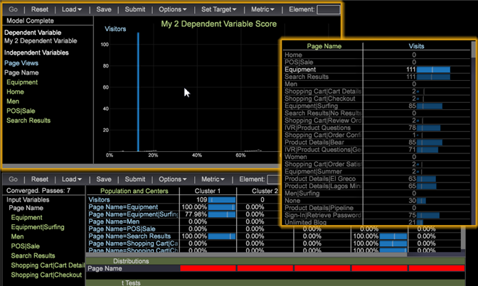

# Data Workbench 6.0 发行说明

Data Workbench 6.0.4 中引入的新增功能，包括错误修复和已知问题。

## 新增功能 {#section-1225066ea8f44cf68e42e019d0bca816}

Data Workbench (Insight 6.0) 包括以下新增功能，以及用于新增报告功能和预测分析工具的可视化。

| Data Workbench 功能 | 描述 |
|---|---|
| [漏斗可视化图表](../../../home/c-get-started/c-analysis-vis/c-funnel-visualization/c-funnel-visualization.md#concept-79a0854325324bb9a60906cf79ef66da) | 漏斗可视化可让您定义客户的序列处理流，并监视流程中每个步骤的访客流失。 |
| [访客聚类](../../../home/c-get-started/c-analysis-vis/c-visitor-cluster/c-visitor-cluster.md#concept-1c2406ef7b284a56a02daa38eaa2e73d) | 聚类可让您利用客户特性对访客进行动态分类，并基于选定的数据输入生成聚类集，以便进行客户分析和定位。 |
| [关联分析](../../../home/c-get-started/c-analysis-vis/c-correlation-analysis/c-correlation-analysis.md#concept-a7c8766b40be43aaa4084612689b630c) | 关联分析可让您快速识别相关数据关系，以便扩展和加强分析。 |
| [更新的 DeviceAtlas 分配](../../../home/c-inst-svr/c-upgrd-uninst-sftwr/c-upgrd-sftwr/c-6-0-to-6-1-upgrade/c-deviceatlas-update.md#concept-28b7bd5c0d854e73834261c431bed1e0) | DeviceAtlas JSON 文件现在将与 DeviceAtlas.dll 和 DeviceAtlas64.dll 一起分配到 .bundle 文件（重命名的 .tar.gz）中。 |

## 客户端升级要求 {#section-f316103b48374b6eac77e8feb5c47ecf}

请完成下列升级任务以获得 Data Workbench (Insight 6.0) 客户端功能：

**更新客户端的 .zbin 文件**

Data Workbench 现在支持使用输入法编辑器 (IME) 作为辅助文本输入程序，以便使用浮动文本框从键盘输入国际字符。Data Workbench 默认将支持英语，但是也允许您加载其他文件以支持国际语言，例如虚拟中文键盘（拼音 IME）。

在更新至 6.0 版之前，客户端应用程序需要新的字典文件（.zbin 文件）。您可以从“软件和文档”配置文件 (Softdocs) 中获得所需的 .zbin 文件。

先决条件:

* 在升级到 Insight 6.0 客户端和 Report Server 6.0 之前，Insight 管理员必须首先升级到 Insight Server 6.0。
* Insight 管理员需要根据语言选择 zbin 文件（en-us.zbin、zh-cn.zbin），复制语言文件，然后将其重命名为 insight.zbin，并将重命名的文件置于可执行文件所在的 Report Server 根目录中。接下来重新启动 Insight Report Server。

有关其他服务器端升级信息，请参阅[服务器升级要求](../../../home/c-release-notes-insight/release-notes.md)。

**将客户端的zbin文件升级（从版本5.x升级到6.0）**

1. 为确保客户端在此升级期间不会从 Insight Server 获取更新，请将 Insight.cfg 参数设置为 false。

   ```
   Update Software = bool: false
   ```

1. 重新启动 Insight 客户端。
1. 导航到“软件和文档”配置文件（SoftDocs配置文件）并下载所需的&#x200B;**[!UICONTROL Insight.zbin]**&#x200B;文件：[!DNL Software\Insight Client\v6.00\Insight_6.00.zip]

1. 将 Insight.zbin 文件复制到 Insight.exe 文件所在的文件夹。
1. 为确保 Insight 客户端现在从 Insight Server 获取更新，请将 Insight.cfg 文件参数更改为 true：

   ```
   Update Software = bool: true
   ```

1. 重新启动客户端。

   您的客户端将与服务器同步，并且您将看到一条消息，说明正在下载客户端。下载结束时，您将收到一条消息，询问您是否要重新启动 Insight 客户端。
1. 单击&#x200B;**确定**&#x200B;重新启动客户端。

   客户端将启动并升级至版本 6.0。

1. 再次重新启动客户端，以使 Insight.zbin 客户端同步生效。

   如果您收到以下消息，则表示 zbin 不在 Insight.exe 文件所在的正确文件夹位置。

   ```
   Insight Terminated: The backup dictionary file insight.zbin 
   is missing.
   ```

   要更正此问题，请删除 Insight.exe，并将最新版本的 Insight.exe.old 重命名为 Insight.exe，然后从上述步骤 1 开始重新操作。

## 服务器升级要求 {#section-d6edba8b36234957ba8d06b555667a5a}

请完成下列升级任务以获得 Insight 6.0 服务器功能：

**更新所有 Insight Server 6.0 包**。Insight 6.0 包含需要更新的服务器包，包括新的“预测分析”配置文件。

>[!IMPORTANT]
>
>建议用户在更新时使用最新安装的Insight Server 6.0来升级其服务器群集。

此外，建议客户端也使用最新安装的 Insight Server 6.0 来升级服务器聚类。

## 升级服务器聚类

**准备语言文件（.zbin 文件）。** Insight管理员会选择 `<language>.zbin` 所需语言的文件(例如：zh-cn.zbin)，位于文件夹 `/localization/<language>.zbin` 中。然后，管理员复制语言文件，并将其重命名为“insight.zbin”。

在准备语言文件 (.zbin) 后，需要更新 Insight Client 和 Report Server。Insight Client 会在[客户端升级过程](../../../home/c-release-notes-insight/release-notes.md)期间更新，而在大多数情况下，Insight 管理员将更新 Report Server。

**使用语言文件（.zbin 文件）更新 Report Server**。

对于所有语言，Report Server 6.0 要求将“insight.zbin”文件复制到 Report Server 根文件夹中。

更新 Report Server 语言文件：

1. 将重命名的“insight.zbin”文件添加到报表服务器根目录中。
1. Report Server 配置文件 (reportserver.cfg) 需要对双字节语言设置字体。例如，中文要求添加使用 SimSun 的字体：

   ```
   Report Server.cfg - Add Fonts 
   
   Fonts = vector: 2 items 
     0 = string: SimSun 
     1 = string: Arial
   ```

1. 需要在命令行中传递一个 Report Server 6.0 参数以进行本地化，例如：

   ```
   ReportServer.exe -Locale -zh-cn 
   ReportServer.exe -Locale -en-us
   ```

   >[!NOTE]
   >
   >如果未指定区域设置，则报表服务器将默认使用insight.zbin文件中选择的语言。

   按照以下步骤，使用区域设置参数将报表服务器作为服务启动：

   1. 以管理员身份启动命令提示符。
   1. 导航至报表服务器安装文件夹。
   1. 键入下列命令以启动该服务：

      * 对于英语：[!DNL ReportServer.exe -RegServer -Locale -en-us]
      * 对于中文：[!DNL ReportServer.exe -RegServer -Locale -zh-cn]

1. 验证报表服务器是否使用正确的参数运行：

   1. 打开 Windows 服务管理器。
   1. 右键单击[!DNL Adobe Insight Report Server - Properties]。

   可执行文件的路径将包含以下参数：

   ```
   ReportServer.exe -Service ReportServer -Locale -en-us
   ```

**修改“配置文件配置”文件以便进行预测分析**。Insight 管理员需要修改自定义的 profile.cfg 文件，以便包含“预测分析”配置文件供在 Insight 中使用。

profile.cfg 条目的示例：

```
Example ("profile.cfg"): 
Profile = profileInfo:  
  Active = bool: true 
  Directories = vector: 5 items 
    0 = string: Base\\  
    1 = string: Predictive Analytics\\ 
    2 = string: Geography\\ 
    3 = string: Adobe SC\\ 
    4 = string: Custom Profile\\ 
```

**更新 PAServer.cfg 文件**。如果您要将“预测分析”聚类作业提交至 Insight Server，则将需要配置 PAServer.cfg 文件以便处理服务器端聚类提交。

自定义配置文件应该从“预测分析”配置文件 (Server\Profiles\Predictive Analytics\Dataset) 继承 PAServer.cfg。根据您的实施网站，配置并保存 PAServer.cfg。

>[!NOTE]
>
>配置PAServer.cfg并将其保存到自定义配置文件后，需要在整个站点中重新启动Insight Server。

**升级 Report Server。**&#x200B;您将需要更新 Report Server 的字体和启动参数。

先决条件:

* 在升级 Report Server 6.0 之前，Insight 管理员必须先升级到 Insight Server 6.0。
* 对于所有语言，Report Server 6.0 要求将 Insight.zbin 添加到 Report Server 根文件夹中。确保将`base/localization/<language>.zbin`复制并重命名为“insight.zbin”。 将其复制到 Report Server 的根目录。

更新字体和启动参数：

1. Report Server 需要为双字节设置字体，以便输出到不同的语言，

   例如：

   Report Server.cfg - 添加字体

   ```
   Fonts = vector: 2 items 
   0 = string: SimSun 
   1 = string: Arial
   ```

1. 需要在命令行中传递一个 Report Server 6.0 参数以进行本地化。

   使用区域设置参数将 Report Server 作为服务启动：

   1. 停止 Report Server 服务。
   1. 以管理员身份启动命令提示符。
   1. 导航至 Report Server 安装文件夹。
   1. 键入下列命令以启动该服务：

      ```
      ReportServer.exe -RegServer -Locale -en-us
      ```

验证 Report Server 是否使用正确的参数运行：

1. 打开 Windows 服务管理器。
1. 右键单击[!DNL Adobe Insight Report Server - Properties]。
1. 可执行文件的路径将包含以下参数：

   ```
   ReportServer.exe -Service ReportServer -Locale -en-us
   ```

**升级适用于 Insight 6.0 的 SiteCatalyst 数据源**。适用于 Insight 6.0 的 SiteCatalyst 数据源的文件名格式已更改。

当前文件名格式：

```
 RSID_YYYYMMDD_HH0000.tsv.gz
```

新文件名格式：

```
YYYYMMDD-RSID_HH0000.tsv.gz
```

>[!NOTE]
>
>此更改不会影响当前使用&#x200B;*wbench/ecom*&#x200B;版本的SiteCatalyst数据馈送部署的用户。

文件名格式更改将允许在日志处理期间充分使用 Insight 开始和结束时间声明。这使该流程能够评估文件内容是否应被读取，而不是使用逐行搜索过滤所有源文件。

在大多数情况下，重命名流程会在收到文件时执行，以便充分利用此功能。默认情况下，此修改会提供所需的命名约定，而无需使用辅助流程和支付相关费用。

使用新的 SiteCatalyst 数据源：

1. 确定接收流程将如何处理新文件名格式。

   在实施期间部署的标准重命名/移动脚本会移动带有“.gz”扩展名的文件；如果文件名与带有前缀 RSID 的文件名格式匹配，则仅执行重命名。

   新文件名格式为：

   ```
    YYYYMMDD-RSID_HH0000.tsv.gz
   ```

1. 评估定义的日志源路径以确认将会读取所有文件。

   如果已经实施重命名脚本，则您已经定义日志源读取此新文件名格式。

## 修复 {#section-203f917dd6224114a1f801309c4c2cee}

* 现在，用于离开工作区而不保存更改的键组合已更新为&#x200B;**[!UICONTROL `<Ctrl>`+`<Backspace>`]**。 以前，通过按`<Ctrl>` + `<Delete>`可撤消更改并关闭工作区。

## Data Workbench 6.0.4 发行说明{#data-workbench-release-notes}

Data Workbench 6.0.4 中引入的新增功能，包括错误修复和已知问题。

要查看基于每个旧版本的先前功能和修复，请参阅[发行说明存档](https://experienceleague.adobe.com/docs/data-workbench/using/release-notes/release-notes.html)。

## 新增功能 {#section-2-1225066ea8f44cf68e42e019d0bca816}

Data Workbench 6.0.4 包括以下新增功能，以及用于新增报告功能和预测分析工具的可视化。

**倾向评分可视化**。Data Workbench 针对每个访客计算评分，以表示指定事件可能发生的估计概率。通过“访客评分”可视化，可创建一个评分维度，以基于输入变量为每个感兴趣访客提供指定事件的发生概率。



请参阅[倾向评分](../../../home/c-get-started/c-analysis-vis/c-visitor-propensity/c-visitor-propensity.md#concept-2958f4640dd44b9d86ad51c4f6165f40)，以了解有关此功能的更多信息。

## 升级要求 {#section-08bd6fe3da8740fcb19688e8cac6f223}

**必须定义日志源 ID**。从 6.04 版开始，只要未定义日志源 ID，就会遇到以下错误：

```
Missing Log Souce ID in log processing.cfg. Log Source ID must be  
defined for all log sources.
```

在 Data Workbench 6.0 中，新增了“按照日志源记录行”，并且可通过添加唯一命名的“日志源 ID”在自定义配置文件 Log Processing.cfg 文件中对其进行定义。如果您有空白“日志源 ID”，则可能遇到日志处理问题，例如日志源数据读取不完整及其他异常。

```
Log Processing.cfg 
Log Sources = vector: 2 items 
  0 = VisualSensor: 
    Compressed = bool: false 
    Log Paths = vector: 1 items 
      0 = Path: \some path\ 
    Log Server = serverInfo:  
      Address = string:  
      Name = string:  
      Port = int: 80 
      Proxy Address = string:  
      Proxy Password = string:  
      Proxy Port = int: 8080 
      Proxy User Name = string:  
      SSL Client Certificate = string: Certificates\\server_cert.pem 
      SSL Server Common Name = string:  
      Use SSL = bool: false 
     
Log Source ID = string: <Name your ID Here>
    Name = string:  
    Recursive = bool: false
```

**可以委派 FSU 资源**

在[!DNL Profiles/`<profilename>`/dataset/Cluster.cfg]中，您现在可以为标准化和源列表服务器指定单独的文件服务器单元(FSU)。 这些服务不再绑定到主 FSU。

>[!NOTE]
>
>如果未指定列表服务器，则列表服务器将继承标准化服务器的配置设置。

[!DNL cluster.cfg]文件中的示例。

```
Cluster = ClusterConfig: 
  Normalize Server = serverInfo: 
    Address = string: normalizeserver.domain.com 
    Port = int: 80 
    Use SSL = bool: false 
  List Server = serverInfo: 
    Address = string: sourcelistserver.domain.com 
    Port = int: 80 
    Use SSL = bool: false
```

## 已修复的错误 {#section-3b4b85a35f534288adf8a5246ef028cc}

* 在 Data Workbench 6.0 中，关联矩阵和聚类生成器不支持后台计算。此问题现已在 6.0.4 版中得已修复。
* 之前，如果您有关于漏斗的选择，并且删除了某个步骤，则可能发生访问冲突。已解决该问题。
* 修复了区段导出中在负载过重时可能导致问题的潜在锁定情况。
