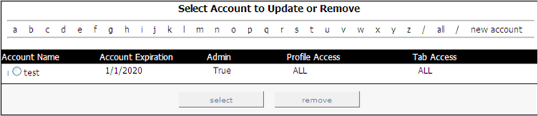

# 查看帐户{#viewing-accounts}

{{eol}}

有关查看帐户的信息。

在 [!DNL Report Portal]，请单击 **[!UICONTROL Admin]** 选项卡。 的 [!DNL Admin] 页面，其中列出了所有单独的用户和群组帐户。

每个帐户都显示以下信息：

| 此字段。.. | 表示。.. |
|---|---|
| 帐户名称 | 单个用户或群组帐户的名称。 显示在用户或组名称左侧的信件指示这是个人(i)还是组(g)帐户。 单个帐户允许用户重置密码，而组则不会重置密码。 管理员是唯一能够重置群组帐户密码的人员。 |
| 帐户过期 | 日期（YYYY/MM/DD/MM格式），在该日期之前，允许此用户或组使用 [!DNL Report Portal]. |
| 管理员 | 是否允许此用户创建、更新和删除用户帐户，以及编辑与每个报表关联的注释。 设置 [!DNL True] 表示这是管理员帐户。 |
| 配置文件访问 | 允许此用户访问的配置文件（例如，ProductSales）。 如果允许用户访问与关联的所有用户档案 [!DNL Report Portal]，则会显示“全部”。 |
| 选项卡访问 | 允许此用户访问的选项卡(例如， [!DNL Admin])。 如果允许用户访问 [!DNL Report Portal]，则会显示“全部”。 |
