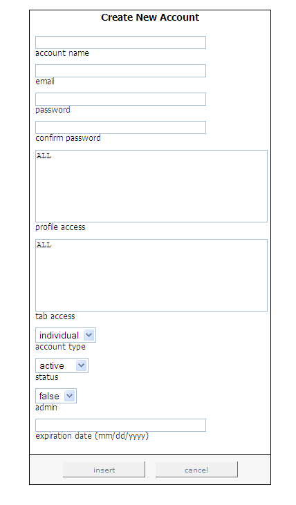

# 添加新帐户{#adding-new-accounts}

添加新帐户的步骤。

1. 在[!DNL Report Portal]中，单击&#x200B;**[!UICONTROL Admin]**&#x200B;选项卡。 此时将显示[!DNL Admin]页面。

   

1. 单击页面右侧的&#x200B;**[!UICONTROL new account]**。 此时将显示[!DNL Create New Account]页面。

   

1. 按照下表所示，填写此页面上的所有字段：

   | 在此字段中。.. | 在“管理工具”中指定分类的 . . . |
   |---|---|
   | 帐户名称 | 登录[!DNL Report Portal]时用户必须提供的帐户名称。 |
   | 电子邮件 | 用户或组的电子邮件地址。 |
   | password | 登录[!DNL Report Portal]时用户必须提供的密码。 |
   | 确认密码 | 登录[!DNL Report Portal]时用户必须提供的密码。 |
   | 配置文件访问 | 允许此用户访问的配置文件（例如，ProductSales）。 要允许访问多个配置文件，请使用逗号分隔各个名称。 如果允许用户访问与[!DNL Report Portal]关联的所有配置文件，请键入“ALL”。 |
   | 选项卡访问权限 | 允许此用户访问的选项卡（例如[!DNL Admin]）。 要允许访问多个选项卡，请用逗号分隔各个名称。 如果允许用户访问[!DNL Report Portal]中的所有选项卡，请键入“ALL”。 此字段与帐户类型字段一起用于定义组访问权限。 |
   | 帐户类型 | 此帐户是针对个人还是群组。 单个帐户允许用户重置密码，而组则不会重置密码。 管理员是唯一能够重置群组帐户密码的人员。 |
   | status | 此帐户是活动帐户还是不活动帐户。 默认值为活动值。 要停用某个用户帐户，请选择不活动。 |
   | admin | 是否允许此用户创建、更新和删除用户帐户，以及编辑与每个报表关联的注释。 默认值设置为 false。要将此用户设为管理员用户，请选择true。 |
   | 过期日期 | 日期，以YYYY/MM/DD格式表示，在该日期之前，允许此用户使用[!DNL Report Portal]。 |

1. 单击 **[!UICONTROL insert]**。
