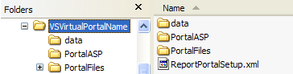

# 安装报表门户应用程序文件{#install-the-report-portal-application-files}

{{eol}}

报表门户由一组应用程序服务器页面(ASP)和支持文件组成。

安装 [!DNL Report Portal]，则必须从从Adobe收到的分发文件中提取这些文件，并将其安装在运行Microsoft IIS的计算机上。

**安装 [!DNL Report Portal] 应用程序文件**

1. 如果尚未下载，请下载 [!DNL Report Portal] 从AdobeFTP站点。
1. 在运行IIS的计算机上，将安装包中的文件解压缩到任何位置。 此步骤将在VSVirtualPortalName文件夹中安装以下子文件夹和文件。

   | 文件夹或文件 | 描述 |
   |---|---|
   | [!DNL \data\users.mdb] | 包含已授权列表的数据库 [!DNL Report Portal] 用户。 |
   | [!DNL \PortalASP\] | 包含组成 [!DNL Report Portal]. |
   | [!DNL \PortalFiles\] | 包含五个子文件夹（核心、CSS、HTC、图像和输出）的文件夹，其中包含由 [!DNL Report Portal]. |
   | [!DNL ReportPortalSetup.xml] | 用于定义与关联的虚拟目录的配置文件 [!DNL Report Portal] （仅与IIS 6.0一起使用）。 |

   目录类似于以下示例：

   

   >[!NOTE]
   >
   >目录的名称可能与示例中显示的名称不同。

1. 将VSVirtualPortalName（或其他名称）文件夹重命名为要用作的根虚拟目录的文件夹 [!DNL Report Portal] (下称 *门户名称*)。 有关虚拟目录的更多信息，请参阅下一节。
