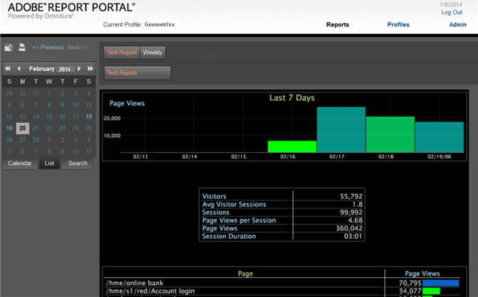

# 打开报表门户{#opening-the-report-portal}

打开报表门户的步骤。

如果您有多个可用的配置文件，则可以从下拉框中选择相应的配置文件。 如果您只有一个用户档案，您将看不到下拉框。 如果您只有一个配置文件，并且禁用了身份验证，则会将您直接发送到[!DNL Report Portal]主页。

1. 在Web浏览器中，使用以下URI格式打开[!DNL Report Portal]:

   http://*ServerAddress*/*PortalName*
示例：[!DNL http://dataworkbench/ReportPortal]
1. 如果有多个配置文件可用，请从&#x200B;**[!UICONTROL Profile]**&#x200B;下拉菜单中选择一个配置文件。
1. 如果[!DNL Report Portal]提示您输入登录凭据，请输入帐户名称和密码，然后单击&#x200B;**[!UICONTROL login]**。 将打开[!DNL Report Portal]。

   

<table id="table_E68190C670684FA798B41702FC911827"> 
 <tbody> 
  <tr> 
   <td colname="col1"> 报表按钮 </td> 
   <td colname="col2"> 
单击可视化窗格上方的按钮以选择报表。 
 </td> 
  </tr> 
  <tr> 
   <td colname="col1"> 日历 </td> 
   <td colname="col2"> 
单击左窗格中的日历按钮，然后单击a以查看选定日期的报表。 
 </td> 
  </tr> 
  <tr> 
   <td colname="col1"> 列表 </td> 
   <td colname="col2"> 
单击左窗格中的列表按钮以查看按日期列出的日期。 
 </td> 
  </tr> 
  <tr> 
   <td colname="col1"> 搜索 </td> 
   <td colname="col2"> 要查找特定报表，请单击搜索按钮以打开<a href="../../../home/c-rpt-oview/c-search-adv.md#concept-083b751e28b645ceaa4d9784d21f78ca">高级搜索</a>功能。 </td> 
  </tr> 
 </tbody> 
</table>
