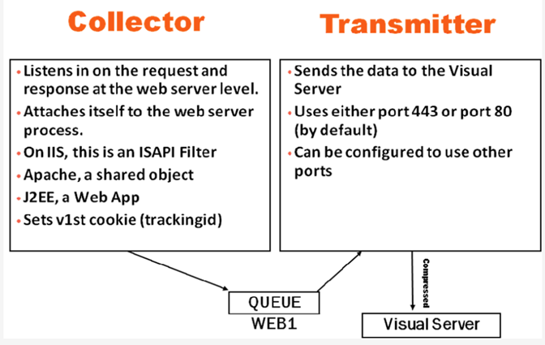

# 使用 Web 服务器的多个实例{#working-with-multiple-instances-of-a-web-server}

有关传感器在Web服务器上运行一个Web服务器实例的常规配置的信息。

在此方案中，单个Web服务器实例正在将数据写入内存映射的队列文件，该文件由发送器读取并发送到[!DNL data workbench server]。

在运行多个收集器实例的Web服务器上安装[!DNL Sensor]时，可以通过以下两种方式之一对其进行配置：

* 您可以让所有收集器模块共享一个队列文件。

   使用单个队列文件时，管理、配置和管理会因为体系结构本身不那么复杂而有所简化。 但是，使用单个队列文件时，整个Web服务器（无论实例数如何）均被标识为WEB1。

* 您可以多次复制上述架构，并让每个Web服务器实例都有一个单独的队列文件。

   这样，您就可以唯一标识每个Web服务器实例。 换句话说，Web服务器的标识（以及[!DNL Sensor]配置中相应的传感器ID）是此配置的函数。

无论如何，数据仍包含所有主机名信息，以便您能够区分[!DNL www.client.com]、[!DNL www2.client.com]等。 正确的配置取决于分析目标以及分析人员是否需要根据Web服务器上运行的特定实例对数据进行分段。

>[!NOTE]
>
>此类分段通常仅用于操作分析，在该区域之外没有太多实际用途。
