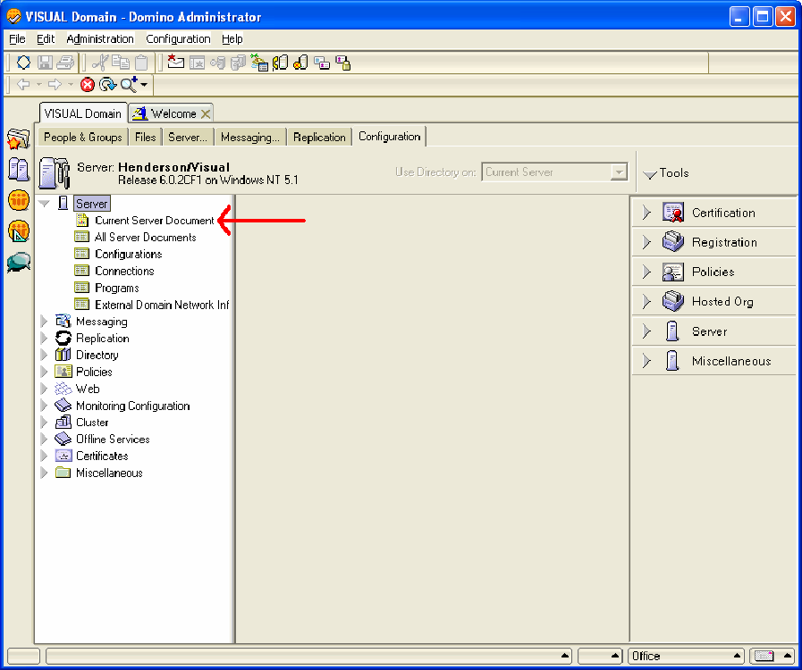
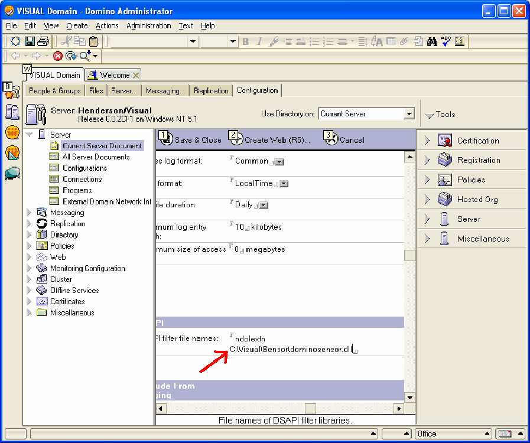

# Windows Server 2000 或更高版本上的 Lotus Domino Server{#lotus-domino-server-on-windows-server-or-later}

{{eol}}

有关如何安装和配置在Microsoft Windows Server 2000或更高版本下运行的适用于Windows 3.1或更高版本的Lotus Domino Server 6传感器的说明。

传感器的程序文件打包在从Adobe下载站点获取的安装文件中。 如果您还没有特定Web服务器的传感器安装文件，请先下载它(或从Adobe代表处获取它)，然后再开始执行以下步骤。

要安装和配置传感器，必须执行以下步骤：

## 安装程序文件 {#section-2f3e85083b4f4aa989a85997330e86ae}

1. 在Lotus Domino计算机上，创建一个目录以安装传感器程序文件。 请记住，磁盘队列也位于此目录中，因此请确保您选择的设备有足够的空间容纳所需大小的队列。

   ```
   C:\VisualSensor
   ```

1. 将安装文件的内容解压到Lotus Domino目录中。 在此步骤中，传感器安装以下文件：

<table id="table_ABFF5F92271B4F3CB0AC68DAB6A5709F"> 
 <thead> 
  <tr> 
   <th colname="col1" class="entry"> 文件 </th> 
   <th colname="col2" class="entry"> 描述 </th> 
  </tr> 
 </thead>
 <tbody> 
  <tr> 
   <td colname="col1"> EventMessages.dll </td> 
   <td colname="col2"> 事件查看器消息 </td> 
  </tr> 
  <tr> 
   <td colname="col1"> stchatlog.dll </td> 
   <td colname="col2"> 收集器模块 </td> 
  </tr> 
  <tr> 
   <td colname="col1"> <p>TestExperiment.xls </p> </td> 
   <td colname="col2"> <p>一种Excel电子表格文件，架构师可以使用它配置对照实验 </p> <p>传感器不使用此文件。 </p> </td> 
  </tr> 
  <tr> 
   <td colname="col1"> trust_ca_cert.pem </td> 
   <td colname="col2"> 用于验证Insight Server在连接过程中显示的数字证书的证书 </td> 
  </tr> 
  <tr> 
   <td colname="col1"> TXLog.exe </td> 
   <td colname="col2"> 发射机程序 </td> 
  </tr> 
  <tr> 
   <td colname="col1"> <p>txlogd.conf </p> </td> 
   <td colname="col2"> 传感器配置文件 </td> 
  </tr> 
 </tbody> 
</table>

>[!NOTE]
>
>安装包包含一个名为TestExperience.xls的电子表格文件。 此电子表格是一种用于架构师配置受控实验的工具。 传感器本身不使用此文件，因此不必在运行传感器的计算机上安装该文件（尽管您可以选择这样做）。 您可能希望将文件复制到架构师可以访问的位置，或者根据需要从安装包中提取文件。 有关对照实验的更多信息，请参阅《Insight对照实验指南》。

## 配置Lotus Domino Server {#section-2e2f1875a5304cdfa2cbcd0680683cfd}

配置Lotus Domino Server的步骤。

1. 登录到Lotus Domino Administrator ，然后单击 **[!UICONTROL Domain]**.

   

1. 在Lotus Domino Administrator中，单击 **[!UICONTROL Configuration]**.

   

1. 展开服务器节点并单击 **[!UICONTROL Current Server Document]**.

   

1. 单击 **[!UICONTROL Current Server Document]**，然后单击 **[!UICONTROL Internet Protocols]**。

   

1. 在HTTP选项卡的DSAPI部分下，双击单词后面的 [!DNL ndolextn].

   

1. 按 **[!UICONTROL Enter]** 并键入 [!DNL dominosensor.dll] 文件。

   

1. 单击 **[!UICONTROL Save & Close]**。

   

## 编辑传感器配置文件 {#section-de0eb4a646394b61abb6cd5a2b706de0}

txlogd.conf文件包含传感器的配置参数。

您必须编辑此文件以指定磁盘队列文件的大小和位置、 Insight Server的地址以及将附加到此传感器生成的事件数据的ID等内容。

配置文件包含必需的参数和可选参数。

* **必需的参数** 是安装传感器时必须指定的设置。 如果没有这些设置，传感器将无法成功运行。
* **可选参数** 是默认设置，用于预定义值（您可以对其进行修改）或启用可选功能。

**编辑传感器配置文件**

* 打开 `<Sensor directory>/txlogd.conf` 文件，并设置所需的参数以及任何所需的可选参数。
* 保存并关闭该文件。

## 启动发送器并创建磁盘队列 {#section-55630de65f264274aefd771da2002852}

配置txlogd.conf文件后，可以启动发送器程序，将其注册为Windows服务，然后创建磁盘队列。

1. 从Windows的“开始”菜单中，选择 **附件** > **命令提示符**.

1. 在命令提示符窗口中，导航到安装传感器的目录并执行以下命令：

   ```
   txlog /regserver
   ```

   此命令启动发送器，创建磁盘队列，并将传感器注册为Windows服务。

1. 要确认发送器运行正确，请单击 **开始>控制面板>管理工具>服务**.

   >[!NOTE]
   >
   >此命令序列可能因您使用的Windows版本而异。

   1. 在服务列表中，找到传感器的条目，并确认其状态为“已启动”且其启动类型为“自动”。
   1. 关闭“服务”控制面板。

1. 要检查发送器在启动过程中是否遇到任何错误，请单击开始>控制面板>管理工具>事件查看器以打开事件查看器。

   >[!NOTE]
   >
   >此命令序列可能因您使用的Windows版本而异。

   1. 在事件查看器窗口的左窗格中，选择应用程序日志。
   1. 在右侧窗格中，查找“源”列中包含“Adobe”的事件。
   1. 如果从“Adobe”中找到错误，请双击该错误以显示“事件属性”窗口。 此窗口提供有关错误的详细信息。

1. 检查完应用程序日志后，关闭事件查看器。
1. 验证发送器是否已创建磁盘队列( [!DNL Diskq2000.log])，并且其大小与您在 [!DNL QueueSize] 参数 [!DNL txlogd.conf] 文件。

   如果队列未正确创建：

   1. 检查txtlogd.conf文件，并验证QueueSize参数是否已正确设置。
   1. 检查安装传感器的设备是否有足够的空间来存放QueueSize参数中指定大小的文件。
   1. 在Windows中使用“服务”控制面板，停止发送器。
   1. 删除队列文件。
   1. 将传感器重新注册为Windows服务：从Windows的“开始”菜单中，选择“附件”>“命令提示符”。 在命令提示符窗口中，导航到安装传感器的目录并执行以下命令：

      ```
      txlog /regserver
      ```

      发射机设计为连续运行。 如果重新启动计算机，则发送器会自动重新启动。 如果需要手动启动和停止发送器，可以使用Windows中的“服务”控制面板执行此操作。
