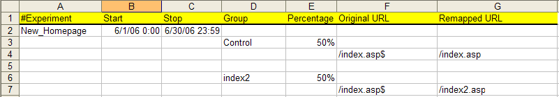
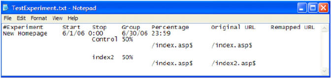

# 配置和部署试验{#configuring-and-deploying-the-experiment}

定义目标、假设和实验详细信息并创建测试内容后，必须配置“传感器”以部署受控实验。

## 配置实验配置文件 {#section-037fe7dea9c94aee9cdc354dafdb7c03}

要配置实验，必须完成由Adobe提供的实验配置电子表格(名为 [!DNL TestExperiment.xls] )。 此文件配置 [!DNL Sensor] 要执行实验，它是您在 [修改ExpFile参数](../../../home/c-undst-ctrld-exp/t-en-ctrld-exp/c-mod-expfile-prm.md#concept-25232b386a654870becc789d4f1fcc28).

此文件可以包含有关多个实验的信息，这些实验可以在同一时间或不同时间运行，并使用不同的组和百分比，但这些实验不会以任何方式关联。

对于文件中列出的每个实验，用户将被放入一个组中，该文件配置为当前正在运行。

>[!NOTE]
>
>每个实验都与所有其他实验无关。 对一个实验所做的更改不会影响任何其他实验，并且尽管访客可能在多个实验中，但结果不会彼此关联。 如果您认为多个实验中的更改之间存在关联，则必须创建一个可一起测试这些更改的新实验。

**配置实验**

您应该在实验开始之前完成此文件，而不是在实验运行时修改信息。

>[!NOTE]
>
>如果实验开始后实验的定义发生变化，任何实验都会立即失效。

1. 如果您拥有Web或应用程序服务器的管理员访问权限，请导航到 [!DNL Sensor] 任何 [!DNL Sensor] web群集中的计算机以访问 [!DNL TestExperiment.xls] 文件。 如果您没有管理员访问权限，请联系您的Adobe客户经理以请求 [!DNL TestExperiment.xls] 文件。

1. 打开 [!DNL TestExperiment.xls] 文件（如果需要，可以重命名此文件）并完成以下字段：

<table id="table_FDD6AE631C614F97AD7AE8829E53CCAC"> 
 <thead> 
  <tr> 
   <th colname="col1" class="entry"> 字段 </th> 
   <th colname="col2" class="entry"> 描述 </th> 
  </tr> 
 </thead>
 <tbody> 
  <tr> 
   <td colname="col1"> 试验 </td> 
   <td colname="col2"> 
实验的描述性名称。 每个实验名称必须唯一，且不能包含空格。 
 
在  Insight . 这些名称显示为受控实验维度中元素名称的前半部分。 元素名称的后半部分是此文件中Group字段中的组名称。 每个组的命名格式如下：使用实验名称后跟组名称： 
 
<i>ExperienceName.Group Name</i> 
 
例如：  New_Homepage.Control  
 </td> 
  </tr> 
  <tr> 
   <td colname="col1"> 开始 </td> 
   <td colname="col2"> 
您希望开始实验的日期和时间。 如果不输入值，则实验将在文件部署后立即开始。 
 
格式：MM/DD/YYYY H:MM 
 
    <ul id="ul_FB8B50C688584683AC2226FCBED40AF9"> 
     <li id="li_223EF962CFC64454965444E66284F670">如果将开始时间和停止时间留空，则实验将无限期地运行。 </li> 
     <li id="li_0544C9A98635418CAECD85B67F345772">您可以提前预定义开始和停止时间；因此，您可以根据需要同时配置下一年的所有实验。 </li> 
     <li id="li_BDFBB74B1D134E57B37DC5C3457AA1A9">启动和停止时间基于Web服务器的系统时间。 如果时钟因任何原因而发生更改，您的实验可能会意外地开始或停止。 </li> 
     <li id="li_3295FE5B2AC64B6CA90CC7F31B808EB9">如果希望将实验添加为配置文件条目，但不希望该实验在不久的将来运行，则可以使用数字符号“#”注释掉实验信息，或定义过去的开始和停止时间。 </li> 
    </ul> </td> 
  </tr> 
  <tr> 
   <td colname="col1"> Stop </td> 
   <td colname="col2"> 
您希望实验结束的日期和时间。 当停止日期和时间发生时，  传感器  将停止向测试URI发送标识为测试组的Cookie值，并将所有Cookie发送到控制组URI。 
 
格式：MM/DD/YYYY H:MM 
 
请参阅  开始  字段。 
 </td> 
  </tr> 
  <tr> 
   <td colname="col1"> 群组 </td> 
   <td colname="col2"> 
实验中每组访客的描述性名称。 组名称不能包含空格。 
 
在中显示实验结果时，会使用组名称  Insight . 有关更多信息，请参阅实验字段说明。 
 
控制组可以根据在“百分比”字段中输入的值隐式或显式定义。 
 
 
注意：要满足在定义的时间段内需要的访客数量，以便实验在统计上有效，您可能需要降低置信水平或增加时间段。 例如，如果您的时间范围为5天，置信水平为98%，并且所需访客数量超过了该时间段的预期数量，则您需要增加时间段或降低置信水平，直到预期访客数量超过运行统计有效实验所需的数量为止。 
 
 </td> 
  </tr> 
  <tr> 
   <td colname="col1"> 百分比 </td> 
   <td colname="col2"> 
要包含在每个定义群组中的网站访客百分比。 这些值可以以百分比或小数值表示。 此外，这两个值必须大于或小于1。 
 
例如： 
 
33.3%和66.7% 
 
.99和。01 
 
如果所有组的总和小于100，则未定义的超额将默认为控制组。 
 </td> 
  </tr> 
  <tr> 
   <td colname="col1"> 原始URL </td> 
   <td colname="col2"> 
要重新映射的内容的URI，后跟$。 此值区分大小写。 
 
格式：index.asp$ 
 
可以使用URI末尾的美元符号($)指定原始URI，以表示需要与文件名完全匹配。 例如，表达式  /product/product_view.asp$  仅与该确切页面匹配，而  /product  与  /product  目录和可用于重新映射整个子树。 实验将忽略未在文件名末尾指定$字符的原始URL条目，除非已将ExpPartialMatch参数设置为“on”。 有关此参数的更多信息，请参阅 <a href="../../../home/c-undst-ctrld-exp/t-en-ctrld-exp/c-mod-expplmth-prm.md#concept-9c817c4c49b74287b0f70d6a1a37655e"> 修改ExpPartialMatch参数（可选） </a>. 
 
受控实验功能忽略附加到URI主干的任何查询字符串。 例如，页面 
 
  /product/product_view.asp?productid=53982  不是有效的URI，但页面  /product/product_view.asp  是有效的URI。 
 </td> 
  </tr> 
  <tr> 
   <td colname="col1"> 重新映射的URL </td> 
   <td colname="col2"> 
替代内容的URI。 
 
格式：index2.asp 
 
请参阅“原始URL”字段的注释。 
 </td> 
  </tr> 
 </tbody> 
</table>

以下是已完成的示例 [!DNL TextExperiment.xls] 电子表格：

>[!NOTE]
>
>请勿修改电子表格中的列位置。

此示例表示“New_Homepage”实验从2006年6月1日开始，从2006年6月30日结束，其中包含一个控制组，其中50%的访客和一个测试组，其中50%的访客对一个URI看到不同的内容。

>[!NOTE]
>
>尽管上述样例文件定义了明确的控制组，但是不必明确定义控制组 — 实验会自动创建控制组。 如果实验中所有组的百分比总和小于100%，则会向不属于显式组的用户分配隐式控制组。

1. 要插入注释以提供有关特定实验的其他信息，请在单元格的开头处添加数字符号(#)，然后在单元格后面添加您的注释。 注释可以插入文件中的任意位置。
1. 在实验配置电子表格中完成变量后，保存更改，然后以制表符分隔的文本格式( [!DNL *.txt])使用您在 [!DNL Sensor] 配置文件。 请参阅 [修改ExpFile参数](../../../home/c-undst-ctrld-exp/t-en-ctrld-exp/c-mod-expfile-prm.md#concept-25232b386a654870becc789d4f1fcc28).

   以下是实验配置文本文件的示例：

   

   >[!NOTE]
   >
   >由于此文件中需要使用选项卡，因此请勿手动编辑实验配置文本文件。 如果需要更改文件，请在实验配置Excel文件中进行更改，然后将文件重新保存为以制表符分隔的文本文件。

如果已定义“开始”和“停止”时间，则没有理由从实验配置文件中删除实验。 保留实验配置文件中列出的所有实验实际上是记录每个实验的定义方式的好方法。

## 部署配置文件和测试内容 {#section-34ff29649f584b93bc6129b75084b37c}

必须将实验配置文件部署到Web群集中运行 [!DNL Sensor] 并为实验中涉及的页面提供服务。 您可以使用手动过程或现有的内容管理系统来执行此操作。

**部署测试内容**

* 在运行 [!DNL Sensor] 用于提供实验中涉及的页面的测试内容，请使用现有的发布流程将测试内容部署到相应的位置。

   例如，如果要发布测试组页面 [!DNL index2.asp] 到您网站的测试文件夹( [!DNL mysite.com])，您会将文件发布到 [!DNL www.mysite.com/test].

   >[!NOTE]
   >
   >请勿直接从您网站上的页面链接到任何测试文件。 这样会使测试结果和索引得分失效。

**部署实验**

* 在运行 [!DNL Sensor] 为实验中涉及的页面提供服务的，请将实验配置文本文件放置在ExpFile参数中指定的目录中 [!DNL Sensor] 配置文件。 请参阅 [修改ExpFile参数](../../../home/c-undst-ctrld-exp/t-en-ctrld-exp/c-mod-expfile-prm.md#concept-25232b386a654870becc789d4f1fcc28).

[!DNL Sensor] 根据您在文件中定义的百分比随机选择每个组的网站访客，并酌情向他们提供测试或控制组内容。
