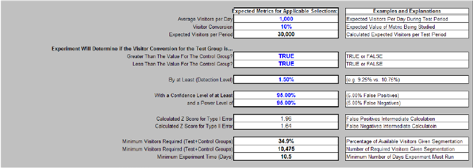

# 实验设计电子表格{#experiment-design-spreadsheet}

此文件不仅用作工作表，还用作您有关实验的决策的记录。

如果您在设计实验时需要帮助，可以使用Adobe提供的实验设计电子表格（默认情况下名为VS Controlled Experience Design.xls）。

仅当所述量度被定义为满足某些条件的访客的百分比时，实验设计电子表格才能提供有用的统计推断。 也就是说，只有测试基于访客的量度假设验证时，它才有用。

**使用实验设计文件设计实验**

1. 如果您对Web或应用程序服务器具有管理员访问权限，请导览至Web群集中任何[!DNL Sensor]计算机上的[!DNL Sensor]安装文件夹。 如果您没有管理员访问权限，请与您的Adobe客户经理联系以请求文件。
1. 打开VS Controlled Experience Design.xls文件。 （如果需要，可以重命名此文件。）

   以下页面上的电子表格是准备测试本指南中使用的示例假设验证时如何完成电子表格的示例。

   

   

   

1. 在此文件中，以蓝色输入所有字段的文本或值，下表中对这些字段进行了说明。 计算的字段在第二个表中定义。

<table id="table_C343F7A4BF3D4E0E9A5E9739EC7C2E10"> 
 <thead> 
  <tr> 
   <th colname="col1" class="entry"> 在这个领域…… </th> 
   <th colname="col2" class="entry"> 在“管理工具”中指定分类的 </th> 
  </tr> 
 </thead>
 <tbody> 
  <tr> 
   <td colname="col1"> 实验标题 </td> 
   <td colname="col2"> 实验的描述性名称。 </td> 
  </tr> 
  <tr> 
   <td colname="col1"> 实验说明 </td> 
   <td colname="col2"> 实验的文本描述。 </td> 
  </tr> 
  <tr> 
   <td colname="col1"> 正在研究的量度 </td> 
   <td colname="col2"> 
实验所基于的度量的名称。 
 
示例：访客转换 
 </td> 
  </tr> 
  <tr> 
   <td colname="col1"> 量度定义 </td> 
   <td colname="col2"> 
实验所基于的度量的定义。 
 
格式：访客[X]/访客 
 
示例：访客[URI='conversionpage.asp']/访客
 </td> 
  </tr> 
  <tr> 
   <td colname="col1"> 预期开始时间 </td> 
   <td colname="col2"> 希望实验开始的日期和时间。 </td> 
  </tr> 
  <tr> 
   <td colname="col1"> 预期结束时间 </td> 
   <td colname="col2"> 希望实验结束的日期和时间。 </td> 
  </tr> 
  <tr> 
   <td colname="col1"> 适用选择 </td> 
   <td colname="col2"> （可选）要进一步细分数据集的维度名称和元素集或范围。 </td> 
  </tr> 
  <tr> 
   <td colname="col1"> 实验URI </td> 
   <td colname="col2"> 您的假设验证中涉及的URI。 您为对照组定义当前URI以及为测试组创建或将创建的替代URI。 </td> 
  </tr> 
  <tr> 
   <td colname="col1"> 应用程序选择的预期量度 </td> 
   <td colname="col2"> 您期望网站的量度值标题。 </td> 
  </tr> 
  <tr> 
   <td colname="col1"> 每天平均访客 </td> 
   <td colname="col2"> 每天访问网站的平均访客数。 </td> 
  </tr> 
  <tr> 
   <td colname="col1"> 访客转换 </td> 
   <td colname="col2"> 网站的平均访客转化率。 </td> 
  </tr> 
  <tr> 
   <td colname="col1"> 实验将确定测试组的量度名称是否为…… </td> 
   <td colname="col2"> 如何比较量度值的标题。 </td> 
  </tr> 
  <tr> 
   <td colname="col1"> 大于对照组的值？ </td> 
   <td colname="col2"> 如果希望能够得出测试组的量度在实验期间增加的结论，请将此字段设置为True。 将此字段设置为False可减少得出结论所需的访客数。 Adobe建议您将其设置为True。 </td> 
  </tr> 
  <tr> 
   <td colname="col1"> 小于对照组的值？ </td> 
   <td colname="col2"> 如果希望能够得出测试组的量度在实验期间下降的结论，请将此字段设置为True。 Adobe建议您将其设置为True。 </td> 
  </tr> 
  <tr> 
   <td colname="col1"> 至少（检测级别） </td> 
   <td colname="col2"> 您希望测试组的量度高于或低于对照组的量度的百分比。 </td> 
  </tr> 
  <tr> 
   <td colname="col1"> 至少具有 </td> 
   <td colname="col2"> 测试组值所需的置信度级别。 置信度确定误报数以测量所述期望为真的概率。 </td> 
  </tr> 
  <tr> 
   <td colname="col1"> 以及 </td> 
   <td colname="col2"> 测试组值所需的功率电平。 电源级别确定错误负数的数量。 </td> 
  </tr> 
  <tr> 
   <td colname="col1"> 访客 </td> 
   <td colname="col2"> 访客值百分比的标题。 </td> 
  </tr> 
  <tr> 
   <td colname="col1"> 测试组 </td> 
   <td colname="col2"> 要包含在测试组中的访客百分比。 您可以播放此数字，直到“访客”部分的“合计”（通常为100%）字段中的值等于或大于“最小要求访客”(“测试+对照组”)字段中的值，下表对这两个字段进行了说明。 </td> 
  </tr> 
  <tr> 
   <td colname="col1"> 对照组 </td> 
   <td colname="col2"> 要包含在访客中的对照组百分比。 </td> 
  </tr> 
  <tr> 
   <td colname="col1"> 其他设计说明 </td> 
   <td colname="col2"> 要保存以供将来参考的任何注释。 </td> 
  </tr> 
 </tbody> 
</table>

其余字段将根据您输入的值计算，并在下表中进行说明。

| 字段 | 描述 |
|---|---|
| 应用程序选择的预期量度 | 您期望网站的量度值标题。 |
| 每期预期访客 | 此字段通常由电子表格自动计算。 它基于以下假设：在大多数日子里，网站接收的新访客比返回访客多得多。 如果不是这样，则此单元格的计算应被实验期间预期的实际访客数覆盖。 |
| I类错误的计算Z得分 | 假阳性结果的Z得分。 这是一个中间统计计算。 |
| 计算II类错误的Z得分 | 假负结果的Z得分。 这是一个中间统计计算。 |
| 最低访客(测试+对照组) | 达到指定置信度、功率级别和Z得分所需的最小访客数，以“每期预期访客数”字段中值的百分比表示。 |
| 最低访客(测试+对照组) | 达到指定的置信度、功率级别和Z得分所需的最小访客数。 此值必须小于或等于“访客”部分“总值（通常为100%）”字段中的值。 |
| 最小实验时间（天） | 运行实验以达到指定置信度、电源级别和Z得分所需的最少天数。 此计算数量受与“每个期间的预期访客数”字段中讨论的问题相同的影响。 对于具有许多返回访客的网站，“最小实验时间（天数）”字段是查看与“最小访客要求”字段中的值相等的多个唯一访客所需的预期天数。 |
| 访客 | 访客值的标题。 |
| 测试组 | 测试组中需要的访客数。 |
| 对照组 | 对照组中需要的访客数。 |
| 总计（通常为100%） | 实验所需的访客总数。 此值必须等于或大于“需要的最小访客(测试+对照组)”字段中的值。 |
| 测试组准确性(在目标置信度级别) | 百分比表示有可能等于指定置信度级别，即为测试组计算的量度的测量值将在其真实值的此百分比内。 |
| 对照组准确性(在目标置信度级别) | 百分比表示有可能等于指定的置信度级别，即为对照组计算的量度的测量值将在其实际值的这个百分比内。 |
| Z得分(按目标准确度) | 给定值的标准偏差数与测试平均值。 |
| 实际置信度级别(目标间隔) | 实验的置信度。 置信度测量所述期望为真的概率。 |
| 实际间隔(目标置信度级别) | 为实验实现的置信区间，它提供可能包括未知种群参数的估计值范围。 此范围从一组给定的样本数据中计算。 |

您需要查看“需要的最小访客(测试+对照组)”字段中的值。..

并将其与[!DNL Visitors]列的“总计”字段中的值进行比较。

要使您的实验在统计上有效，“总计（通常为100%）”字段中的值必须等于或大于“最小要求访客(测试+对照组)”字段中的值。

根据提供的输入，示例工作表显示，有10,475名访客需要参与此实验，才能达到输入的95%置信度（这是任何受控实验的建议置信度最低值，但您可以增加此数量）。 目前设计的实验包括3万个访客，远远超过了所需的最低访客数。

如果保持相同的天数，则只要访客总数继续达到或超过所需的最小值，您就可以提高置信度。

1. 保存记录的文件，然后使用文件中的信息使用实验配置电子表格配置实验。 有关此电子表格的详细信息，请参阅[配置和部署实验](../../home/c-undst-ctrld-exp/t-crt-ctrld-exp/c-cnfg-dply-exp.md#concept-50f1de0242904698937bb72b3ea1b429)。
