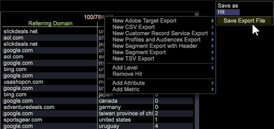

# Data Workbench与Adobe Target集成

Adobe Data Workbench与Adobe Target的集成更轻松，可借助Data Workbench功能导出数据段并自动填充导出文件。

Adobe Data Workbench提供与Adobe Target的闭环集成，用于共享数据和生成报表。 在Data Workbench中，您可以使用所有可用数据分析人群，以找到有意义的细分，包括通过电话、商店等渠道进行离线转换。

例如，访客在您的网站上查找鞋子，但不会进行转换。 相反，访客下载了下次购买的20%的优惠券，然后在您的商店购买一件衬衫。 使用Data Workbench，您可以收集该数据，然后将该配置文件数据推回Target，以显示访客离线购买了衬衫。 然后，您可以定位为该访客提供领带的营销活动，通常情况下，Target可能会尝试向该访客重新营销鞋。

## 使用Adobe Target设置数据工作台

1. 右键单击窗口中的标 [!UICONTROL Detail Table] 题。

   

1. 选 **[!UICONTROL New Target Export]** 择并在菜单中的命令下输入新导 **[!UICONTROL Save As]** 出文件的名称。

1. 单击 **[!UICONTROL Save Export File]**.

   此时将打开导出模板窗口。

   所有Adobe Target信息都会自动填充。 它会根据您在区段导出中输入的内容生成参数列表。 完成后，Data Workbench会将数据发送到Adobe Target服务器。

   **注意：** 模板文件应由配置 [!UICONTROL Profile Architect]。 需 [!UICONTROL Client Name]要输 [!UICONTROL Domain Postfix]入、 [!UICONTROL Mbox Host]和 [!UICONTROL Mbox Name] 等。 如果您有多个站点，则填写多个模板并将其保存到服务器。 Profile Manager中的模板位于 `Context\FileNew\Detail Table\Export\Copy`。

   

1. 指定查 [!UICONTROL mboxPC] 询参数。

   如果Data Workbench属性的名称不是其他名称，则必须编辑相应的“查询参数” [!UICONTROL mboxPC]，并将其重命名为 _mboxPC_。

   

   将导出文件保存到服务器后，将开始导出。 完成后，应用 [!UICONTROL TnTSend.exe] 程序将启动并开始向Target帐户发送数据。

## 为Target配置Data Workbench

在Adobe Target中完成以下任务：

Data Workbench正在将用户配置文件传递到Adobe Target。 要配置导出到Target，您需要设置并启用其API，并为导出配 **[!UICONTROL clientname]** 置文 **[!UICONTROL domain postfix]** 件()提供和参数`export.cfg`。

为区段导出文件添 **[!UICONTROL Oneshot]** 加了一个名为的新布尔选项。 此选项包含在随新配置文件分发的模板文件中。 如 [!UICONTROL Oneshot] 果设置为 _true_，则在导出完成后 `.export` ，文件将重命名为， `.export.done-TIMESTAMP` 以确保区段不会多次导出。 这在导出到Adobe Target时很重要。

**注意：** 从Data Workbench到Adobe Target的调用计为调用，每 [!UICONTROL mbox] 个发送的配置文件都需要一次调用。 因此，如果两个解决方案之间需要多次呼叫，成本就会增加。

配置不完整会在日志中生成以下错误消息：

```
TNT-040615-133212-Adobe-Target-Product-Test.log:
TnT Configuration left out these empty fields:
ClientName,MboxHost,MboxName
```

## 为Data Workbench配置Adobe Target

在Adobe Target中，客户发送个人资料数据不需要特殊配置。 用户的配置文件信息通常在常规请求中传递，而服 [!UICONTROL mbox] 务器会将配置文件参数作为标准功能提供给目标营销活动设置，而无需进行任何其他设置。

Adobe Target中内置了Data Workbench集成，可从“超级用户客户端详细信息”页面启用该集成。 启用此选项后，将会显示从Adobe Target中的Data Workbench共享的区段，以使其可用于定位。

## 在ExportIntegration.exe中设置HTTP日志报告

使用导出Adobe Target集 [!UICONTROL HTTP.log] 成文件 [!UICONTROL ExportIntegration.exe] 时，可缩短报告时间。

新的配 [!UICONTROL httpLoggingEI.cfg] 置文件(位于 `server\Admin\Export\httpLoggingEI.cfg`)可让您减少在使用导出数据时对文件进行 [!UICONTROL HTTP.log] 的详细记录 [!UICONTROL ExportIntegration.exe]。 这允许您停止详细的请求／响应记录。

文件中已捕获详细记 [!UICONTROL TnTSend.log] 录。

_True_ 设置详细记录， _False_ 停止对文件进行详细记 [!UICONTROL HTTP.log] 录。

在“False”设置中，只有一条警告消息将发送到该 [!UICONTROL HTTP.log] 文件（未发送信息内容）。