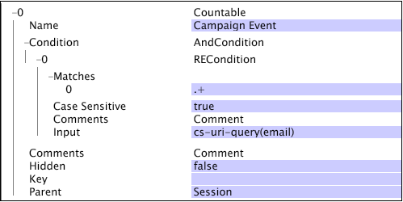

# 模式设计可数结构{#schema-design-countable-structures}

Dataworkbench(DWB)中用于设计和实施模式的可数表说明。

## 了解数据工作台中的可计数 {#section-6e6b8d1c17634d669e62c91a80a0bc62}

最高级别是可计数维。 可数维具有两个主要功能。 首先，它们是要计算其元素的维。 换句话说，可数者回答如下问题：

* 有多少访客访问过您的主页？

* Google.com访问了多少次？

`<discoiqbr>`可计数维度通常用于创建求和量度，这些量度会返回维度的所有元素计数或总和。您可以定义可计数维度来统计实例（如预订或产品订单数目）。例如，您可以定义可计数维度订单，其元素（与在线商店的订单对应的日志条目）可以被计数。 如果要在可视化中显示订单计数，您应定义订单总和量度，该量度可以在某个维上评估，也可以应用过滤器。

可数维度可以是其他维度的父维度，也可以是其他可数维度的子维度。

尽管根可计数维度不必与数据中的跟踪ID关联，但Adobe建议您配置数据集的根可计数维度，以使用跟踪ID字段(x-trackingid)作为其密钥。 这样，根可计数维度的每个元素都将与 x-trackingid 的唯一值相关联，并且有关每个元素的所有数据都会分到一组。

可计数维度由以下参数定义：

<table id="table_5E00B72CFDD645368ADCC25AB9B5E53D"> 
 <thead> 
  <tr> 
   <th colname="col1" class="entry"> 参数 </th> 
   <th colname="col2" class="entry"> 描述 </th> 
   <th colname="col3" class="entry"> 默认 </th> 
  </tr>
 </thead>
 <tbody> 
  <tr> 
   <td colname="col1"> 名称 </td> 
   <td colname="col2"> 向 Data Workbench 中的用户显示的描述性维度名称。维度名称不能包含连字符 (-)。 </td> 
   <td colname="col3"> </td> 
  </tr> 
  <tr> 
   <td colname="col1"> 
Comments（备注） 
 </td> 
   <td colname="col2"> 
可选。有关扩展维度的说明。

    &lt;/p> &lt;/td>
<td colname="col3"> </td> 
  </tr> 
  <tr> 
   <td colname="col1"> 
Condition（条件） 
 </td> 
   <td colname="col2"> 
输入字段可用于创建可计数维度的条件。如果指定，则会有一个条件限制可向数据集架构中的维度及其所有子项显示的日志条目集。 
 </td> 
   <td colname="col3"> </td> 
  </tr> 
  <tr> 
   <td colname="col1"> Hidden（隐藏） </td> 
   <td colname="col2"> 确定维度是否显示在 Data Workbench 界面中。默认情况下，此参数设为 false。例如，如果维度仅用作量度的基础，则可以将此参数设为 true，以在 Data Workbench 显示中隐藏维度。 </td> 
   <td colname="col3"> false </td> 
  </tr> 
  <tr> 
   <td colname="col1"> 键 </td> 
   <td colname="col2"> 
可选。用作键的字段名称。如果您定义此参数，则对于可计数维度的父项元素与指定为键的字段不同值的每个组合，可计数维度都将存在一个对应的元素。 
 
可计数维度的每个元素都需要与一组连续的日志条目相关联。因此，如果日志条目没有按照键进行排序，则每次键字段更改时，都会为可计数维度创建一个元素。为了防止出现这种情况，Adobe 建议您使用按时间顺序连续的唯一键。 
 </td> 
   <td colname="col3"> </td> 
  </tr> 
  <tr> 
   <td colname="col1"> Parent（父项） </td> 
   <td colname="col2"> 
 父维度的名称。任何可计数维度都可以是父维度。若要使维度成为数据集架构中的顶级维度，请将该参数设为“根”。已定义的维度将成为数据集的根可计数维度。例如，如果您使用 Site，则“访客”维度就是数据集的根可计数维度。 
 
注意：尽管根可计数维度不必与数据中的跟踪 ID 相关联，但 Adobe 建议您将数据集的根可计数维度配置为使用跟踪 ID 字段 (x-trackingid) 作为其“键”。这样，根可计数维度的每个元素都将与 x-trackingid 的唯一值相关联，并且有关每个元素的所有数据都会分到一组。如果您想要以不同的方式配置数据集，请联系 Adobe。 
 </td> 
   <td colname="col3"> </td> 
  </tr> 
 </tbody> 
</table>

此示例使用从网站流量收集的事件数据说明对可计数维度的定义。可计数维度会统计指定会话中的 Web 营销活动事件。假定所有电子邮件营销活动资源都通过将“email=”作为 cs-uri-query 的一部分从 Web 服务器请求。在该示例中，主要关注的是访客在指定会话期间响应电子邮件营销活动的次数，而不是 cs-uri-query(email) 字段的实际值。

可数表的第二个主要功能是它们构成了数据集模式结构的支柱。 您的数据模式和所有其他维都将组织到其下，并属于可数。 换句话说，如果我们将维视为“类别”，那么可数就是我们将这些“类别”组织成组的方式。
当维在可计数维下进行分组时，它们被认为位于可计数维的“级别”。 例如，在下图中，您可以看到“电子邮件地址”在访客级别，“浏览器”在访问级别。 “父项”和“子项”指可数与其下分组的维之间的关系。 例如，访客是电子邮件地址的“父项”。 相反，电子邮件地址是访客的“子级”。  

## 在数据工作台中创建可计数 {#section-491f3e8e4fbc429e95d6c97f012a208e}

执行以下步骤以在Dataworkbench中创建可计数：

1. 打开用户档案管理器
1. 在“转换”文件夹下，创建一个配置文件并在工作站中打开它。
1. 在“扩展维”下，右键单击并选择“添加新->可数”，如下所示： 

1. 输入新可数表的名称。 在以下示例中，定义了客户可数。 如果它是最高级可计数，则在父写入根中。 

   如果可数不是顶级1，则在父字段中指定父可数的名称。 在以下示例中，将创建“参与可计数”，此可计数的父代是“客户”。 

有关模式设计、可计数结构和离线数据馈送配置的Data Workbench体系结构的其他信息，请参阅 [数据集模式界面](https://docs.adobe.com/content/help/en/data-workbench/using/client/admin-ui/c-dtst-sch-intrf.html)。
