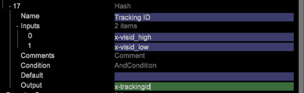

# 数据处理——构建主密钥{#data-processing-building-primary-key}

本节介绍如何为架构设计和实施的Data Workbench数据集创建主键（跟踪ID）。

## 了解跟踪ID {#section-24683031044a4af49988655ccb9a45fd}

在DWB（使用解码器）中读取和解码数据后，第一步是定义跟踪ID和时间戳。 跟踪ID是唯一标识客户记录的标识符。 它可以是源中的任何字段，如电子邮件ID、社交安全号码、Cookie ID，等等。 用作跟踪ID的字段由客户端在发现会话期间决定。 跟踪ID和时间戳是必填字段，必须为每个记录定义。

通常，对于在线数据，Cookie ID( *x-visid_high和* x-visid_low* *的组合)用作唯一客户标识的默认机制，但是，这可以根据客户的要求进行更改。 发生请求（或事件）的日期和时间是 *x-timestamp*。 DWB中的所有记录都按跟踪 *id分组* ，并按时间戳排序。 The Required Field [!DNL Definitions.cfg] file is a Log Processing Dataset Include file that defines the required fields : *x-trackingid* and *x-timestamp*.

注意：*x-trackingid *在DWB中是内置字段，此名称不应用于任何其他字段。

**示例1**:使 *用Cookie ID创建x-trackingid* （当仅使用在线数据时）

要在DWB中使用Cookie ID创建*x-trackingid *，请使用Hash函数在文件中创建 *x-trackingid*[!DNL foundation.cfg][!DNL foundation.cfg][!DNL Dataset > log processing] （在中定义跟踪ID是最佳做法，但可以在文件夹下的任何其他配置文件中定义跟踪ID），如下所示：

**示例2**:使 *用电子邮件ID* （联机和脱机数据均可用时）创建x-trackingid

假设脱机和联机数据都可用（在本例中），并且电子邮件ID在两个数据源中都可用。 由于电子邮件ID可唯一标识客户，因此将用于创建 *x-trackingid*。

使用Hash函数创建 *trackingId* ，如下所示：

