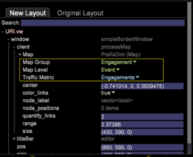

# 新架构的配置更改{#configuration-changes-for-new-schema}

{{eol}}

本文档介绍在新架构到位后如何更改所有默认Data Workbench配置。

## 了解数据集架构 {#section-2ffac5170c894781bc943565af7ad479}

Data Workbench集架构的基础由一组关键关系组成，这些关系构成了数据集Web分析架构的骨干。 在以下示例中，典型的Web分析架构提供了访客、访问和页面查看之间关系的概念。 

* 任何给定访客都可能有一次或多次访问。
* 任何给定的访问都只由一个访客生成。
* 任何给定的访问都可能包含一个或多个页面查看。
* 任何给定的页面查看都只属于一次访问。 `<discoiqbr>`

随着Web和商业世界的不断发展，Web和数据分析的需求也发生了变化。 网站最初是用来查看内容的地方。 现在，您可以查看内容；通过聊天、视频或提交以交互方式对应；购买产品；等等。 此外，企业现在希望将其Web数据与业务中的其他数据渠道相集成，以便更好地了解其业务整体。 例如，企业可能希望将其Web、呼叫中心、电子邮件、社交以及存储和客户数据集成在一起。 通过离线和在线渠道的这一集成，数据集架构在没有两个数据集架构相同的年份中发生了演变。

`<discoiqbr>`在集成线上和线下数据时，“访客”一词并不总是合适。 因此，有时会使用术语“customer”来代替访客。  

当您拥有来自多个数据源的数据时，“参与度”级别用于启用单个时间视图。 例如，假定您只有一个数据源：由您网站上的访客活动收集的电子商务数据。 在这种情况下，访问级别表示这些访客对您网站的访问。 请注意时间维度 — “日”、“周”、“月”等。  — 通常在“访问”级别捕获。

同样，“事件”级别也会显示参与期间发生的所有事件（页面查看、呼叫中心等）。 它整合了客户在参与期间的所有在线和离线事件。

## DWB中新的可计数结构 {#section-b77638ec04e4441cb51c56fd3d4abeb6}

新的架构结构取代了“按客户、按参与度和按事件点击的访客”。 

## 根据新数据集架构进行的配置更改 {#section-27135515be5c471ba2ee879d1ef4771f}

要将数据集架构从访客更改为客户，您需要更改以下配置文件：

1. 定义可计数和扩展维度的数据集文件夹下的所有配置文件。 

1. Dimension文件夹下的配置文件，其中“访客”、“访问”或“事件”用作“级别”。

   示例：Campaign.cfg文件。 在AdobeSC配置文件中，营销活动在访问级别定义。 

   以下示例介绍了将父架构从“访问”更改为“参与”的概念： 

1. 由于某些量度是由不可计数的量度派生或创建的，因此需要修改或创建“量度”文件夹下的配置文件。

   例如：创建新量度 [!DNL Customers.metric with formula = sum(one,customer)] 或作为Page Views.metric到 *定义* 在点击级别。 修改量度，然后将级别更改为“事件”而不是“点击”。

   Adobe在点击级别定义的SC页面查看量度： 

   `<discoiqbr>` `<discoiqbr>`根据新架构，页面查看次数量度如下所示： 

1. 更改 *order.txt* “量度”文件夹中的量度，以便它反映与客户、参与度和事件相关的新量度或已修改量度。

   Adobe *SC order.txt* 文件。 

   *Order.txt* 文件，但有新模式更改： 

1. 可视化文件夹下的所有配置文件(.vw)都应更改为引用新级别：客户、参与度和事件。 例如：2D流程图、3D流程图等

   AdobeSC在点击级别和访问组中为2D流程图定义了默认URI.vw，如下所示： 

   在URI.vw中为新架构进行的更改： 
