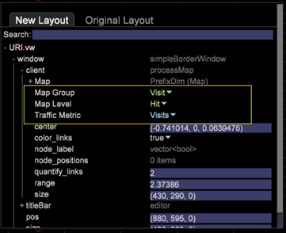

# 新架构的配置更改{#configuration-changes-for-new-schema}

本文档介绍了在新架构到位后如何更改所有默认的Data Workbench配置。

## 了解数据集架构 {#section-2ffac5170c894781bc943565af7ad479}

数据集架构的基础由构成Data Workbench Web分析架构骨干的一组关键关系组成。 在以下示例中，典型的Web分析架构提供了访客、访问和页面视图之间关系的概念。 

* 任何给定访客都可能有一次或多次访问。
* 任何给定访问只由一个访客生成。
* 任何给定的访问都可能包括一个或多个页面查看。
* 任何给定页面视图只属于一次访问。 `<discoiqbr>`

随着Web和商业世界的不断发展，Web和数据分析的需求也发生了变化。 网站最初是查看内容的场所。 现在，您可以查看内容；通过聊天、视频或提交以交互方式进行对应；购买产品；等等。 此外，企业现在希望将其Web数据与业务中的其他数据渠道相集成，以更好地了解其业务整体。 例如，企业可能希望将其Web、呼叫中心、电子邮件、社交、商店和客户数据整合在一起。 在线和线下渠道的集成下，数据集架构在没有两个数据集架构相同的年份中不断演变。

`<discoiqbr>`整合线上和线下数据时，“访客”一词并不总是合适。 因此，有时会使用术语“customer”代替访客。  

“参与”级别用于在您有来自多个数据源的数据时启用单个时间视图。 例如，假设您只有一个数据源：由网站上的访客活动收集的电子商务数据。 在这种情况下，“访问”级别指示这些访客对您网站的访问。 请注意，时间维度-“日”、“周”、“月”等。 -通常在“访问”级别捕获。

同样，“活动”级别也会显示参与过程中发生的所有活动（页面查看、呼叫中心等）。 它结合了客户参与过程中的所有线上和线下活动。

## DWB中新的可数结构 {#section-b77638ec04e4441cb51c56fd3d4abeb6}

新的架构结构替代了按客户、按参与和按事件访问的访客。 

## 根据新数据集架构的配置更改 {#section-27135515be5c471ba2ee879d1ef4771f}

要将数据集架构从访客更改为客户，您需要更改以下配置文件：

1. 数据集文件夹下定义可计数和扩展维度的所有配置文件。 

1. Dimension文件夹下的配置文件，其中“visitor”、“visit”或“event”用作级别。

   示例：Campaign.cfg文件。 在Adobe SC配置文件中，Campaign在访问级别定义。 

   以下示例介绍了从访问到参与的父架构更改的概念： 

1. 由于某些度量是派生或创建自可数表，因此需要修改或创建“度量”文件夹下的配置文件。

   例如：创建新量度 [!DNL Customers.metric with formula = sum(one,customer)] 或作为Page Views.metric，在 *点击级别* 定义它。 修改量度，然后将级别更改为“事件”而不是“点击”。

   在点击级别定义的Adobe SC页面查看次数： 

   `<discoiqbr>` 根 `<discoiqbr>`据新架构，以下将是页面查看量度： 

1. 更改 *metrics文件夹中的order.txt* ，使其反映与客户、参与和事件相关的新指标或已修改指标。

   Adobe *SC order.txt文件* 。 

   *Order.txt文件* （新架构更改）: 

1. Visualization文件夹下的所有配置文件(.vw)都应更改为引用新级别：客户、参与和活动。 例如：2D流程图、3D流程图等

   2D流程图的Adobe SC默认URI.vw在点击级别和访问组中定义，如下所示： 

   在URI.vw中对新架构所做的更改： 

