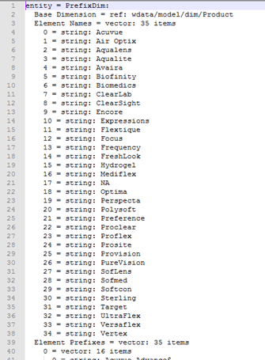
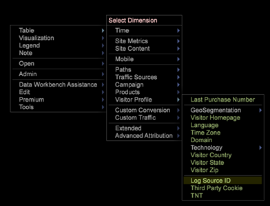
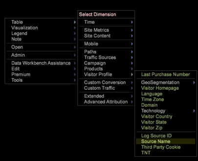

# 派生维度设置{#derived-dimensions-setup}

{{eol}}

派生（客户端）Dimension的不同类型以及如何在Data Workbench中设置这些类型。

## 派生Dimension的类型 {#section-33e6dcc9ab9745de9b830cecb2427ca3}

**量度Dimension**

量度Dimension允许您按特定级别对量度计数进行分组。 它还允许您按特定级别对量度计数进行分组。 创建量度Dimension后，您便可以根据量度值对数据进行分段。

示例1:您是一家旅游公司，您想了解您的常客和订票次数少于5次的客户之间网站上的行为活动差异，您该如何做？

您只有将“预订”计为一个量度，如何根据量度（此处为预订）对客户进行分段，以了解他们在网站上的行为？

示例2:您是一家金融银行，您希望根据客户所投资的CD数量对客户进行分组。 您希望按3个层对客户进行细分。 第1层 — 具有10张以上CD的客户，第2层 — 具有5张和&lt;10张CD的客户，第3层 — 具有>0张和&lt;5张CD的客户

您拥有的信息是用于提供CD投资计数的量度 — 如何创建疲劳客户区段供您分析？

*创建量度Dimension — 通过工作站*

将其中一个OOB量度维标记为本地维，然后使用自定义名称重命名该维/为RenameDim.example制作本地副本，并将其重命名为扩展名为.dim的正确维名称

在工作站中打开新创建的维度进行更改。 根据要求更改量度维度的以下参数： 

量度 — 要分组的量度

级别 — 将量度分组到的级别

存储段开始 — 量度Dimension的开始元素。 在“偏移”中输入相同的值。

存储段大小 — 量度的分组大小。 在比例中输入相同的值

存储段计数 — 要在维度中显示的元素的最大数量

如果要与他人共享新创建的维度，请在服务器上保存该维度。

**前缀Dimension**

“前缀”维度的主要用途是对原始维度的元素进行分组，并为分组的元素提供用户友好名称。

例如，您拥有一个零售网站，并且您的网站具有各种网站区域，如“女装”、“男装”、“玩具和游戏”、“家居装饰”等，并且每个网站区域都有与其关联的多个页面。 您希望进行路径分析，并深入了解从一个网站区域流向其他网站区域的流量，等等。 如果您使用URI维度，则需要在路径浏览器或流程图中提取每个网站区域的每个页面并进行分析。

如果存在前缀维度，该维度将网站区域的页面分组为单个元素，则可以轻松进行相同的分析。

创建前缀Dimension:

从“可视化”(Visualization)菜单中打开2D流程图。

根据要求更改前缀维度的以下参数。

更改图Dimension — 要用于2D流程图的Dimension(例如：短信分类)

更改映射级别Dimension — 上述维度的级别

更改映射剪辑Dimension — 要查看数据的可计数级别。

更改映射量度 — 要查看的量度。

设置2D流程图后，打开您在更改图Dimension参数中提及的维度。

选择要分组的元素。 使用CTRL+ALT并将元素拖放到上以处理映射。

右键单击显示的圆点并重命名组名称。 如果已选择3个要分组的元素，则默认名称将为3个已选。

右键单击可视化的大纲，并从显示的菜单中保存维度。

**重命名Dimension**

重命名Dimension是基于预先存在的维度创建的。 重命名维度的主要用途是为维度的元素提供用户友好名称。 现成的“重命名”维是基于URI维创建的“页面”维。 对于不知道页面技术名称的人员，URI维度可能会令人困惑，这也是为什么页面维度允许您重命名URI维度的元素的原因。

创建自定义重命名DIMENSION:

“重命名”维度的元素包含与原始基本维度元素的一对一映射。 您可以通过在工作站/备注板中打开“重命名”Dimension的.dim文件来验证这一点。 您会注意到，原始维度的每个元素在文件中只有一个值（重命名字符串）。

如果用于重命名的元素较少；您可以在工作站中创建.dim文件，并按照下面说明的步骤重命名每个元素。

为重命名Dimension创建.dim文件的步骤 — 使用工作站

如果要重命名的元素数量较少，请使用此选项。

1. 打开空白工作区并打开“Dimension管理器”。 右键单击>管理员>配置文件>配置文件管理器。
1. 展开“文件”列中的“Dimension”文件夹。
1. 展开“文件”列中的“页面文件夹”，然后右键单击“从第二到最后一列”中的Page.dim文件（此列通常表示配置文件名称），然后单击“制作本地副本”选项。
1. 右键单击“用户”列中的Page.dim，然后单击复制选项，然后将复制的.dim文件粘贴到Dimension目录下的所需文件夹中。
1. 单击错误消息上的确定。
1. 现在，您会注意到“Dimension”文件夹下有两个Page.dim文件。 一个是Dimension\页面目录下的原始文件，另一个是您刚刚在步骤4中复制粘贴的文件。
1. 右键单击“用户”列下最近粘贴的Page.dim文件，然后单击显示Page.dim的蓝色/灰色输入框。 当光标闪烁时，输入框将变为绿色，表示可以修改它。 键入要创建的“重命名”维的名称。
1. 您会注意到“文件列”中的Page.dim文件已更改为您在步骤7中提供的新文件名。 右键单击“用户”列（“最后一列”）中的new.dim文件，然后选择“打开”>“在工作站中”。
1. 在工作站中打开.dim文件后；单击实体旁边的加号(+)并展开该实体。 观察“父项”字段存在的值，它反映“URI”维度。 它显示“wdata/model/dim/URI”单击蓝色/灰色输入框，将URI更改为要重命名其元素的维度名称。
1. 确保数据集中确实存在要重命名的维度。 Dimension名称区分大小写，因此请保留原始维度的大小写。
1. 观察维度名称旁边显示的“已修改”。 这表示原始维度已修改。 （二）保持第9步所作的改变；右键单击new.dim（已修改），然后单击“另存为”选项。
1. 在每步10保存维度后，现在即可使用为营销活动新创建的重命名维度来重命名。 此设置仅在本地可用。
1. 为了让其他人看到您创建的维度，必须将其保存到用户档案。 在“用户”列（最后一列）中右键单击新维度的.dim文件，然后单击要在其中保存该维度的“保存到”>“配置文件名称”。
1. 将文件保存到配置文件后，所有有权访问此配置文件的工作站用户都将能够看到营销活动的重命名维度。

前缀和重命名维度创建者工具

Adobe具有用于生成前缀和重命名Dimension的Excel工具。

以下是使用工具生成前缀/重命名维度的步骤：

1. 保存Excel工具 *Adobe_DWB_Dimension_生成器.xlsm* 中。 请联系Adobe客户关怀团队以下载该工具。
1. 打开该工具并启用宏： 

1. 在数据表中填入要使用的值。

   例如，我们将根据产品Dimension创建产品品牌前缀维度。 在数据表中，捕获了以下信息： 

   每个产品都会在数据表中分配给品牌。

1. 在“配置”选项卡中，填写与要创建的维度相关的信息。 对于上述示例数据，输入以下信息： 

   名称：“前缀”/“重命名”维度的名称

   类型：前缀/重命名

   源维度：原始Dimension

   匹配列：要匹配的列

   结果列：用于新维度的值。

1. 单击标题为的按钮 *单击此处*. 

1. 维文件将在保存工具的同一文件夹中生成。 

   使用“配置文件管理器”，将维度文件保存到Dimension文件夹中。

**班次Dimension**

Shift维度允许您在任何特定可计数Dimension内的中查看任何维度的N元素。

它们还允许您回顾任何特定可计数Dimension中任何维度的 — Nth元素

示例 1:

* 会话中的第N页 — 下一页Dimension
* 所有会话中访客的第N页 — 访客的下一页
* 用户的N调用

为什么知道可计数维度的N元素很重要？

* 您希望了解会话中查看的第5页。
* 您想对营销活动进行路径分析，以了解在查看“免费检查帐户”营销活动后查看了哪个2次营销活动？
* 您想要了解访客在单击“与代理聊天”链接之前点击了哪个链接？ 

下一个URI是OOB Shift维度之一，可用作模板。 以上示例在参与事件（剪辑=参与事件）中为您提供营销活动（维度=营销活动）的第2nd（偏移= 1）元素

此处的offset 1表示在事件中向右前移查看

其他一些OOB ShiftDimension

*下一页面:*

会话中在“页面”Dimension中当前选定的页面后查看的下一页

此处的“offset”为1，“Level”为“Page View”，“Dim”为“Page”，“Clip”为“Session”

*上一页面:*

在会话中查看的上一页，在“页面”Dimension中当前选定的“页面”之前查看

此处的“offset”为–1，“Level”为“Page View”，“Dim”为“Page”，“Clip”为“Session”

访客在当前选定的营销活动之前查看的上一个营销活动是什么？

其中，“offset”为–1，“level”为“促销活动响应”，“dim”为“促销活动响应”属性值，“clip”为“访客”

*创建班次Dimension — 通过工作站*

* 将一个OOB移位维标记为本地
* 使用自定义名称重命名该维度
* 在工作站中打开新创建的维度以进行更改
* 根据要求更改量度维度的以下参数。

   * 级别可计数维度
   * 偏移 — 您希望向后看
   * Dim -Dimension要分析其元素
   * 要查看的剪辑可计数。

* 如果要与他人共享新创建的维度，请在服务器上保存该维度。

**最近N个Dimension**

最后N个Dimension仅在系统的“时间”Dimension和“截止时间”操作。 OOB时间维度包括日、周、小时和月。 您可以为每个基本时间维度创建“最近N”维度，例如“最近10天”、“最近72小时”、“最近8周”、“最近6个月”等。 最后N个Dimension根据当前的“报表时间量度”或截至系统时间计算最后N个。 

计数 — 要在维度中显示的元素总数

范围偏移 — 偏移值，表示计算最近N天/周的起始点（天/周）。

**None.dim**

None.dim是“别名”维度。 它用于从扩展维度创建别名。

示例：

在None.dim中，实体被定义为“wdata/model/dim/Parent/+name”（可以更改），这意味着根据维度文件的名称创建维度。 因此，如果我们在“Dimension”文件夹下创建None.dim文件的副本（例如，复制并重命名“访客配置文件”文件夹下的None.dim文件），并将其重命名为“日志源ID.dim”，则具有日志源ID的新派生维度将显示在“访客配置文件”下的“菜单”中，如下所示：

更改前： 

在None.dim发生更改后： 

实体可更改为扩展维度名称，在此例中，另一个具有其他名称的维度指向与该维度相同的维度，如下所示：

在本例中，“Source Name.dim”包含以下内容： 

因此，将显示另一个指向日志源ID的Dimension源名称。 

**隐藏派生Dimension**

要隐藏派生Dimension，请将 *显示* 属性更改为“false”。 
