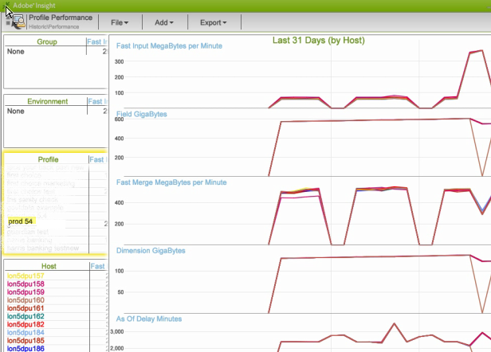

# Data Workbench历史工作区{#data-workbench-historic-workspace}

使用Data Workbench历史配置文件，了解配置、硬件和其他更改如何影响性能、稳定性和服务器容量随时间的推移。

“历史”配置文件在选项卡下包含基于 [配置文件的](../../../home/monitoring-installation/monitoring-profiles/monitoring-historical-using.md#section-184a86f9de054970bf68515bb9dea85d) “配置文件性能”数据集和基于服务器的“服务器性能 [”数据集](../../../home/monitoring-installation/monitoring-profiles/monitoring-historical-using.md#section-5dad5870384b40e094d50173fcd90a09)**[!UICONTROL Performance]** 。 这些是过去从数据工作台服务器性能角度查看的最常用的数据集。 此外，您还可以通过选择选 [项卡](../../../home/monitoring-installation/monitoring-profiles/monitoring-historical-using.md#section-5be7223abb384784bafe7b37c764ea66) ，查看组 [件和处理模式](../../../home/monitoring-installation/monitoring-profiles/monitoring-historical-using.md#section-5be7223abb384784bafe7b37c764ea66)**[!UICONTROL Up Time]** 。

此外，您还可以通过选择选 [项卡](../../../home/monitoring-installation/monitoring-profiles/monitoring-historical-using.md#section-5be7223abb384784bafe7b37c764ea66) ，查看组 [件和处理模式](../../../home/monitoring-installation/monitoring-profiles/monitoring-historical-using.md#section-5be7223abb384784bafe7b37c764ea66)**[!UICONTROL Up Time]** 。

有关在数据工作台历史配置文件中使用的维的其他参考信息，请参阅Insight历史 [配置文件中的维。](../../../home/monitoring-installation/monitoring-appendix/monitoring-historical.md#concept-a42837c9c9274f83ad5bc5a6720f02b0)

## 配置文件性能工作区 {#section-184a86f9de054970bf68515bb9dea85d}

此数据集包括以下有关Data Workbench监视的相关指标。

* 快速输入每分钟兆字节数——在初始日志处理过程中显示大量数据输入的度量。
* 快速合并每分钟MegaBytes —显示转换的度量。

>[!NOTE]
>
>要对您的个人资料进行实际的绩效评估，请查看费率，而不是已经过的日历时间。 该速率以每十分钟轮询一次之间更改的值来度量。

## 服务器性能工作区 {#section-5dad5870384b40e094d50173fcd90a09}

此数据集监视超出包含的配置文件范围的服务器指标，并包含以下用于数据工作台监视的相关服务器指标。

* 估计扫描分钟数— 估计查询解析时间。
* 投票延迟毫秒— 通过测量完成每个组件的整个服务周期需要多长时间来指示软件有多忙。

## 组件工作区 {#section-5be7223abb384784bafe7b37c764ea66}

此数据集位于“Up Time”选项卡下。

组件数据集包含两个方面的组件运行状况：

* 通信量度— Data Workbench Server进程是否做出响应？
* 所有组件指标— “详细状态”页顶部是主机在Data Workbench Server进程中提供服务的组件列表。 如果任何组件处于错误状态，则它将列在“错误中的组件”(Components in Error)表中。

## 处理模式工作区 {#section-3e1dedb9474e4b4ba513240943e76817}

此工作区位于“启动时间”选项卡下。 通过此工作区，您可以观察在快速输入、快速合并和实时模式中花费的时间。

此数据集提供重要的服务器负载特征，如标识

* 星期几（例如，星期二和星期三的快速输入率）,
* 小时（在“快速输入”模式下，一天的百分比是多少？）

