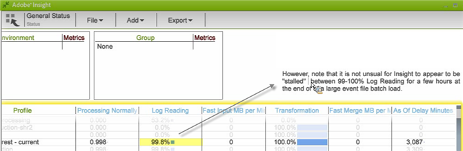

# Data Workbench 配置文件状态工作区{#data-workbench-profile-status-workspace}

{{eol}}

Data Workbench配置文件状态配置文件根据配置文件而不是服务器量度或历史数据提供有关Data Workbench服务器运行状况的当前信息。

## Data Workbench配置文件状态 {#section-65d1fa393cfd450cbacef3cba823fcc1}

此状态配置文件提供了Data Workbench Server的最新信息，但并非非常实时，因为代理每10分钟轮询一次，并且报表始终包含这10分钟的延迟。 更准确地说，此用户档案生成的数据集提供了代理对服务器的最新观察，代理的默认轮询周期通常为10分钟。

有关Data Workbench配置文件状态配置文件中使用的维度的其他参考信息，请参阅 [分析配置文件状态配置文件](../../../home/monitoring-installation/monitoring-profiles/monitoring-profile-using.md#concept-d4cd7da41c8a42bab4aea25418264e64).

此报表更适用于监控操作，而不是组件或特定流量波动。

这样，我们就可以了解哪些人处于哪种模式：如果某个配置文件的“快速输入”率较高，则该配置文件将处于“快速输入”模式。

如果“停止”量度为1，则服务器将停止。 如果值为0，则服务器不会停止。

**大批量加载的日志读取**

